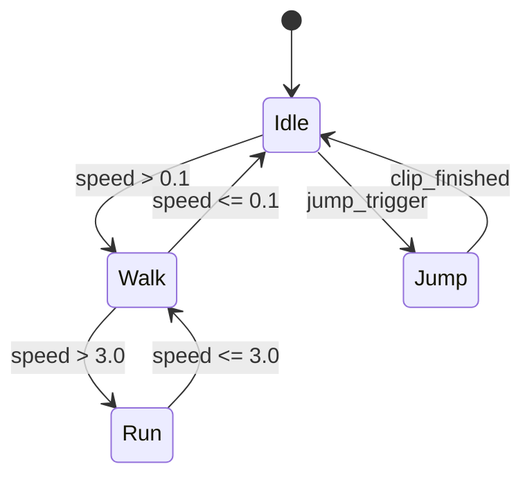

# Animation System

**Version:** 0.1.0
**Status:** Draft
**Layer:** concept

## Overview

The animation system drives time-varying changes to component properties. An `AnimationClip` asset stores sampled curves that map time to values with keyframe interpolation. An `AnimationPlayer` component plays clips on an entity. For complex behaviors, an `AnimationGraph` asset defines a state machine of clips with blend trees and transitions. The system supports skeletal animation, morph targets / blend shapes, generic property animation, and timed animation events.

## Related Specifications

- [hierarchy-system.md](hierarchy-system.md) — Joint hierarchy via ChildOf relationships
- [math-system.md](math-system.md) — Interpolation, quaternion slerp, transform types
- [asset-system.md](asset-system.md) — Clips and graphs are loaded as assets
- [mesh-and-image.md](mesh-and-image.md) — Morph target vertex data in meshes

## 1. Motivation

Animation is fundamental to games — from character movement to UI transitions to camera shakes. A data-driven clip and graph model separates authored content from runtime logic. Supporting arbitrary property animation (not just transforms) enables a single system to handle skeletal rigs, morph faces, material color fades, and UI tweens.

## 2. Constraints & Assumptions

- Animation evaluation must be safe to run in parallel across independent entity hierarchies.
- Clips are immutable assets; runtime variation comes from player speed, blend weight, and graph state.
- The reflection system must expose a property path for any field that can be animated.
- Skeletal animation targets `Transform` components on `Joint`-marked entities within a hierarchy.
- Animation graphs are acyclic in their transition topology; cycles are permitted only through explicit looping edges.

## 3. Core Invariants

- **INV-1**: Animation graph evaluation produces deterministic output for the same input state. No hidden random state affects curve or blend results.
- **INV-2**: Skeletal animation respects the entity hierarchy — joint transforms propagate through ChildOf relationships.
- **INV-3**: Animation runs in PostUpdate, before transform propagation. This ensures animated local transforms are propagated to world-space in the same frame.
- **INV-4**: Missing joints or morph targets in an animation clip are silently skipped (partial animation). A clip authored for a full skeleton works correctly on a partial one.

## 4. Detailed Design

### 4.1 Animation Clips

Sampled curves storing position, rotation, scale, or arbitrary properties. Each curve maps a time value to a property value through keyframes with interpolation.

```
AnimationClip {
    duration: f32
    curves:   Vec<VariableCurve>
    events:   Vec<AnimationEvent>
}

VariableCurve {
    target:    AnimationTargetId
    keyframes: Keyframes           // times + values + interpolation
}
```

Keyframes with interpolation modes:
- **Step** — holds the previous keyframe value until the next keyframe.
- **Linear** — linearly interpolates between adjacent keyframes (lerp for scalars, slerp for quaternions).
- **CubicSpline** — cubic spline with in/out tangents per keyframe for smooth curves.

### 4.2 AnimationTargetId

Identifies what to animate. Composed of an entity path (relative to the player entity) and a component property path resolved through reflection.

```
AnimationTargetId {
    entity_path: EntityPath        // e.g., "Armature/Hips/Spine"
    property:    PropertyPath      // e.g., "Transform.translation"
}
```

### 4.3 Animation Graph

A state machine for blending and transitioning between clips. The graph defines animation behavior declaratively:



Node types:
- **ClipNode** — plays a single AnimationClip.
- **BlendNode** — mixes child nodes based on a parameter (1D blend by speed, 2D blend by direction). Weights are computed from the parameter value and child thresholds.
- **AddNode** — additively layers an animation on top of a base pose (e.g., breathing overlay).

Edges carry transition conditions and cross-fade durations. `AnimationNodeIndex` is an opaque handle into the graph for runtime queries.

### 4.4 Animation Player

Component that drives playback on an entity:

```
AnimationPlayer {
    active_animations: Map<AnimationNodeIndex, ActiveAnimation>
}

ActiveAnimation {
    clip:         Handle<AnimationClip>
    elapsed:      f32
    speed:        f32         // default 1.0, negative for reverse
    repeat:       RepeatMode  // Once | Loop | PingPong
    blend_weight: f32
    paused:       bool
}
```

Controls: play, pause, seek, set speed, set looping mode. The player supports multiple simultaneous clips for layered blending (e.g., upper-body attack layered over lower-body run).

### 4.5 Skeletal Animation

Joint hierarchy, skin weights, and inverse bind matrices. Joints map to entities in the hierarchy:

- Skeletal clips target `Transform` components on entities marked with `Joint`.
- The hierarchy system provides parent-child relationships via ChildOf.
- The animation system writes local transforms; the transform propagation system computes world-space matrices.
- Inverse bind matrices transform from mesh space to joint space for GPU skinning.

```
Joint component marks an entity as a skeleton joint:
  Joint {
      index: u16    // index into the skin's joint array
  }

Skin component on the mesh entity:
  Skin {
      joints:              Vec<Entity>      // joint entities
      inverse_bind_matrices: Vec<Mat4>
  }
```

### 4.6 Morph Targets / Blend Shapes

Weighted vertex displacement for facial animation, corrective shapes, and other mesh deformations:

```
MorphWeights {
    weights: Vec<f32>    // one weight per morph target, range [0.0, 1.0]
}
```

Clips can target the `MorphWeights` component. The mesh system uses these weights to interpolate between morph target vertex offsets at render time. Multiple morph targets can be active simultaneously.

### 4.7 Animation Events

Fire events at specific times in a clip (e.g., footstep sound at frame 12, particle spawn at impact):

```
AnimationEvent {
    time:    f32
    payload: Box<dyn Reflect>
}
```

Events are embedded in clips and dispatched through the event system when the player crosses their trigger time. Frame-rate independence is ensured by checking the interval `[prev_time, current_time]`, guaranteeing each event fires exactly once per crossing.

### 4.8 Animation Curves

Interpolation of any numeric component property, not just transforms. Any component field registered with the reflection system can be animated:

```
Animatable properties:
  - Transform.translation  (Vec3)
  - Transform.rotation     (Quat)
  - Transform.scale        (Vec3)
  - MorphWeights.weights   (Vec<f32>)
  - Material.color         (Color)
  - Light.intensity        (f32)
  - Any user-defined Reflect field
```

The animation system resolves the property path at clip load time and caches a typed write accessor for efficient per-frame evaluation.

### 4.9 Transitions

Crossfade between animation graph states with configurable blend time:

```
Transition {
    target:         AnimationNodeIndex
    condition:      TransitionCondition    // parameter threshold, trigger, clip_finished
    blend_duration: f32                    // seconds to crossfade
    blend_curve:    EasingCurve            // linear, ease-in, ease-out, custom
}
```

During a transition, both source and target states are evaluated simultaneously. Their outputs are blended by a weight that ramps from 0→1 over the blend duration.

### 4.10 Parallel Evaluation

Animation graphs on independent entity hierarchies have no data dependencies. The system partitions work by root entity and evaluates graphs in parallel on the task pool.

## 5. Open Questions

- Animation compression formats? Quantized keyframes, curve fitting, or streaming from disk?
- Runtime retargeting between different skeletons? How to map joints with different names or proportions?
- Should additive animation layers be a first-class concept or emulated through blend weights?
- What is the serialization format for animation graphs — visual editor output or hand-authored?

## Document History

| Version | Date | Description |
| :--- | :--- | :--- |
| 0.1.0 | 2026-03-25 | Initial draft |
