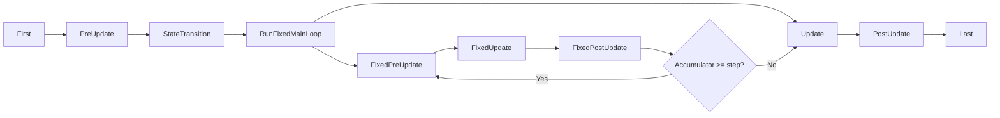

# App Framework

**Version:** 0.1.0
**Status:** Draft
**Layer:** concept

## Overview

The App framework is the top-level entry point for the engine. It provides a builder-pattern API for configuring the engine, registering plugins, adding systems, and running the main loop. Plugins are the primary extension mechanism — each plugin encapsulates a set of systems, resources, and configuration. The framework supports SubApps for isolated execution contexts (e.g., rendering), modular feature profiles via PluginGroups, and a well-defined main schedule ordering.

## Related Specifications

- [world-system.md](world-system.md) — Each App (and SubApp) owns a World
- [system-scheduling.md](system-scheduling.md) — Systems are organized into named schedules
- [event-system.md](event-system.md) — Event clearing runs in First
- [definition-system.md](definition-system.md) — App configuration and game flow expressible as JSON definitions

## 1. Motivation

An ECS engine is more than entities and components — it needs a structured way to:

- Configure and assemble the engine from modular pieces.
- Define the order in which systems execute each frame.
- Support plugins that extend engine functionality without modifying core code.
- Isolate subsystems (like rendering) into their own execution contexts.
- Support different deployment profiles (headless server, 2D game, full 3D).

The App framework answers all of these needs with a single, composable entry point.

## 2. Constraints & Assumptions

- There is exactly one main App per engine instance.
- Plugins are added at startup, before the main loop begins. Hot-adding plugins at runtime is not supported.
- The main schedule order is fixed by the engine. Users add systems to the appropriate schedule slots.
- SubApps run after the main app's update cycle, not concurrently (concurrency is a future optimization).
- Zero external dependencies in the core framework. Platform-specific plugins may have dependencies.

## 3. Core Invariants

- **INV-1**: Plugins are initialized in dependency order. The lifecycle proceeds through Build → Ready → Finish phases for all plugins before the main loop begins.
- **INV-2**: A plugin cannot be added twice. Adding a duplicate plugin is an idempotent no-op (checked by type).
- **INV-3**: SubApp extract runs exactly once per frame, before the sub-app's schedule.
- **INV-4**: The main App always has at least one schedule (Main).

## 4. Detailed Design

### 4.1 App Builder

The App is constructed via a builder pattern — the App struct serves as the entry point with a fluent API for adding plugins, systems, and resources:

```
app = NewApp()
app.AddPlugins(DefaultPlugins)
app.InsertResource(GameSettings{Difficulty: Hard})
app.AddSystems(Update, move_player, check_collisions)
app.AddSystems(FixedUpdate, physics_step)
app.AddSystems(OnEnter[AppState.Playing], spawn_level)
app.InitState[AppState](AppState.Menu)
app.Run()
```

Builder methods:

```
App
  AddPlugins(plugins ...Plugin)
  AddSystems(schedule Label, systems ...System)
  InsertResource(resource)
  InitResource[T]()
  InitState[S](default S)
  SetRunner(runner RunnerFunc)
  Run()
  SubApp(label) -> *SubApp
```

### 4.2 Plugin Trait

A Plugin is any type that implements the Build method. Plugins declare dependencies on other plugins — the framework resolves and orders initialization accordingly.

```
Plugin interface:
  Build(app *App)

Optional lifecycle methods (detected via interface assertion):
  Ready(app *App) bool       // return false to defer initialization
  Finish(app *App)           // called after all plugins have built
  Cleanup(app *App)          // called on shutdown, reverse order
```

Lifecycle phases execute in order:

```
Phase 1: Build    — all plugins, in dependency-resolved order
Phase 2: Ready    — polled until all return true (with cycle detection)
Phase 3: Finish   — all plugins, in dependency-resolved order
Phase 4: [main loop runs]
Phase 5: Cleanup  — all plugins, in reverse order
```

### 4.3 Functions as Plugins

Any function with the signature `func(app *App)` is automatically a Plugin:

```
func MyFeaturePlugin(app *App) {
    app.InsertResource(MyConfig{...})
    app.AddSystems(Update, my_system)
}

app.AddPlugins(PluginFunc(MyFeaturePlugin))
```

### 4.4 Plugin Groups

A PluginGroup is an ordered collection of plugins with per-plugin enable/disable:

```
PluginGroup interface:
  Build() -> []Plugin

DefaultPlugins = PluginGroup:
  - LogPlugin
  - TaskPoolPlugin
  - TimePlugin
  - InputPlugin
  - WindowPlugin
  - AssetPlugin
  - ScenePlugin
  - RenderPlugin
  - AudioPlugin
  - StatePlugin
  - DiagnosticsPlugin

MinimalPlugins = PluginGroup:
  - LogPlugin
  - TaskPoolPlugin
  - TimePlugin
  - ScheduleRunnerPlugin     // headless loop with configurable tick rate
```

Plugin groups support customization:

```
app.AddPlugins(
    DefaultPlugins.Set(
        WindowPlugin{Title: "My Game", Width: 1280, Height: 720},
    ).Disable(AudioPlugin),
)
```

### 4.5 Main Schedule Order

Each frame, the main app runs schedules in this fixed order:

```
Startup (once):
  PreStartup -> Startup -> PostStartup

Per-frame:
  First
    - Event clearing (swap double buffers)
    - Time resource updates
  PreUpdate
    - Input processing
    - Asset loading callbacks
  StateTransition
    - Process all pending state transitions
    - Run OnExit / OnEnter / OnTransition schedules
  RunFixedMainLoop
    - Consume accumulated fixed time
    - For each step: FixedPreUpdate -> FixedUpdate -> FixedPostUpdate
  Update
    - User gameplay logic (default schedule for game systems)
  PostUpdate
    - Transform propagation
    - Hierarchy updates
    - Render data preparation
  Last
    - ClearTrackers (change detection reset)
    - Diagnostics collection
```



### 4.6 Startup Schedules

Startup schedules run exactly once before the main loop begins:

```
PreStartup -> Startup -> PostStartup
```

PreStartup is for engine internals that must be ready before user startup code. Startup is where most user initialization belongs. PostStartup runs after all startup systems, useful for validation or derived state computation.

### 4.7 SubApp

A SubApp is an isolated World instance with its own set of schedules. It communicates with the main app through an explicit extract function — a one-way copy from the main world to the sub-app world each frame.

```
SubApp
  - World         World
  - Schedules     map[Label]Schedule
  - ExtractFn     func(mainWorld *World, subWorld *World)

app.InsertSubApp(RenderApp, SubApp{
    ExtractFn: extract_render_data,
})
```

SubApp execution flow:

```
1. Main app completes its per-frame schedules (First through Last)
2. For each SubApp:
   a. Run ExtractFn(main_world, sub_world) — copy relevant data
   b. Run SubApp's own schedules
```

Primary use case: render world isolation. The render pipeline runs as a SubApp, isolating render state from gameplay state. This enables future pipelined rendering where the render SubApp processes frame N-1 while the main app processes frame N.

### 4.8 RunMode

The App supports different execution modes:

```
RunMode:
  Loop
    - WaitDuration  float64  // optional minimum frame time (0 = uncapped)
    - Runs the main loop continuously

  Once
    - Runs startup + one frame + cleanup
    - Useful for CLI tools, testing, and batch processing
```

### 4.9 Runner Function

The runner function is a customizable game loop function that receives the App. It controls how and when the main schedule is executed:

```
RunnerFunc = func(app *App) error

// Default runner: simple loop
func DefaultRunner(app *App) error {
    for !app.ShouldExit() {
        app.Update()
    }
    return nil
}

app.SetRunner(CustomRunner)
```

This allows users to integrate with external event loops, custom frame pacing, or test harnesses.

### 4.10 App Exit

The application exits when:

```
1. An AppExit event is sent (with exit code)
2. The runner function returns
3. All windows are closed (if using WindowPlugin)
```

Exit sequence:

```
1. Stop the main loop
2. Run Cleanup on all plugins (reverse registration order)
3. Drop all World resources
4. Return exit code
```

## 5. Open Questions

- Should plugins support explicit dependency declaration (plugin A requires plugin B) with automatic ordering, or is registration order sufficient?
- Should SubApps support bidirectional data transfer, or is extract (main to sub) sufficient?
- How should plugin configuration errors (e.g., conflicting settings) be reported — panic at startup or structured error return?

## Document History

| Version | Date | Description |
| :--- | :--- | :--- |
| 0.1.0 | 2026-03-25 | Initial draft |
