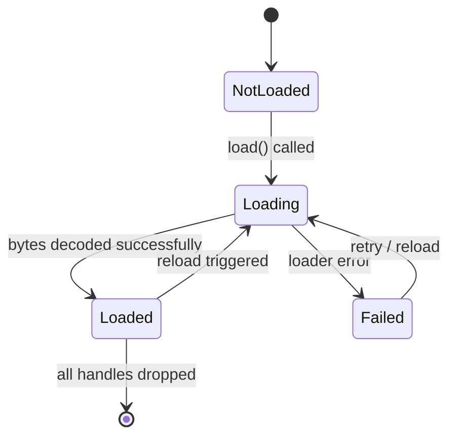

# Asset System

**Version:** 0.1.0
**Status:** Draft
**Layer:** concept

## Overview

The asset system manages loading, tracking, and lifetime of external resources (textures, meshes, audio, scenes). It provides asynchronous loading through the task system, reference-counted handles, hot-reload support, and an extensible loader architecture. All loaded assets are stored in typed ECS resources accessible to systems.

## Related Specifications

- [task-system.md](task-system.md) — Async loading runs on the IO pool
- [scene-system.md](scene-system.md) — Scenes are assets loaded through this system
- [event-system.md](event-system.md) — Asset lifecycle events

## 1. Motivation

Games reference thousands of external files. A robust asset system must:
- Load assets asynchronously to avoid frame stalls.
- Track load state so systems can react when assets become available.
- Support hot-reload for rapid iteration during development.
- Provide a stable handle abstraction that decouples users from load timing.
- Allow multiple IO backends (filesystem, embedded, network).

## 2. Constraints & Assumptions

- Asset loading is always asynchronous; there is no synchronous load API.
- Each asset type has at least one registered AssetLoader.
- Strong handles keep assets alive; when all strong handles drop, the asset is eligible for removal.
- Asset IDs come in two forms: runtime Index (generational) and persistent UUID.
- Meta files are optional; sensible defaults apply when absent.

## 3. Core Invariants

1. **Handle validity.** A strong handle always points to a valid slot (Loading, Loaded, or Failed).
2. **Reference counting.** Assets are freed only when the strong reference count reaches zero.
3. **Loader determinism.** Given the same bytes and settings, a loader produces the same asset.
4. **Event ordering.** Created fires before Modified; Removed fires only after all dependents are notified.

## 4. Detailed Design

### 4.1 AssetServer

The central coordinator for all asset operations:

```plaintext
AssetServer
  fn load(path: AssetPath) -> Handle[A]
  fn load_with_settings(path, settings) -> Handle[A]
  fn get_load_state(id: AssetID) -> LoadState
  fn reload(path: AssetPath)
  fn unload(id: AssetID)
```

Load states follow this progression:



### 4.2 AssetLoader Trait

```plaintext
trait AssetLoader:
    type Asset
    type Settings
    type Error
    fn load(reader: AssetReader, settings: Settings) -> Result[Asset, Error]
    fn extensions() -> []string
```

Loaders are registered at startup. When a path is loaded, the server selects a loader by file extension. If multiple loaders handle the same extension, the most recently registered one wins unless the meta file specifies otherwise.

### 4.3 Handles and Asset IDs

```plaintext
Handle[A]
├── Strong(AssetID)   -- ref-counted, keeps asset alive
└── Weak(AssetID)     -- does not prevent unload

AssetID
├── Index { index: u32, generation: u32 }   -- runtime, like Entity
└── UUID  { uuid: u128 }                    -- persistent across sessions
```

Strong handles are the default return from `load()`. A weak handle is obtained via `handle.downgrade()` and can be upgraded back if the asset still exists.

### 4.4 Assets Resource

Each asset type gets a typed resource inserted into the World:

```plaintext
Assets[A]
  fn get(id: AssetID) -> Option[&A]
  fn get_mut(id: AssetID) -> Option[&mut A]
  fn add(asset: A) -> Handle[A]           -- for programmatic creation
  fn remove(id: AssetID) -> Option[A]
  fn iter() -> Iterator[(&AssetID, &A)]
```

### 4.5 IO Abstraction

```plaintext
trait AssetReader:
    fn read(path) -> Result[bytes, IOError]
    fn read_directory(path) -> Result[[]string, IOError]
    fn is_directory(path) -> bool

trait AssetWriter:
    fn write(path, bytes) -> Result[(), IOError]
    fn delete(path) -> Result[(), IOError]
```

Built-in backends: FileSystem (default), Memory (testing), Embedded (compile-time bundled), HTTP (remote fetching).

### 4.6 Asset Path Format

```plaintext
"source://path/to/asset.ext#label"

source   -- named IO backend (default if omitted)
path     -- virtual path within that source
label    -- sub-asset identifier (e.g., a mesh within a GLTF file)
```

### 4.7 Asset Events

The system emits typed events each frame:

- **Created** — asset loaded for the first time.
- **Modified** — asset data replaced (hot-reload or manual update).
- **Removed** — asset unloaded, ID is no longer valid.
- **LoadedWithDependencies** — asset and all its transitive dependencies are loaded.

### 4.8 Hot-Reload

In development builds, a file watcher monitors asset directories. When a file changes:
1. The watcher enqueues the changed path.
2. AssetServer calls `reload(path)`, transitioning the asset back to Loading.
3. The loader re-processes the file; on success the asset slot is updated in-place.
4. A Modified event is emitted so dependent systems can react.

### 4.9 Asset Processor (Optional)

An offline pipeline that transforms source assets into optimized forms:

```plaintext
AssetProcessor
  fn process(source_path, dest_path, settings)
  fn register_processor(ProcessorDescriptor)
```

Processors run at build time or in a background tool, not at runtime. They produce processed assets plus updated meta files.

## 5. Open Questions

1. Should failed assets retry automatically, or require explicit reload?
2. How are circular asset dependencies detected and reported?
3. Should the asset processor be integrated into the engine binary or a separate CLI tool?

## Document History

| Version | Date       | Description                              |
| :------ | :--------- | :--------------------------------------- |
| 0.1.0   | 2026-03-25 | Initial draft from architecture analysis |
