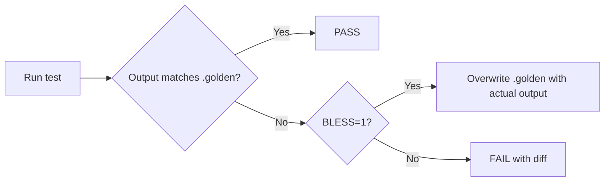

# Build Tooling

**Version:** 0.3.0
**Status:** Draft
**Layer:** concept

## Overview

Defines the engine's build automation, CI pipeline, testing infrastructure, and release documentation conventions. These tools ensure code quality, prevent regressions, and maintain professional release practices as the engine grows.

## Related Specifications

- [examples-framework.md](examples-framework.md) — Examples validated by CI pipeline
- [diagnostic-system.md](diagnostic-system.md) — Profiling integration used by benchmark tooling
- [app-framework.md](app-framework.md) — Plugin architecture tested by compile-check tools
- [platform-system.md](platform-system.md) — CI matrix targets, cross-compilation pipeline

## 1. Motivation

A game engine is a large, multi-subsystem project. Without standardized build tooling:
- Regressions slip through because there is no automated validation.
- Contributors cannot run the same checks locally that CI runs.
- Breaking API changes go undocumented, frustrating users on upgrade.
- Performance regressions go undetected until users complain.

## 2. Constraints & Assumptions

- All tooling is written in Go and uses only the standard library (C24).
- CI checks must be runnable locally with a single command.
- Golden file testing uses a `BLESS` environment variable to regenerate expected output.
- Migration guides use a structured format with YAML frontmatter.
- The CI tool is a single Go binary with subcommands, not a collection of shell scripts.

## 3. Core Invariants

- **INV-1**: Every CI check that runs in the pipeline must be reproducible locally with the same tool and flags.
- **INV-2**: Golden file mismatches produce a clear diff, not a generic "test failed" message.
- **INV-3**: Migration guides are required for every breaking API change before a release is tagged.
- **INV-4**: Benchmark regressions beyond a configurable threshold (default: 10%) are flagged as CI warnings.
- **INV-5**: The CI tool exits with non-zero status on any failure; `--keep-going` mode aggregates all failures before exiting.

## 4. Detailed Design

### 4.1 CI Command Tool

A single Go binary (`cmd/ci/`) with modular subcommands. Each subcommand is an independent check:

```plaintext
ci format          # go fmt check (no modification, diff only)
ci vet             # go vet on all packages
ci lint            # golangci-lint (if available) or built-in checks
ci test            # go test ./... with race detector
ci test-doc        # verify all doc examples compile and run
ci bench           # run benchmarks, compare against baseline
ci compile-check   # verify all packages compile (go build ./...)
ci example-check   # verify all examples compile and run in headless mode
ci golden-test     # run golden file tests, compare output
ci integration     # run integration tests (longer, heavier)
ci all             # run all checks in sequence
```

**Flags:**
- `--keep-going` — Continue on failure, report all errors at the end.
- `--jobs N` — Parallelism level for independent checks.
- `--verbose` — Detailed output for debugging CI failures.

**Architecture:**

```plaintext
cmd/ci/
  main.go          # Entry point, subcommand dispatch
  commands/
    format.go      # Format check implementation
    vet.go         # Vet check implementation
    test.go        # Test runner implementation
    bench.go       # Benchmark runner implementation
    ...
```

Each command implements:

```
type Check interface {
    Name() string
    Run(ctx context.Context, opts Options) error
}
```

### 4.2 Golden File Testing

Golden file tests compare program output against a stored expected file (`.golden`). Used for:
- CLI output format validation.
- Error message wording verification.
- Serialization format stability (JSON scene output).

**Workflow:**



**Convention:**
- Golden files live next to their test: `testdata/{name}.golden`
- Regenerate all: `BLESS=1 go test ./...`
- CI never sets `BLESS=1` — mismatches always fail.

### 4.3 Compile-Error Testing

Tests that verify the compiler correctly rejects invalid code. Used for:
- Ensuring type-safety constraints are enforced (e.g., mutable query conflicts).
- Validating that required components produce clear errors when missing.
- Documenting expected error messages in spec-adjacent test files.

**Approach:**
- Test files in `testdata/compile_fail/` contain Go code expected to fail compilation.
- Each file has annotation comments marking expected errors:

```plaintext
package compilefail

// This must not compile: conflicting mutable access
func badSystem(q1 Query[*Position], q2 Query[*Position]) { // ERROR: conflicting access
    // ...
}
```

- A test harness invokes `go build` on each file and verifies:
  1. Compilation fails (exit code != 0).
  2. Error output contains the expected message pattern.
- Golden file approach: expected stderr stored as `.golden`, compared on each run.

### 4.4 Benchmark Infrastructure

Benchmarks track performance across commits to detect regressions.

**Components:**
- Standard Go benchmarks (`func Benchmark*(b *testing.B)`) in `_test.go` files.
- Benchmark baseline file (`testdata/bench_baseline.txt`) storing previous results.
- `ci bench` compares current run against baseline using `benchstat`-compatible format.
- Threshold-based alerts: >10% regression = warning, >25% = failure.

**Key benchmarks (minimum set):**
- Entity spawn/despawn throughput (entities/sec).
- Query iteration throughput (entities/sec for 1-component, 3-component, 5-component).
- Command buffer flush time.
- Archetype creation time.
- Transform propagation for N-deep hierarchy.
- Event send/receive throughput.

### 4.5 Example Showcase Runner

A tool that bulk-runs all examples for validation and documentation:

```plaintext
cmd/showcase/
  main.go
```

**Features:**
- Run all examples or a filtered subset by category.
- Headless mode for CI (no window, mock render backend).
- Frame-limited execution (run N frames, then exit) for deterministic testing.
- Screenshot capture at a specified frame for visual regression testing.
- Progress reporting with example count and timing.
- Pagination for memory management with large example sets (`--page`, `--per-page`).

**CI integration:**
- `ci example-check` uses the showcase runner in headless mode.
- Each example must exit cleanly within a timeout (default: 30 seconds).
- Failed examples are collected and reported as a batch.

### 4.6 Migration Guide Format

When a breaking API change is made, a migration guide is required before the release.

**File location:** `docs/migrations/{version}/{change-name}.md`

**Format:**

```plaintext
---
title: {Short description of the change}
pull_requests: [123, 456]
breaking: true
---

## Migration Guide

{Explanation of what changed and why.}

**Before:**

    entity.AddComponent(Position{X: 1, Y: 2})

**After:**

    entity.Insert(Position{X: 1, Y: 2})

{Additional notes if needed.}
```

**Conventions:**
- YAML frontmatter with title, PR references, and breaking flag.
- Before/after code examples in Go pseudo-code.
- Brief explanation of motivation (link to spec if relevant).
- One file per breaking change, not one file per release.

### 4.7 Release Note Format

Feature announcements and notable changes for each release version.

**File location:** `docs/releases/{version}/{feature-name}.md`

**Format:**

```plaintext
---
title: {Feature name}
authors: ["@username"]
pull_requests: [789]
---

{2-3 paragraph description of the feature, why it matters, and how to use it.}

**Usage:**

    app.AddPlugin(NewFeaturePlugin{
        Option: value,
    })

{Additional details, caveats, or links to full documentation.}
```

**Conventions:**
- Author attribution for credit and review context.
- PR references for traceability.
- Practical usage example showing the feature in action.
- Separate file per notable feature (not one monolithic changelog).

### 4.8 Co-Located Tests

Test files live next to the code they test, inside the same package — not in a centralized `tests/` directory:

```plaintext
internal/ecs/
  archetype.go
  archetype_test.go        // tests for archetype.go
  query.go
  query_test.go            // tests for query.go
  testdata/
    query_filter.golden    // golden files for query tests
```

Each package owns its test files and test data. This scales better than a monolithic test directory, makes ownership clear, and keeps tests close to the code under change. Integration tests that span multiple packages live in a top-level `tests/` directory with `_test` package suffixes.

### 4.9 Named Test Commands

Beyond standard `go test` unit tests, the CI tool supports named entry points for specialized test modes:

```plaintext
ci test-command <name>

Registered commands:
  scene-roundtrip     // serialize → deserialize → compare for all scene formats
  definition-validate // validate all .json definition files against schema
  stress-spawn        // spawn/despawn 100k entities in a tight loop
  stress-query        // iterate 1M-entity queries, measure throughput
```

Test commands are registered programmatically:

```plaintext
RegisterTestCommand("scene-roundtrip", func(ctx context.Context) error {
    // load all .json scene files, roundtrip, compare
})
```

This supports parser tests, serialization roundtrip tests, and performance stress tests that don't fit the standard `func Test*` model.

### 4.10 Error Suppression in Negative-Path Tests

When testing that invalid input produces the correct error (negative-path tests), expected engine error logs should not pollute test output:

```plaintext
// Test that duplicate component registration produces an error
SuppressErrors()
err := registry.Register[Position]()  // expected to fail
RestoreErrors()

assert(err != nil)
assert(err.Code == ErrDuplicateComponent)
```

`SuppressErrors()` / `RestoreErrors()` temporarily redirect error output to a capture buffer. The test can then assert on captured error messages if needed. This keeps test output clean while still validating error behavior. CI never shows suppressed errors in the summary — only assertion failures.

### 4.11 Event Testing Utilities

A `EventWatcher` utility for asserting event emissions in test code:

```plaintext
watcher := NewEventWatcher(bus)
watcher.Watch("CollisionEvent")

// ... perform actions ...

watcher.Check("CollisionEvent", expected_args)    // assert event emitted with args
watcher.CheckNone("DeathEvent")                    // assert no emission
watcher.Clear()                                    // reset between test cases
```

This records all watched event emissions with their arguments into an internal map. No mock framework needed — it connects to the real event bus. See [event-system.md §4.8](event-system.md) for the design.

### 4.12 Serialization Roundtrip Tests

Every format version bump requires an explicit roundtrip test:

1. Load a reference file in the old format.
2. Deserialize into runtime structures.
3. Re-serialize to the new format.
4. Deserialize again and compare with step 2.
5. Store the re-serialized output as a golden file.

This ensures format compatibility across versions and catches silent data loss during format evolution. The `BLESS=1` workflow applies: mismatches fail in CI, `BLESS=1` regenerates the golden file locally.

### 4.13 Parallel Test Dispatching

CPU-bound test suites (benchmarks, stress tests, golden file comparisons) use batched parallel dispatch for throughput:

```plaintext
Dispatcher.ForBatched(testCount, batchSize, func(tests, from, to):
  for i in from..to:
    tests[i].Run()
)
```

**Batch sizing**: Tests are divided into batches of `batchSize` items. Each batch runs on a worker goroutine. The main goroutine participates in processing (work stealing) rather than blocking idle.

**Work stealing**: When a goroutine finishes its batch early, it atomically claims the next unclaimed batch via `atomic.AddInt64(&batchIndex, 1)`. This balances load across workers without central coordination — fast tests don't leave workers idle.

**Thread-local collectors**: Each worker accumulates results into a thread-local collector (no mutex contention). After all batches complete, results are merged into the final report. This pattern is reused across the engine — transform updates (see [math-system.md §4.12](math-system.md)), render culling (see [render-core.md §4.11](render-core.md)), and test dispatching all share the same `Dispatcher.ForBatched` primitive.

**Cooperative main thread**: The main goroutine calls `TryCooperate()` while waiting for workers — it steals and processes batches rather than sleeping. This eliminates idle time on the main thread and avoids the overhead of `time.Sleep` polling.

## 5. Open Questions

- Should benchmark baselines be committed to the repo or stored externally?
- Visual regression testing: compare screenshots pixel-by-pixel or use perceptual hash?
- Should migration guides be auto-generated from git commit conventions?

## Document History

| Version | Date | Description |
| :--- | :--- | :--- |
| 0.1.0 | 2026-03-26 | Initial draft from reference engine tooling analysis |
| 0.2.0 | 2026-03-26 | Added co-located tests, named test commands, error suppression, event testing, serialization roundtrip tests |
| 0.3.0 | 2026-03-26 | Added parallel test dispatching with work stealing and cooperative main thread |
| — | — | Planned examples: `examples/stress_test/` |
