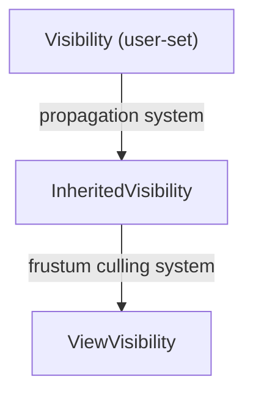

# Camera & Visibility
**Version:** 0.1.0
**Status:** Draft
**Layer:** concept

## Overview
Cameras define the viewpoint from which a scene is rendered. The visibility system determines which entities should be drawn for a given camera by combining user-controlled visibility flags with automatic frustum culling. Together they gate what enters the render pipeline each frame.

## Related Specifications
- [Render Core](render-core.md)
- [Hierarchy System](hierarchy-system.md)
- [Math System](math-system.md)

## 1. Motivation
Without visibility management every entity would be submitted to the GPU regardless of whether it is on screen or intentionally hidden. A layered visibility model gives users explicit control while frustum culling provides automatic performance gains. Multiple cameras enable split-screen, render-to-texture, and minimap use cases.

## 2. Constraints & Assumptions
- At least one camera must exist for anything to render.
- Frustum culling operates on axis-aligned bounding boxes (AABBs); tighter bounds require user-provided overrides.
- Visibility propagation depends on the hierarchy system — entities without a parent inherit root-level visibility.
- Camera projection matrices are recomputed only when projection parameters or viewport size change.

## 3. Core Invariants
1. An entity is rendered only if its `ViewVisibility` is true for the evaluating camera.
2. `InheritedVisibility` of a child is always false if the parent's `InheritedVisibility` is false, regardless of the child's own `Visibility` setting.
3. Frustum culling never produces false negatives — an entity inside the frustum is always marked visible (false positives are acceptable with AABBs).
4. Camera ordering is deterministic: cameras with equal `order` values are sorted by entity ID as a tiebreaker.
5. Projection near plane must be greater than zero for perspective projections.

## 4. Detailed Design

### 4.1 Camera Component

```plaintext
Camera
  ├── render_target: RenderTarget   (window, texture, or off-screen)
  ├── viewport: Option<Viewport>    (sub-region of render target)
  ├── clear_color: ClearColorConfig (color, or don't clear, or inherit)
  ├── hdr: bool                     (enable HDR render path)
  ├── order: i32                    (lower renders first)
  └── is_active: bool
```

Only active cameras participate in rendering. The render core iterates cameras sorted by `order` and executes the full render graph for each.

### 4.2 Convenience Bundles
- **Camera2D**: Camera + OrthographicProjection + Transform (default position at Z = far/2).
- **Camera3D**: Camera + PerspectiveProjection + Transform (default position at origin looking -Z).

Both include `Visibility::default()` and `Frustum` components automatically.

### 4.3 Projection Types

**PerspectiveProjection**

```plaintext
fov_y:  f32   (vertical field of view in radians)
aspect: f32   (width / height, auto-updated from viewport)
near:   f32   (> 0)
far:    f32   (> near)
```

**OrthographicProjection**

```plaintext
area:          Rect   (left, right, bottom, top)
near:          f32
far:           f32
scaling_mode:  WindowSize | FixedVertical(f32) | FixedHorizontal(f32)
```

Both produce a 4x4 projection matrix consumed by the render pipeline.

### 4.4 Visibility Hierarchy
Visibility is resolved in three layers:



- **Visibility**: set by user code. Values: `Inherited` (default — inherit from parent), `Hidden`, `Visible`.
- **InheritedVisibility**: computed by walking the hierarchy. True only if the entity and all ancestors are not hidden.
- **ViewVisibility**: true if `InheritedVisibility` is true **and** the entity's AABB intersects the camera frustum.

The propagation system runs in `PostUpdate` before frustum culling.

### 4.5 Frustum Culling
Each camera maintains a `Frustum` component (six planes extracted from the view-projection matrix). The culling system tests every entity's `Aabb` against the frustum:

```plaintext
for each entity with (Aabb, InheritedVisibility == true):
    if frustum.intersects(entity.aabb):
        entity.view_visibility = true
    else:
        entity.view_visibility = false
```

Entities without an `Aabb` are assumed always visible (e.g., lights, audio sources).

### 4.6 Frustum Primitives
- **Frustum**: six `HalfSpace` planes (near, far, left, right, top, bottom).
- **Aabb**: axis-aligned bounding box with `center` and `half_extents`.
- **BoundingSphere**: center + radius, used for coarse pre-tests.
- **CascadesFrusta**: array of `Frustum` for cascaded shadow map splits.

### 4.7 Camera Update Systems
A `CameraUpdateSystems` system set runs in `PostUpdate`:
1. Update projection matrices if parameters changed.
2. Compute view matrix from `GlobalTransform`.
3. Extract frustum planes from view-projection matrix.
4. Run visibility propagation.
5. Run frustum culling.

### 4.8 ClearColor
`ClearColor` is a global resource holding the default clear color for all cameras. Individual cameras override this via `ClearColorConfig::Custom(color)` or disable clearing with `ClearColorConfig::None`.

### 4.9 Multiple Cameras
Each camera renders independently to its `render_target`. Cameras sharing the same render target composite in `order` sequence. Common patterns:
- Main camera (order 0) + UI camera (order 1) to the same window.
- Security camera (order -1) rendering to an off-screen texture used as a material input.

## 5. Open Questions
1. Should occlusion culling (software or GPU-driven) be added alongside frustum culling?
2. How should visibility layers (bitmask-based filtering) interact with the hierarchy?
3. What is the performance ceiling for the number of simultaneous active cameras?

## Document History
| Version | Date | Description |
| :--- | :--- | :--- |
| 0.1.0 | 2026-03-25 | Initial draft from architecture analysis |
| — | — | Planned examples: `examples/camera/` |
