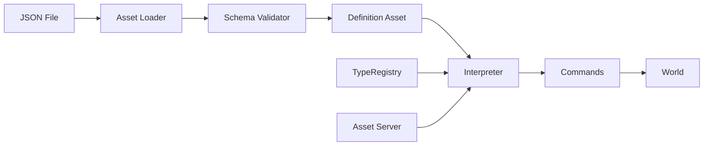

# Definition System

**Version:** 0.2.0
**Status:** Draft
**Layer:** concept

## Overview

The Definition System is a JSON-based declarative configuration layer that serves as a bridge between engine code and visual tooling. It allows UI layouts, game scenarios, entity templates, and behavioral flows to be described in structured JSON files rather than compiled Go code. The engine interprets these definitions at runtime, constructing entities, components, and state transitions from data.

This is the foundation for data-driven game development: **code defines capabilities, data defines content**. A game designer can create menus, configure loading screens, wire up game flow, and compose entity templates without writing or compiling Go. A GUI editor reads and writes the same JSON files, making "visual programming" possible.

## Related Specifications

- [type-registry.md](type-registry.md) — Maps JSON type names to Go struct types at runtime
- [ui-system.md](ui-system.md) — UI tree and style definitions expressed in JSON
- [scene-system.md](scene-system.md) — Entity/component snapshots in definition format
- [state-system.md](state-system.md) — State machine flows described declaratively
- [app-framework.md](app-framework.md) — App configuration and plugin setup from definitions
- [asset-system.md](asset-system.md) — Definition files loaded as assets with hot-reload
- [component-system.md](component-system.md) — Component values deserialized from JSON via registry
- [hierarchy-system.md](hierarchy-system.md) — Parent-child trees expressed in nested JSON structure

## 1. Motivation

Every game engine eventually faces the same problem: the gap between code and content. Programmers write systems in Go; designers want to tweak menus, adjust game flow, and compose scenes without a compiler. Without a declarative data layer:

- Every UI change requires a code edit, recompile, and restart.
- Game flow (loading screen → main menu → level select → gameplay) is hardcoded in state machine setup functions.
- Entity templates (prefabs) exist only as Go structs, invisible to visual editors.
- Scene files store raw component data but lack higher-level semantics (styling, flow, conditions).
- A GUI editor has no standard format to read or produce.

The Definition System solves this by introducing a single, unified JSON format that the engine interprets at runtime. The same format serves hand-authored files, GUI editor output, and programmatic generation.

## 2. Constraints & Assumptions

- JSON is the sole serialization format for definitions (human-readable, editor-friendly, stdlib `encoding/json`).
- All types referenced in definitions must be registered in the TypeRegistry.
- Definitions are loaded as assets — they participate in hot-reload, dependency tracking, and asset lifecycle.
- Definitions are declarative and side-effect-free. They describe **what** to create, not **how** to create it.
- The definition runtime interprets files each time they are instantiated (no ahead-of-time compilation).
- Definitions can reference other definitions by asset path (composition, not inheritance).
- A definition file has exactly one root type: `ui`, `scene`, `flow`, or `template`.

## 3. Core Invariants

- **INV-1**: A definition file that passes schema validation will always instantiate without runtime errors (fail-fast at validation, not at instantiation).
- **INV-2**: Definitions never bypass the ECS — they produce entities, components, and resources through the standard command pipeline.
- **INV-3**: Hot-reloading a definition file re-instantiates the affected content without restarting the app.
- **INV-4**: Every value in a definition file maps to a registered type or a built-in primitive (no opaque blobs).
- **INV-5**: Definitions are composable — a definition can include other definitions by reference, forming a DAG (cycles are detected and rejected at load time).

## 4. Detailed Design

### 4.1 Definition File Structure

Every definition file has a common envelope:

```plaintext
{
    "definition": "ui" | "scene" | "flow" | "template",
    "version": "1.0",
    "metadata": {
        "name": "main_menu",
        "description": "Main menu layout",
        "tags": ["menu", "ui"]
    },
    "content": { ... }
}
```

- `definition` — The root type, determining which interpreter processes the content.
- `version` — Schema version for forward compatibility.
- `metadata` — Human-readable info, used by editor and asset browser.
- `content` — The actual definition payload, structure varies by type.

### 4.2 UI Definitions

UI definitions describe a tree of UI nodes with layout and style properties. Analogous to HTML+CSS but in a single JSON structure.

```plaintext
{
    "definition": "ui",
    "content": {
        "root": {
            "type": "Node",
            "style": {
                "display": "flex",
                "flex_direction": "column",
                "justify_content": "center",
                "align_items": "center",
                "width": "100%",
                "height": "100%",
                "background_color": "#1a1a2e"
            },
            "children": [
                {
                    "type": "Text",
                    "value": "My Game",
                    "style": {
                        "font_size": 48,
                        "color": "#e94560",
                        "margin_bottom": 40
                    }
                },
                {
                    "type": "Button",
                    "id": "btn_play",
                    "style": {
                        "width": 200,
                        "height": 50,
                        "background_color": "#0f3460",
                        "border_radius": 8
                    },
                    "children": [
                        {
                            "type": "Text",
                            "value": "Play",
                            "style": { "font_size": 24, "color": "#ffffff" }
                        }
                    ],
                    "on_click": { "action": "transition", "target": "gameplay" }
                },
                {
                    "type": "Button",
                    "id": "btn_quit",
                    "style": {
                        "width": 200,
                        "height": 50,
                        "background_color": "#533483",
                        "border_radius": 8,
                        "margin_top": 10
                    },
                    "children": [
                        {
                            "type": "Text",
                            "value": "Quit",
                            "style": { "font_size": 24, "color": "#ffffff" }
                        }
                    ],
                    "on_click": { "action": "quit" }
                }
            ]
        }
    }
}
```

**Key properties:**
- `type` — Node type from the UI system (`Node`, `Text`, `Button`, `ImageNode`, `ScrollView`).
- `style` — Flat key-value map of style properties. Mirrors the `Style` component fields (flexbox layout + visual).
- `children` — Nested array defining the UI hierarchy (maps to ECS ChildOf relationships).
- `id` — Optional identifier for referencing this node from code or other definitions.
- `on_click`, `on_hover` — Event binding declarations (see 4.6 Action Bindings).

**Style properties** map directly to the UI system's Style component: `display`, `flex_direction`, `justify_content`, `align_items`, `width`, `height`, `margin`, `padding`, `border`, `background_color`, `border_color`, `border_radius`, `font_size`, `color`, `gap`, `overflow`, etc.

### 4.3 Scene Definitions

Scene definitions describe entity hierarchies with component data. An extension of the existing DynamicScene format with richer semantics.

```plaintext
{
    "definition": "scene",
    "content": {
        "entities": [
            {
                "name": "player",
                "components": {
                    "Transform": { "translation": [0, 1, 0], "rotation": [0, 0, 0, 1], "scale": [1, 1, 1] },
                    "MeshRenderer": { "mesh": "assets/models/character.glb", "material": "assets/materials/player.json" },
                    "Health": { "max": 100, "current": 100 },
                    "Player": {}
                },
                "children": [
                    {
                        "name": "weapon_slot",
                        "components": {
                            "Transform": { "translation": [0.5, 0.8, 0.2] }
                        }
                    }
                ]
            },
            {
                "name": "camera",
                "components": {
                    "Transform": { "translation": [0, 5, -10] },
                    "Camera": { "projection": "perspective", "fov": 60 }
                }
            }
        ]
    }
}
```

**Integration with Scene System:**
- Component names resolve through the TypeRegistry to ComponentIDs.
- Component values are deserialized via reflection using registered field metadata.
- `children` nesting maps to ChildOf relationships.
- Asset references (e.g., `"assets/models/character.glb"`) resolve to Handle types through the Asset System.
- Entity names become `Name` components for debugging and cross-referencing.

### 4.4 Flow Definitions

Flow definitions describe game state graphs — the high-level scenario of the application. This replaces hardcoded state machine setup with a declarative graph.

```plaintext
{
    "definition": "flow",
    "content": {
        "initial_state": "loading",
        "states": {
            "loading": {
                "ui": "assets/ui/loading_screen.json",
                "on_enter": [
                    { "action": "load_assets", "manifest": "assets/manifests/core.json" }
                ],
                "transitions": [
                    { "event": "assets_loaded", "target": "main_menu" }
                ]
            },
            "main_menu": {
                "ui": "assets/ui/main_menu.json",
                "systems": ["menu_animation_system"],
                "transitions": [
                    { "event": "button:btn_play", "target": "gameplay" },
                    { "event": "button:btn_quit", "target": "quit" }
                ]
            },
            "gameplay": {
                "scene": "assets/scenes/level_01.json",
                "ui": "assets/ui/hud.json",
                "systems": ["player_movement", "enemy_ai", "combat"],
                "transitions": [
                    { "event": "player_died", "target": "game_over" },
                    { "event": "key:escape", "target": "pause_menu" }
                ]
            },
            "pause_menu": {
                "ui": "assets/ui/pause_menu.json",
                "overlay": true,
                "transitions": [
                    { "event": "button:btn_resume", "target": "gameplay" },
                    { "event": "button:btn_main_menu", "target": "main_menu" },
                    { "event": "key:escape", "target": "gameplay" }
                ]
            },
            "game_over": {
                "ui": "assets/ui/game_over.json",
                "on_enter": [
                    { "action": "despawn_scene" }
                ],
                "transitions": [
                    { "event": "button:btn_retry", "target": "gameplay" },
                    { "event": "button:btn_main_menu", "target": "main_menu" }
                ]
            },
            "quit": {
                "on_enter": [
                    { "action": "exit_app" }
                ]
            }
        }
    }
}
```

**Each state declares:**
- `ui` — Asset path to a UI definition file to show while in this state.
- `scene` — Asset path to a scene definition to spawn on enter.
- `systems` — Named systems to activate only during this state (maps to RunConditions).
- `overlay` — If true, the previous state's content remains visible underneath.
- `on_enter` / `on_exit` — Action lists executed on state transition.
- `transitions` — Event→target mappings defining edges in the state graph.

**Integration with State System:**
- Each state name maps to a value in an engine-managed `FlowState` enum.
- Transitions generate the same `NextState` writes as code-driven state machines.
- `on_enter`/`on_exit` actions are executed as Commands during the StateTransition schedule.
- `DespawnOnExit` behavior is automatic — entities spawned by a state's scene/ui are tagged and cleaned up on exit.

### 4.5 Template Definitions

Template definitions describe reusable entity blueprints (prefabs). They are not instantiated directly — other definitions or code reference them.

```plaintext
{
    "definition": "template",
    "content": {
        "name": "enemy_goblin",
        "components": {
            "Health": { "max": 30, "current": 30 },
            "Speed": { "value": 3.5 },
            "Enemy": { "aggro_range": 10.0 },
            "AI": { "behavior": "patrol" }
        },
        "overridable": ["Health.max", "Speed.value", "AI.behavior"]
    }
}
```

- Templates are loaded as assets and referenced by path.
- Scene definitions can reference templates: `{ "template": "assets/templates/enemy_goblin.json", "overrides": { "Health.max": 50 } }`
- `overridable` declares which fields a consumer may customize (editor hint, not runtime enforcement).

### 4.6 Action Bindings

Actions are the verbs of the definition system — they connect declarative data to engine behavior:

| Action | Description | Parameters |
| :--- | :--- | :--- |
| `transition` | Trigger a flow state transition | `target`: state name |
| `quit` | Request app exit | — |
| `spawn` | Spawn an entity from a template | `template`: asset path, `overrides`: map |
| `despawn` | Despawn entities by tag or name | `target`: name or tag |
| `despawn_scene` | Despawn all entities from the current scene | — |
| `load_assets` | Begin loading an asset manifest | `manifest`: asset path |
| `play_audio` | Play a sound effect or music | `source`: asset path, `spatial`: bool |
| `set_resource` | Set a resource value | `type`: type name, `value`: map |
| `send_event` | Send a typed event | `type`: event name, `data`: map |
| `log` | Log a message (debug) | `message`: string, `level`: string |

Actions are extensible — plugins can register custom action types with the Definition System.

### 4.7 Binding Pipeline

The path from JSON file to live ECS entities:



1. **Load**: Asset System loads the JSON file via a `DefinitionLoader`.
2. **Validate**: Schema validator checks structure, type references, and DAG integrity (no circular includes).
3. **Store**: Parsed definition is stored as a typed asset (`Handle[UIDefinition]`, `Handle[FlowDefinition]`, etc.).
4. **Interpret**: When instantiated, the interpreter walks the definition tree and emits Commands.
5. **Apply**: Commands create entities, insert components, set up hierarchy, register state transitions.

The TypeRegistry resolves all string type names to Go types. The Asset Server resolves all asset path references to Handles.

### 4.8 Hot-Reload Workflow

Because definitions are assets, they participate in the standard hot-reload pipeline:

1. File watcher detects change to a `.json` definition file.
2. Asset System reloads the file and fires `AssetEvent[T]::Modified`.
3. The definition interpreter detects the modification event.
4. For UI definitions: the existing UI entity tree is despawned and re-instantiated from the updated definition.
5. For flow definitions: the flow graph is updated in-place; current state is preserved if it still exists.
6. For scene definitions: the scene is re-instantiated (or flagged for manual re-spawn).

This enables the core workflow: **edit JSON in editor → save → see changes in running game**.

### 4.9 Editor Integration Points

The Definition System is designed as the data format a GUI editor reads and writes:

- **Editor → Engine**: Editor saves JSON files. Engine hot-reloads them.
- **Engine → Editor**: Engine can export current World state as definition files (via DynamicScene + UI tree serialization).
- **Schema as contract**: JSON Schema files generated from TypeRegistry define what the editor can offer as autocomplete and validation.
- **Live preview**: Editor connects to a running engine instance and pushes definition updates for immediate preview.

The editor itself is a future specification. The Definition System provides the data contract the editor will consume.

### 4.10 Network Boundary

Definitions operate strictly within a single engine process. They are **never transmitted over the network** as part of the game loop. A definition file is loaded from local storage (or an asset CDN during development), interpreted into ECS commands, and the resulting entities live in the local World.

Backend services (matchmaking, persistence, analytics) communicate with the game via typed network messages — not via definition files. If a server needs to describe a scene to a client, it sends a compact binary protocol; the client may then load a locally cached definition file referenced by that protocol. The definition system does not serialize or deserialize across network boundaries at runtime.

This constraint preserves the engine's monolithic performance model (see [app-framework.md, Section 4.10](app-framework.md)).

## 5. Open Questions

- Should definitions support expressions/formulas (e.g., `"width": "parent.width * 0.5"`) or stay purely static?
- Should there be a binary definition format for shipped games (faster parsing, smaller files)?
- How deep should template inheritance go (single level or multi-level)?
- Should flow definitions support parallel states (two active simultaneously)?
- Localization: should text values support i18n keys (e.g., `"value": "@menu.play_button"`) natively?

## Document History

| Version | Date | Description |
| :--- | :--- | :--- |
| 0.1.0 | 2026-03-26 | Initial draft — captures data-driven design vision for JSON declarative layer |
| 0.2.0 | 2026-03-26 | Added network boundary section — definitions are local-only, no cross-process transmission |
