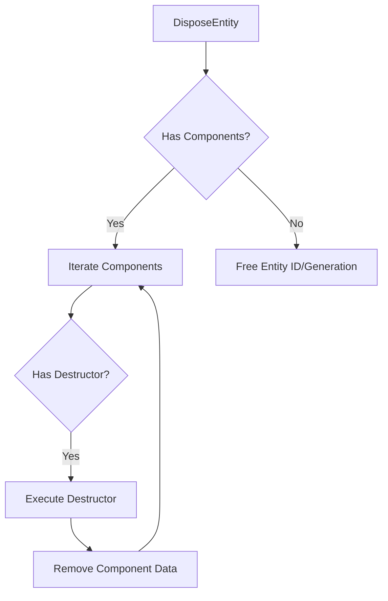

# ECS Lifecycle and Optimization Patterns

**Version:** 0.1.0
**Status:** Draft
**Layer:** concept

## Overview

This specification defines high-performance patterns for managing the lifecycle of entities and components, and optimizing data access through bitmask tagging and cached entity views.

## Related Specifications

- [world-system.md](world-system.md) - Central data store and entity management.
- [query-system.md](query-system.md) - Foundation for data access and filtering.
- [component-system.md](component-system.md) - Component registration and storage.

## 1. Motivation

As the number of entities and component types grows, the engine requires highly efficient mechanisms to:

1. Filter entities based on component combinations without full archetypal scans in every turn.
2. Ensure safe resource cleanup (e.g., GPU memory, file handles) when components are removed or entities are disposed.
3. Speed up repetitive queries that target stable sets of entities.

## 2. Constraints & Assumptions

- **Bitmask Limit**: Initial implementation assumes a maximum of 64 distinct component types for bitmask optimizations.
- **Thread Safety**: Access to component data and entity tags must be protected by appropriate synchronization primitives (e.g., RWMutex) to support parallel system execution.
- **Single World Scope**: Patterns described here apply to a single `World` instance.

## 3. Core Invariants

- **Invariant 1: Atomic Tag Updates**: Entity tags (bitmasks) must be updated atomically when a component is added or removed.
- **Invariant 2: Deterministic Cleanup**: Component destructors must be called immediately or at defined synchronization points before the entity's data is fully purged.
- **Invariant 3: View Consistency**: Cached entity views must remain synchronized with the current world state at all times (Reactive updates).

## 4. Invariant Compliance (Layer 2 only)

> This section is for Layer 2 implementation specifications.

## 5. Detailed Design

### 5.1 Bitmask Tagging System

Each entity carries a `Tag` (bitmask) representing the presence of registered components.

- **Component ID**: Every registered component type is assigned a unique incremental ID (0-63).
- **Tag Structure**: A `uint64` flags field where each bit represents a component ID.
- **Matching Logic**: A query matches an entity if: `(entity.Tag & query.RequiredTag) == query.RequiredTag`.

**Pseudo-code Flow:**

```plaintext
Function AddComponent(entity, component):
    Set bit at component.ID in entity.Tag
    Notify active Views of the tag change

Function Matches(tag, requirement):
    Return (tag AND requirement) == requirement
```

### 5.2 Component Destructors

Components may register a destructor function that is triggered during lifecycle events.

- **OnRemove**: Triggered when a specific component is removed from an entity.
- **OnDispose**: Triggered when the entity itself is destroyed.
- **Context**: The destructor receives the entity identifier and a reference to the component data.

**Flow Diagram:**



### 5.3 Entity Views (Caching)

A `View` is a cached collection of entities that match a specific `Tag` requirement.

- **Reactive Updates**: When an entity's tag changes (component added/removed), the world checks all active Views.
- **Addition**: If the new tag matches the view's requirement and it didn't match before, the entity is added to the cache.
- **Removal**: If the old tag matched but the new one doesn't, the entity is removed.
- **Performance**: Provides O(1) or O(N_matches) access for systems, bypassing the need to iterate all entities.

### 5.4 Spatial Registry Update Lifecycle

For entities with spatial presence (e.g. `Transform`, `Collider`), the engine maintains their state in a **Spatial Acceleration Structure** (Grid/Quadtree/BVH). The lifecycle of this registry is as follows:

- **Entity Movement**: When an entity's `Transform` changes, it is marked for spatial update.
- **Batch Processing**: Instead of updating the spatial registry per-entity, the `PhysicsSystem` performs a batch update at the beginning of each physics step.
- **Dormancy**: Entities that reach a "sleeping" state in the physics engine are skipped in subsequent spatial registry updates until awakened, reducing broad-phase overhead.
- **Clean Registration**: On entity disposal, its entry must be purged from the spatial registry immediately to prevent "ghost" query results.

## 6. Implementation Notes

1. Bitmask Extension: For projects requiring >64 components, the system should transition to bit-arrays or hierarchical tagging.
2. View Synchronization: Views should be updated immediately during `AddComponent`/`RemoveComponent` to ensure consistency for systems running in the same frame.

## 7. Drawbacks & Alternatives

- **Memory Overhead**: Maintaining multiple cached Views increases memory usage.
- **Alternative (Archetypes)**: While Archetypes (SoA) are the primary storage, bitmask tagging provides a faster "filter layer" for heterogeneous queries.

## Document History

| Version | Date | Description |
| :--- | :--- | :--- |
| 0.1.0 | 2026-03-27 | Initial Draft of lifecycle and optimization patterns |
| [example](examples/ecs-lifecycle) | | TBD: Placeholder for correlation |
