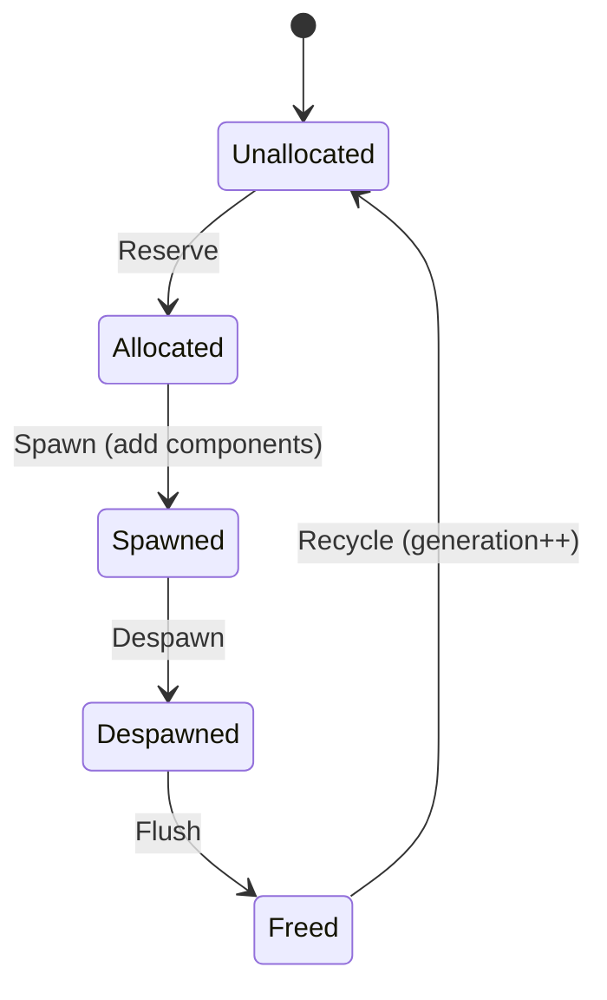

# Entity System

**Version:** 0.3.0
**Status:** Draft
**Layer:** concept

## Overview

Entities are lightweight identifiers for game objects. An Entity carries no data and no behavior — it is simply an ID that components are attached to. The entity system manages allocation, recycling, generational safety, and lifecycle states.

## Related Specifications

- [component-system.md](component-system.md) — Components are attached to Entities
- [command-system.md](command-system.md) — Entity spawn/despawn via deferred commands
- [hierarchy-system.md](hierarchy-system.md) — Parent-child relationships between entities

## 1. Motivation

Games constantly create and destroy objects. A robust entity system must:

- Provide cheap, copyable identifiers.
- Safely detect stale references to destroyed entities.
- Support high-throughput allocation and deallocation.
- Enable entity disabling without destroying data.

## 2. Constraints & Assumptions

- Entity IDs are 64-bit values combining an index and a generation counter.
- Generation prevents ABA problems: reusing an index increments the generation.
- Entity allocation is NOT thread-safe — it runs on the main thread or under exclusive access.
- Maximum entity count is bounded by index size (32-bit index = ~4 billion entities).

## 3. Core Invariants

- **INV-1**: An Entity ID is unique within its World for the lifetime of that entity.
- **INV-2**: After despawn, the same index may be reused but with an incremented generation.
- **INV-3**: Any operation on a despawned Entity (stale generation) must fail gracefully, not panic.
- **INV-4**: Entity allocation and deallocation are O(1) amortized.

## 4. Detailed Design

### 4.1 Entity ID Layout

```
Entity = { Index: uint32, Generation: uint32 }
```

- **Index**: Slot in the entity allocator. Reused after despawn.
- **Generation**: Incremented each time the slot is reused. Detects stale references.
- Packed into a single `uint64` for efficient storage and comparison.

### 4.2 Entity Lifecycle (5 Stages)



1. **Unallocated** — Slot is in the free list.
2. **Allocated** — ID reserved but no components yet (used by Commands for deferred spawn).
3. **Spawned** — Entity is alive with components, queryable by systems.
4. **Despawned** — Marked for removal. Components still exist until flush.
5. **Freed** — Components removed, slot returned to free list with incremented generation.

### 4.3 Entity Allocator

- Free list of available indices (LIFO stack for cache locality).
- `Reserve()` — pops from free list or extends the arena. Returns Entity with current generation.
- `Free(entity)` — pushes index back to free list, increments generation for that slot.
- `IsAlive(entity)` — checks if stored generation matches the entity's generation.

### 4.4 Entity Disabling

Entities can be temporarily disabled without despawning. Disabled entities:

- Retain all their components and data.
- Are excluded from default queries (like a built-in `Without[Disabled]` filter).
- Can be explicitly included via `Query.IncludeDisabled()`.
- Useful for object pooling, pause mechanics, and LOD systems.

### 4.5 Entity Collections

Typed collections for efficient entity storage:

- **EntitySet** — Unordered unique set with O(1) insert/remove/contains.
- **EntityHashMap[V]** — Entity-keyed hash map.
- **EntityVec** — Ordered list of entities.

### 4.6 Entity References

- **EntityRef** — Read-only view of an entity's components (borrowed from World).
- **EntityMut** — Read-write view of an entity's components.
- **EntityWorldMut** — Full mutable access to entity + World (for structural changes).

### 4.7 Placeholder and Special Entities

- `Entity.PLACEHOLDER` — A sentinel value (index=MAX, generation=0) used as a default. Never valid in a World.
- No global "null entity" — use `Option[Entity]` / pointer-to-nil patterns instead.

### 4.8 Dual-Phase Entity Registration

When entities are added to the world in bulk (e.g., spawning a scene), cascading effects can occur: adding a component triggers system discovery (see [system-scheduling.md §4.10](system-scheduling.md)), which may spawn more entities. To prevent ordering issues and partial states, entity registration uses a reentrancy-safe two-phase approach:

```plaintext
EntityRegistrationState
  add_level: int   // reentrancy counter

Phase 1 — Accumulation (add_level > 0):
  Entity is fully inserted into the allocator and tables.
  But: any newly discovered systems go into a pending queue.
  No system matching or initialization occurs during this phase.

Phase 2 — Flush (add_level returns to 0):
  FlushPendingSystems():
    - Sort pending systems by priority.
    - Initialize each system (OnSystemAdd).
    - Match ALL existing entities against new systems
      (systems "catch up" with entities created before discovery).
```

**Why this matters**: Without dual-phase, adding entity A could trigger system S, which processes A and spawns entity B, which triggers system T, which tries to process the still-initializing entity A — a reentrancy bug. The `add_level` counter serializes these cascades: inner spawns increment the counter, ensuring all pending systems are flushed only when the outermost spawn completes.

### 4.9 Entity Reference Counting

For long-lived references to entities (e.g., a UI widget referencing its data entity, an audio emitter tracking its spatial source), the entity system supports optional reference counting:

```plaintext
Entity
  AddReference()     // increment internal ref count
  Release()          // decrement; when zero, entity is eligible for deferred cleanup

EntityManager
  cleanup_queue: []Entity   // entities with ref_count == 0, pending despawn
```

This prevents premature despawn when multiple systems hold references to the same entity. The entity is only freed when all holders release it. Reference counting is opt-in — entities without references follow the standard immediate-despawn path.

### 4.10 Abstract Concept Entities

Not all entities represent visible game objects. Entities are equally suited for modeling **abstract concepts** — relationships, groups, sessions, and other logical constructs that need to carry data and participate in ECS queries.

**Examples:**

- **SquadEntity**: Represents a formation of units. Components: `SquadComponent { memberIDs []EntityID }`, `FormationComponent { shape, spacing }`. Member entities reference it via `SquadRef { squadEntity EntityID }`.
- **GameSessionEntity**: Tracks match state. Components: `SessionTimer`, `ScoreBoard`, `RoundState`.
- **SpawnWaveEntity**: Defines an enemy wave. Components: `WaveDefinition { enemies []EnemyDef }`, `WaveProgress { spawned, remaining int }`.
- **QuestEntity**: Tracks quest progress. Components: `QuestObjectives`, `QuestRewards`, `ActiveQuestTag`.

**Why entities instead of global resources?**

| Aspect | Global Resource (`Res[T]`) | Abstract Entity |
| :--- | :--- | :--- |
| Multiple instances | No (singleton) | Yes (many squads, quests) |
| Queryable | No | Yes (`Query[SquadComponent]`) |
| Debug components | No | Yes (attach `DebugOverlay`) |
| Lifecycle hooks | No | Yes (OnAdd, OnRemove) |
| Relationships | Manual | Via hierarchy/references |

**Guidelines:**

- If only one instance ever exists and no lifecycle hooks are needed, prefer `Res[T]`.
- If multiple instances exist, or the concept benefits from component composition, use an entity.
- Always use entity references (`EntityID`) rather than sharing pointers to the same data across entities (see [component-system.md §4.12](component-system.md) anti-pattern #1).

## 5. Open Questions

- Should the engine support remote entity allocation (reserving IDs from multiple threads)?
- Entity names: built-in `Name` component or separate debug-only system?

## Document History

| Version | Date | Description |
| :--- | :--- | :--- |
| 0.1.0 | 2026-03-25 | Initial draft |
| 0.2.0 | 2026-03-26 | Added dual-phase entity registration, entity reference counting |
| 0.3.0 | 2026-03-28 | Added abstract concept entities pattern (squads, sessions, quests as entities) |
| — | — | Planned examples: `examples/ecs/` |
