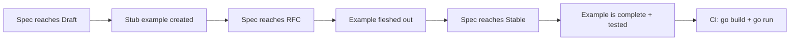

# Examples Framework

**Version:** 0.2.0
**Status:** Draft
**Layer:** concept

## Overview

Defines the structure, conventions, and categories for the engine's `examples/` directory — the primary validation and integration test polygon for all engine subsystems. Each example is a standalone Go program demonstrating a specific engine capability, serving both as documentation and as an executable test.

## Related Specifications

- [ecs-core-architecture.md](ecs-core-architecture.md) - Core ECS architecture that examples validate
- [render-pipeline.md](render-pipeline.md) - Render backend abstraction used by 2D/3D examples
- [app-framework.md](app-framework.md) - App builder pattern used as entry point for all examples

## 1. Motivation

A game engine without runnable examples is untestable and undocumented. The examples directory serves three critical purposes:

1. **Validation Polygon** — Every engine feature must have at least one example that exercises it end-to-end. Examples serve as integration tests that verify subsystems work together correctly.
2. **Living Documentation** — Examples are the first thing new users read. They demonstrate idiomatic usage patterns and best practices for the engine's Go API.
3. **Regression Detection** — When engine internals change, broken examples signal regressions immediately. The full example suite runs as part of CI.

## 2. Constraints & Assumptions

- Each example is a standalone `main.go` that compiles and runs independently.
- Examples depend only on the engine's public API (`pkg/ecs/` or `internal/` via `cmd/`).
- Examples must not import third-party packages outside the engine (respects C24 — stdlib-first).
- Render-dependent examples (2D/3D) use the engine's `RenderBackend` interface — they must work with any pluggable backend.
- Examples are named with lowercase, underscore-separated directory names.
- Each example directory contains a `README.md` with: purpose, what it demonstrates, how to run, expected output.

## 3. Core Invariants

- **INV-1**: Every specification (L1 or L2) in the engine MUST have at least one corresponding example before reaching `Stable` status.
- **INV-2**: Examples contain NO engine-internal logic. They use only the public API surface.
- **INV-3**: Examples must compile and run with `go run ./examples/{category}/{name}/` from the project root.
- **INV-4**: Examples must not panic under normal conditions. All errors are handled gracefully with informative output.
- **INV-5**: 2D/3D examples must work through the render backend abstraction, never through a specific graphics library directly.
- **INV-6**: Each example is self-contained — no shared state or imports between examples.

## 4. Detailed Design

### 4.1 Directory Structure

```plaintext
examples/
├── README.md                            # Master index: all examples with descriptions
│
├── hello_world/                         # The bare minimum: single-file "Hello, World!" app
│
├── ecs/                                 # ECS Core (Specs #1–7)
│   ├── hello_ecs/                       # Minimal: spawn entity, add component, run system
│   ├── ecs_guide/                       # Comprehensive ECS walkthrough (entities, components, systems, queries)
│   ├── entity_lifecycle/                # Create, destroy, generational IDs
│   ├── entity_disabling/                # Temporarily disable entities without despawning
│   ├── component_hooks/                 # OnAdd, OnInsert, OnRemove hooks for components
│   ├── component_storage/               # Table vs SparseSet storage strategies
│   ├── immutable_components/            # Read-only components that cannot be mutated after insertion
│   ├── query_filters/                   # With, Without, Changed, Added filters
│   ├── contiguous_query/                # Cache-friendly contiguous query iteration
│   ├── parallel_query/                  # Parallel iteration over entities
│   ├── custom_query_param/              # User-defined composite query parameters
│   ├── iter_combinations/               # Iterate all entity pair/triple combinations from a query
│   ├── system_ordering/                 # Before/After/Chain dependencies
│   ├── custom_schedule/                 # Custom schedules and executors
│   ├── custom_executor/                 # User-defined schedule executor
│   ├── startup_system/                  # One-time initialization systems
│   ├── run_conditions/                  # Conditional system execution
│   ├── one_shot_systems/                # On-demand single-execution systems
│   ├── generic_system/                  # Generic systems parameterized by component type
│   ├── system_param/                    # Custom system parameters
│   ├── system_stepping/                 # Debug step-through of systems one at a time
│   ├── nondeterministic_system_order/   # Detecting and resolving ambiguous system ordering
│   ├── commands/                        # Deferred entity mutations via command buffer
│   ├── delayed_commands/                # Time-delayed deferred commands
│   ├── callbacks/                       # Callback-style system invocation
│   ├── observers/                       # Reactive triggers on component lifecycle events
│   ├── observer_propagation/            # Observer event propagation through hierarchy
│   ├── message/                         # System-to-system typed message passing
│   ├── error_handling/                  # Graceful error handling patterns in systems
│   ├── dynamic/                         # Runtime-defined dynamic components and entities
│   ├── fixed_timestep/                  # Fixed-rate update loop for deterministic logic
│   ├── extraction/                      # Data extraction between app stages (main → render)
│   └── removal_detection/               # Detecting removed components on entities
│
├── world/                               # ECS Extended (Specs #8–12)
│   ├── resources/                       # Global singleton resources
│   ├── change_detection/                # Tick-based component change tracking
│   ├── hierarchy/                       # Parent-child entity relationships
│   ├── relationships/                   # Custom entity relations (graph edges)
│   ├── events/                          # Typed event bus: send and receive
│   ├── bundles/                         # Component grouping for spawning
│   └── entity_cloning/                  # Clone entities with all components
│
├── app/                                 # Engine Framework (Spec #13)
│   ├── empty/                           # Minimal app with no plugins
│   ├── plugin/                          # Plugin architecture: define and register
│   ├── plugin_group/                    # Plugin collections and default plugins
│   ├── custom_loop/                     # Custom game loop with fixed timestep
│   ├── headless/                        # No-render headless mode (server, tests)
│   ├── no_renderer/                     # App without any renderer attached
│   ├── return_after_run/                # App that returns control after Run() completes
│   ├── drag_and_drop/                   # File drag-and-drop handling
│   ├── logging/                         # Structured logging with log/slog
│   ├── log_layers/                      # Custom log layer configuration
│   └── persisting_preferences/          # Save/load user preferences across sessions
│
├── state/                               # State Machine (Spec #23)
│   ├── game_states/                     # Menu → Playing → Paused transitions
│   ├── sub_states/                      # Hierarchical state nesting
│   ├── computed_states/                 # States derived from other states
│   └── custom_transitions/              # User-defined state transition logic
│
├── input/                               # Input System (Spec #18)
│   ├── keyboard/                        # Key press/release/hold detection
│   ├── keyboard_events/                 # Raw keyboard event stream
│   ├── keyboard_modifiers/              # Modifier key combinations (Ctrl, Alt, Shift)
│   ├── char_input/                      # Character/text input events
│   ├── mouse/                           # Mouse position, buttons, scroll
│   ├── mouse_events/                    # Raw mouse event stream
│   ├── mouse_grab/                      # Mouse cursor lock and grab modes
│   ├── gamepad/                         # Controller button and axis input
│   ├── gamepad_events/                  # Raw gamepad event stream
│   ├── gamepad_rumble/                  # Haptic feedback / force feedback
│   ├── touch/                           # Touch input events
│   ├── touch_events/                    # Raw touch event stream
│   ├── text_input/                      # Text field input handling
│   └── input_map/                       # Action-mapped input abstraction
│
├── camera/                              # Camera (Spec #21 subset)
│   ├── camera_2d/                       # 2D orthographic camera setup
│   ├── camera_2d_top_down/              # Top-down 2D camera controller
│   ├── camera_2d_screen_shake/          # Screen shake effect for 2D
│   ├── camera_orbit/                    # Orbit camera around target
│   ├── camera_free/                     # Free-fly camera controller (3D)
│   ├── camera_first_person/             # First-person view model camera
│   ├── camera_pan/                      # Click-and-drag pan camera controller
│   ├── custom_projection/               # Custom camera projection matrix
│   ├── projection_zoom/                 # Orthographic/perspective zoom control
│   └── camera_sub_view/                 # Sub-viewport camera rendering
│
├── transform/                           # Transform System (Spec #19)
│   ├── transform/                       # Basic transform: position, rotation, scale
│   ├── translation/                     # Entity movement via translation
│   ├── rotation/                        # Entity rotation (2D and 3D)
│   ├── scale/                           # Entity scaling
│   ├── align/                           # Align transform to direction/target
│   └── propagation/                     # Hierarchy-based transform propagation
│
├── math/                                # Math Library (Spec #20)
│   ├── vectors/                         # Vec2/Vec3/Vec4 operations
│   ├── matrices/                        # Mat4 transformations
│   ├── quaternions/                     # Rotation with quaternions
│   ├── cubic_splines/                   # Cubic spline interpolation (Bezier, Hermite, B-Spline)
│   ├── bounding_2d/                     # 2D bounding shapes (AABB, circle) and intersection tests
│   ├── custom_primitives/               # User-defined geometric primitives
│   ├── random_sampling/                 # Random point sampling on shapes and volumes
│   └── render_primitives/               # Visual debugging of math primitives
│
├── 2d/                                  # 2D Rendering (via Spec #21)
│   ├── shapes/                          # 2D primitives (rect, circle, polygon, arcs)
│   ├── sprite/                          # Sprite rendering from texture
│   ├── sprite_animation/                # Animated sprite playback
│   ├── sprite_sheet/                    # Texture atlas and sprite sheets
│   ├── sprite_flipping/                 # Horizontal/vertical sprite flip
│   ├── sprite_scale/                    # Sprite size and scaling
│   ├── sprite_slice/                    # 9-slice sprite rendering
│   ├── sprite_tile/                     # Tiled sprite repeating pattern
│   ├── mesh2d/                          # Custom 2D meshes
│   ├── mesh2d_vertex_color/             # 2D meshes with per-vertex color
│   ├── mesh2d_arcs/                     # 2D arc and sector meshes
│   ├── tilemap/                         # Tile-based map rendering
│   ├── tilemap_orientation/             # Isometric and hexagonal tilemaps
│   ├── text2d/                          # 2D text rendering
│   ├── texture_atlas/                   # Texture atlas creation and usage
│   ├── bloom_2d/                        # 2D bloom post-processing effect
│   ├── transparency_2d/                 # Alpha blending and transparency
│   ├── wireframe_2d/                    # 2D wireframe debug rendering
│   ├── pixel_grid_snap/                 # Pixel-perfect rendering alignment
│   ├── viewport_to_world_2d/            # Screen coordinates to world position (2D)
│   ├── rotate_to_cursor/                # Rotate sprite toward mouse cursor
│   ├── rotation_2d/                     # 2D rotation animation
│   ├── move_sprite/                     # Sprite movement with input
│   ├── repeated_texture/                # Repeating/tiling texture on mesh
│   └── cpu_draw/                        # CPU-side pixel drawing to texture
│
├── 3d/                                  # 3D Rendering (via Spec #21)
│   ├── scene_3d/                        # Basic 3D scene: mesh + camera + light
│   ├── shapes_3d/                       # 3D primitives (cube, sphere, cylinder)
│   ├── lighting/                        # Point, directional, spot lights
│   ├── spotlight/                       # Spotlight cone and falloff
│   ├── shadow_biases/                   # Shadow map bias tuning
│   ├── shadow_caster_receiver/          # Control which meshes cast/receive shadows
│   ├── contact_shadows/                 # Screen-space contact shadows
│   ├── pbr/                             # Physically-based rendering materials
│   ├── clearcoat/                       # Multi-layer PBR clearcoat material
│   ├── anisotropy/                      # Anisotropic material reflections
│   ├── specular_tint/                   # Specular tint color control
│   ├── animated_material/               # Material property animation over time
│   ├── blend_modes/                     # Blend mode comparison (alpha, additive, multiply)
│   ├── texture/                         # Texture loading and application to meshes
│   ├── generate_custom_mesh/            # Programmatic mesh generation from vertices
│   ├── vertex_colors/                   # Per-vertex coloring on 3D meshes
│   ├── lines/                           # 3D line rendering
│   ├── parenting/                       # 3D hierarchy and transform inheritance
│   ├── orthographic/                    # Orthographic 3D camera projection
│   ├── split_screen/                    # Split-screen multi-camera setup
│   ├── render_to_texture/               # Render scene to offscreen texture
│   ├── fog/                             # Distance-based fog effects
│   ├── atmospheric_fog/                 # Atmospheric scattering fog
│   ├── volumetric_fog/                  # Volumetric fog volumes
│   ├── scrolling_fog/                   # Animated scrolling fog texture
│   ├── skybox/                          # Skybox / environment map
│   ├── atmosphere/                      # Procedural sky atmosphere rendering
│   ├── bloom_3d/                        # 3D bloom post-processing effect
│   ├── tonemapping/                     # HDR tonemapping operators comparison
│   ├── color_grading/                   # Color grading and LUT application
│   ├── anti_aliasing/                   # Anti-aliasing techniques (MSAA, FXAA, TAA)
│   ├── depth_of_field/                  # Depth of field camera effect
│   ├── motion_blur/                     # Per-object and camera motion blur
│   ├── post_processing/                 # Custom post-processing passes
│   ├── deferred_rendering/              # Deferred rendering pipeline
│   ├── transparency_3d/                 # 3D transparency and blend modes
│   ├── order_independent_transparency/  # OIT for correct transparent rendering
│   ├── wireframe/                       # 3D wireframe debug rendering
│   ├── lightmaps/                       # Pre-baked lightmap support
│   ├── light_textures/                  # Projected light textures (gobos)
│   ├── irradiance_volumes/              # Global illumination via irradiance probes
│   ├── reflection_probes/               # Environment reflection probes
│   ├── mirror/                          # Planar mirror reflection
│   ├── ssao/                            # Screen-space ambient occlusion
│   ├── ssr/                             # Screen-space reflections
│   ├── parallax_mapping/                # Parallax/displacement mapping on surfaces
│   ├── decal/                           # Decal projection onto surfaces
│   ├── occlusion_culling/               # GPU-driven occlusion culling
│   ├── visibility_range/                # LOD-style distance-based visibility
│   ├── mesh_ray_cast/                   # Ray casting against 3D meshes
│   ├── spherical_area_lights/           # Area light approximation (spherical)
│   ├── mixed_lighting/                  # Combining baked and dynamic lights
│   ├── auto_exposure/                   # Automatic camera exposure adjustment
│   ├── transmission/                    # Transmission (glass, thin-surface refraction)
│   ├── viewport_to_world_3d/            # Screen coordinates to world ray (3D)
│   └── two_passes/                      # Multi-pass rendering technique
│
├── animation/                           # Animation (future spec)
│   ├── animated_mesh/                   # Skeletal mesh animation playback
│   ├── animated_mesh_control/           # Animation playback control (speed, pause, seek)
│   ├── animated_mesh_events/            # Events triggered by animation keyframes
│   ├── animated_transform/              # Tween-based transform animations
│   ├── animation_graph/                 # Animation state machine / blend graph
│   ├── animation_masks/                 # Masking animation to specific bones/joints
│   ├── animation_events/                # Animation event triggers and callbacks
│   ├── morph_targets/                   # Shape key / morph target animation
│   ├── color_animation/                 # Animated color transitions
│   ├── eased_motion/                    # Easing-function-driven motion
│   ├── easing_functions/                # Visual catalog of easing functions
│   ├── sprite_animation/                # Frame-by-frame sprite animation
│   └── custom_skinned_mesh/             # Programmatically skinned mesh
│
├── scene/                               # Scene Management (Spec #16)
│   ├── save_load/                       # Scene serialization to/from file
│   └── dynamic_scene/                   # Runtime scene construction
│
├── asset/                               # Asset Management (Spec #15)
│   ├── asset_loading/                   # Basic asset loading workflow
│   ├── asset_saving/                    # Save processed assets to disk
│   ├── asset_settings/                  # Per-asset load settings and overrides
│   ├── custom_asset/                    # User-defined asset types
│   ├── custom_asset_reader/             # Custom asset source (network, archive, etc.)
│   ├── generated_assets/                # Procedurally generated assets at load time
│   ├── hot_asset_reloading/             # Live asset reloading on file change
│   ├── multi_asset_sync/                # Synchronize loading of multiple dependent assets
│   ├── repeated_texture/                # Repeating/tiling texture on loaded asset
│   ├── alter_mesh/                      # Modify loaded mesh data at runtime
│   ├── alter_sprite/                    # Modify loaded sprite data at runtime
│   └── asset_processing/               # Asset transformation pipeline
│
├── async/                               # Task Parallelism (Spec #14)
│   ├── async_compute/                   # Background goroutine computation
│   ├── async_channel/                   # Channel-based async communication pattern
│   └── external_source/                 # External data source on separate goroutine
│
├── reflect/                             # Type Registry (Spec #17)
│   ├── reflection/                      # Basic runtime type introspection
│   ├── reflection_types/                # Inspecting struct fields, enums, lists, maps
│   ├── dynamic_types/                   # Runtime-constructed dynamic type proxies
│   ├── generic_reflection/              # Reflection on generic/parameterized types
│   ├── custom_attributes/               # User-defined metadata attributes on types
│   ├── function_reflection/             # Runtime introspection of function signatures
│   ├── type_data/                       # Custom type-level metadata
│   └── serialization/                   # Reflect-based serialization/deserialization
│
├── gizmos/                              # Debug Visualization (Spec #24 subset)
│   ├── gizmos_2d/                       # 2D debug shapes (lines, circles, rects)
│   ├── gizmos_3d/                       # 3D debug shapes (lines, spheres, boxes)
│   ├── text_gizmos_2d/                  # 2D debug text overlay
│   ├── text_gizmos_3d/                  # 3D world-space debug text
│   ├── axes_gizmo/                      # Coordinate axes visualization
│   └── light_gizmos/                    # Light source debug visualization
│
├── picking/                             # Object Picking / Selection
│   ├── simple_picking/                  # Click-to-select entity
│   ├── mesh_picking/                    # Ray-cast mesh picking in 3D
│   ├── sprite_picking/                  # Click-to-select sprite in 2D
│   ├── drag_drop_picking/               # Drag and drop entities
│   └── debug_picking/                   # Debug visualization of picking targets
│
├── diagnostic/                          # Diagnostics (Spec #24)
│   ├── fps_overlay/                     # FPS and frame time overlay
│   ├── log_diagnostics/                 # Diagnostic metrics logged to console
│   ├── custom_diagnostic/               # User-defined metrics
│   ├── enabling_disabling_diagnostic/   # Toggle diagnostics at runtime
│   ├── profiling/                       # pprof integration
│   └── infinite_grid/                   # Debug infinite reference grid
│
├── audio/                               # Audio System (Spec #25)
│   ├── audio_basic/                     # Play sound effects and music
│   ├── audio_control/                   # Volume, pause, resume, stop
│   ├── audio_pitch/                     # Pitch shifting audio playback
│   ├── audio_soundtrack/                # Background music with crossfade
│   ├── spatial_audio_2d/                # 2D positional audio
│   └── spatial_audio_3d/                # 3D positional audio with listener
│
├── window/                              # Window System (Spec #22)
│   ├── window_settings/                 # Window size, title, mode, decorations
│   ├── clear_color/                     # Background clear color
│   ├── window_resizing/                 # Dynamic window resize handling
│   ├── scale_factor_override/           # DPI / scale factor control
│   ├── multiple_windows/                # Multi-window rendering
│   ├── multi_window_text/               # Text rendering across multiple windows
│   ├── custom_cursor/                   # Custom cursor images
│   ├── monitor_info/                    # Monitor/display detection and properties
│   ├── low_power/                       # Low-power/battery-friendly render mode
│   ├── screenshot/                      # Capture window to image file
│   ├── transparent_window/              # Transparent/borderless window
│   ├── window_drag_move/                # Window dragging by custom region
│   └── persisting_window_settings/      # Save/load window preferences
│
├── time/                                # Time Management (Spec #13 subset)
│   ├── time/                            # Delta time, elapsed time, frame count
│   ├── timers/                          # One-shot and repeating timers
│   └── virtual_time/                    # Pausable/scalable virtual time
│
├── config/                              # Configuration (Spec #26)
│   └── engine_config/                   # Engine settings, file-based config loading
│
├── ui/                                  # UI System (future spec)
│   ├── layout/                          # Flexbox-style UI layout
│   ├── styling/                         # UI element styling (colors, borders, fonts)
│   ├── text/                            # UI text rendering and formatting
│   ├── widgets/                         # Buttons, sliders, checkboxes, scroll views
│   ├── navigation/                      # Keyboard/gamepad UI navigation
│   ├── images/                          # Image display in UI
│   ├── scroll_and_overflow/             # Scrollable containers and overflow clipping
│   ├── ui_scaling/                      # UI coordinate scaling for different resolutions
│   ├── ui_material/                     # Custom materials on UI elements
│   ├── ui_transform/                    # Transform-based UI positioning
│   ├── ui_drag_and_drop/                # Drag-and-drop within UI
│   └── render_ui_to_texture/            # Render UI to offscreen texture
│
├── shader/                              # Shader System (Spec #21 subset)
│   ├── animate_shader/                  # Time-driven animated shader
│   ├── shader_material/                 # Custom shader material
│   ├── shader_material_2d/              # Custom shader material for 2D
│   ├── shader_defs/                     # Shader preprocessor defines
│   ├── extended_material/               # Extend built-in materials with custom shading
│   ├── compute_shader/                  # General-purpose compute shader
│   ├── gpu_readback/                    # Read data back from GPU to CPU
│   ├── storage_buffer/                  # Shader storage buffer objects
│   ├── array_texture/                   # Texture array sampling in shaders
│   ├── fullscreen_material/             # Full-screen post-process shader
│   ├── shader_prepass/                  # Depth/normal prepass data in shaders
│   ├── custom_post_processing/          # Custom post-processing effect pipeline
│   ├── custom_mesh_pipeline/            # Custom render pipeline for meshes
│   └── custom_vertex_attribute/         # User-defined vertex attributes
│
├── movement/                            # Cross-cutting gameplay patterns
│   ├── physics_fixed_timestep/          # Deterministic physics in fixed update
│   └── smooth_follow/                   # Camera smooth follow
│
├── showcase/                            # Complete mini-games and demos
│   ├── breakout/                        # Classic Breakout clone
│   ├── game_menu/                       # Full game menu (main menu, settings, pause)
│   ├── loading_screen/                  # Asset loading progress screen
│   └── stepping/                        # Interactive system stepping debugger
│
└── stress_test/                         # Performance benchmarks
    ├── many_entities/                   # 100K+ entity spawn and iterate
    ├── many_components/                 # Archetype stress with many component types
    ├── many_systems/                    # System throughput benchmark
    ├── many_sprites/                    # Sprite rendering stress test
    ├── many_animated_sprites/           # Animated sprite rendering stress test
    ├── many_cubes/                      # 3D cube rendering stress test
    ├── many_lights/                     # Light count stress test
    ├── many_cameras_lights/             # Combined camera + light stress test
    ├── many_buttons/                    # UI button stress test
    ├── many_glyphs/                     # Text/glyph rendering stress test
    ├── many_gizmos/                     # Debug gizmo rendering stress test
    ├── many_materials/                  # Material variety stress test
    ├── many_foxes/                      # Animated 3D model stress test
    ├── many_morph_targets/              # Morph target animation stress test
    ├── many_text2d/                     # 2D text rendering stress test
    ├── transform_hierarchy/             # Deep hierarchy propagation stress test
    └── text_pipeline/                   # Text layout pipeline stress test
```

### 4.2 Example Template

Each example follows a consistent structure:

```plaintext
examples/{category}/{name}/
├── main.go         # Entry point: func main()
└── README.md       # Description, usage, expected output
```

**main.go** structure (pseudo-code):

```plaintext
package main

// import engine packages

func main() {
    app := engine.NewApp()
    app.AddPlugins(DefaultPlugins)
    app.AddSystems(Update, mySystem)
    app.Run()
}

// System functions below
```

**README.md** template:

```markdown
# {Example Name}

{One-line description of what this example demonstrates.}

## Demonstrates

- Feature A from spec X
- Feature B from spec Y

## How to Run

    go run ./examples/{category}/{name}/

## Expected Output

{Description or screenshot of what the user should see.}
```

### 4.3 Category-to-Specification Mapping

| Category | Specifications Covered | Examples | Priority |
| :--- | :--- | :--- | :--- |
| `hello_world/` | #13 app-framework | 1 | P1 |
| `ecs/` | #1 ecs-core-architecture, #2 entity, #3 component, #4 storage, #5 query, #6 system, #7 schedule | 33 | P1 |
| `world/` | #8 world, #9 event-observer, #10 bundle-spawn, #11 relationship-hierarchy, #12 change-detection | 7 | P2 |
| `app/` | #13 app-framework | 11 | P3 |
| `state/` | #23 state-machine | 4 | P4 |
| `input/` | #18 input-system | 14 | P4 |
| `camera/` | #21 render-pipeline (camera subset) | 10 | P4 |
| `transform/` | #19 transform-system | 6 | P4 |
| `math/` | #20 math | 8 | P4 |
| `2d/` | #21 render-pipeline (2D subset) | 25 | P4 |
| `3d/` | #21 render-pipeline (3D subset) | 48 | P4 |
| `animation/` | future spec | 13 | P5 |
| `scene/` | #16 scene-management | 2 | P3 |
| `asset/` | #15 asset-management | 12 | P3 |
| `async/` | #14 task-parallelism | 3 | P3 |
| `reflect/` | #17 reflect-registry | 8 | P3 |
| `gizmos/` | #24 diagnostic-system (debug viz subset) | 6 | P4 |
| `picking/` | cross-cutting (input + render + ECS) | 5 | P4 |
| `diagnostic/` | #24 diagnostic-system | 6 | P4 |
| `audio/` | #25 audio-system | 6 | P4 |
| `window/` | #22 window-system | 13 | P4 |
| `time/` | #13 app-framework (time subset) | 3 | P4 |
| `config/` | #26 config-system | 1 | P4 |
| `ui/` | future spec | 12 | P5 |
| `shader/` | #21 render-pipeline (shader subset) | 14 | P4 |
| `movement/` | cross-cutting (multiple specs) | 2 | P4 |
| `showcase/` | cross-cutting (complete demos) | 4 | P5 |
| `stress_test/` | performance benchmarks (all specs) | 17 | P2 |

### 4.4 Example Lifecycle



1. **Draft**: A stub example directory is created with a `README.md` and a `main.go` containing only the intended structure.
2. **RFC**: The example is implemented using the spec's API, even if the engine code is not yet written (compile errors expected).
3. **Stable**: The example compiles, runs, and produces the expected output. It becomes a CI gate.

### 4.5 CI Integration

All examples are validated in CI:

```bash
go build ./examples/...           # All examples must compile
go vet ./examples/...             # No vet warnings
go test ./examples/stress_test/... -bench -benchmem  # Benchmarks run with memory profiling
```

Render-dependent examples (2D/3D) run in headless mode with a mock render backend for CI.

## 5. Implementation Notes

1. **Start with `ecs/hello_ecs/`** — the simplest possible example to validate the ECS core works.
2. **Then `ecs/` category** — one example per core spec, aligned with P1 batch.
3. **`stress_test/many_entities/`** — early benchmark to validate SoA performance.
4. **2D examples before 3D** — 2D requires less render infrastructure.
5. **3D examples** — after render pipeline abstraction is defined.

## 6. Drawbacks & Alternatives

**Drawback**: Maintaining 280+ examples is a significant effort. Each engine API change may break multiple examples.
**Mitigation**: Examples are small (50–200 lines). CI catches breakage immediately. Examples follow a single template, making bulk updates feasible. Categories are independent — changes to one subsystem only affect its category.

**Alternative considered**: Using `_test.go` files instead of standalone examples.
**Rejected**: Tests verify correctness; examples demonstrate usage. They serve different audiences. Both should exist.

**Alternative considered**: A single monolithic `demo/` application.
**Rejected**: Monolithic demos are hard to navigate, harder to debug, and don't map cleanly to individual specs.

## Document History

| Version | Date | Description |
| :--- | :--- | :--- |
| 0.1.0 | 2026-03-25 | Initial Draft |
| 0.2.0 | 2026-03-25 | Expanded: full example catalog from reference engine (280+ examples across 28 categories). Added categories: camera, gizmos, picking, time, ui, shader, showcase. Excluded language-specific examples. |
