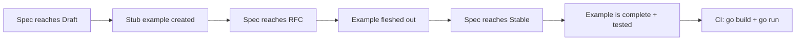

# Examples Framework

**Version:** 0.1.0
**Status:** Draft
**Layer:** concept

## Overview

Defines the structure, conventions, and categories for the engine's `examples/` directory — the primary validation and integration test polygon for all engine subsystems. Each example is a standalone Go program demonstrating a specific engine capability, serving both as documentation and as an executable test.

## Related Specifications

- [ecs-core-architecture.md](ecs-core-architecture.md) - Core ECS architecture that examples validate
- [render-pipeline.md](render-pipeline.md) - Render backend abstraction used by 2D/3D examples
- [app-framework.md](app-framework.md) - App builder pattern used as entry point for all examples

## 1. Motivation

A game engine without runnable examples is untestable and undocumented. The examples directory serves three critical purposes:

1. **Validation Polygon** — Every engine feature must have at least one example that exercises it end-to-end. Examples serve as integration tests that verify subsystems work together correctly.
2. **Living Documentation** — Examples are the first thing new users read. They demonstrate idiomatic usage patterns and best practices for the engine's Go API.
3. **Regression Detection** — When engine internals change, broken examples signal regressions immediately. The full example suite runs as part of CI.

## 2. Constraints & Assumptions

- Each example is a standalone `main.go` that compiles and runs independently.
- Examples depend only on the engine's public API (`pkg/ecs/` or `internal/` via `cmd/`).
- Examples must not import third-party packages outside the engine (respects C24 — stdlib-first).
- Render-dependent examples (2D/3D) use the engine's `RenderBackend` interface — they must work with any pluggable backend.
- Examples are named with lowercase, underscore-separated directory names.
- Each example directory contains a `README.md` with: purpose, what it demonstrates, how to run, expected output.

## 3. Core Invariants

- **INV-1**: Every specification (L1 or L2) in the engine MUST have at least one corresponding example before reaching `Stable` status.
- **INV-2**: Examples contain NO engine-internal logic. They use only the public API surface.
- **INV-3**: Examples must compile and run with `go run ./examples/{category}/{name}/` from the project root.
- **INV-4**: Examples must not panic under normal conditions. All errors are handled gracefully with informative output.
- **INV-5**: 2D/3D examples must work through the render backend abstraction, never through a specific graphics library directly.
- **INV-6**: Each example is self-contained — no shared state or imports between examples.

## 5. Detailed Design

### 5.1 Directory Structure

```plaintext
examples/
├── README.md                        # Master index: all examples with descriptions
│
├── ecs/                             # ECS Core (Specs #1–7)
│   ├── hello_ecs/                   # Minimal: spawn entity, add component, run system
│   ├── entity_lifecycle/            # Create, destroy, generational IDs
│   ├── component_storage/           # Table vs SparseSet storage strategies
│   ├── query_filters/               # With, Without, Changed, Added filters
│   ├── parallel_query/              # Parallel iteration over entities
│   ├── system_ordering/             # Before/After/Chain dependencies
│   ├── custom_schedule/             # Custom schedules and executors
│   ├── startup_system/              # One-time initialization systems
│   ├── run_conditions/              # Conditional system execution
│   └── commands/                    # Deferred entity mutations
│
├── world/                           # ECS Extended (Specs #8–12)
│   ├── resources/                   # Global singleton resources
│   ├── change_detection/            # Tick-based component change tracking
│   ├── hierarchy/                   # Parent-child entity relationships
│   ├── relationships/               # Custom entity relations
│   ├── observers/                   # Reactive triggers on component events
│   ├── events/                      # Typed event bus: send and receive
│   ├── bundles/                     # Component grouping for spawning
│   └── entity_cloning/              # Clone entities with components
│
├── app/                             # Engine Framework (Spec #13)
│   ├── plugin/                      # Plugin architecture
│   ├── plugin_group/                # Plugin collections
│   ├── custom_loop/                 # Custom game loop with fixed timestep
│   ├── headless/                    # No-render headless mode (server, tests)
│   └── logging/                     # Structured logging with log/slog
│
├── state/                           # State Machine (Spec #23)
│   ├── game_states/                 # Menu → Playing → Paused transitions
│   ├── sub_states/                  # Hierarchical state nesting
│   └── computed_states/             # States derived from other states
│
├── input/                           # Input System (Spec #18)
│   ├── keyboard/                    # Key press/release/hold detection
│   ├── mouse/                       # Mouse position, buttons, scroll
│   ├── gamepad/                     # Controller support
│   └── input_map/                   # Action-mapped input abstraction
│
├── transform/                       # Transform System (Spec #19)
│   ├── basic/                       # Position, rotation, scale
│   └── propagation/                 # Hierarchy-based transform propagation
│
├── math/                            # Math Library (Spec #20)
│   ├── vectors/                     # Vec2/Vec3/Vec4 operations
│   ├── matrices/                    # Mat4 transformations
│   └── quaternions/                 # Rotation with quaternions
│
├── 2d/                              # 2D Rendering (via Spec #21)
│   ├── shapes/                      # Drawing 2D primitives (rect, circle, polygon)
│   ├── sprite/                      # Sprite rendering and animation
│   ├── sprite_sheet/                # Texture atlas and sprite sheets
│   ├── tilemap/                     # Tile-based map rendering
│   ├── text/                        # 2D text rendering
│   ├── camera_2d/                   # 2D camera setup and control
│   ├── transparency/                # Alpha blending and transparency
│   └── move_sprite/                 # Sprite movement with input
│
├── 3d/                              # 3D Rendering (via Spec #21)
│   ├── scene/                       # Basic 3D scene: mesh + camera + light
│   ├── shapes/                      # 3D primitives (cube, sphere, cylinder)
│   ├── lighting/                    # Point, directional, spot lights
│   ├── materials/                   # PBR materials, textures
│   ├── custom_mesh/                 # Programmatic mesh generation
│   ├── camera_3d/                   # 3D camera (orbit, fly, FPS)
│   ├── parenting/                   # 3D hierarchy and transform inheritance
│   ├── fog/                         # Distance fog effects
│   ├── shadows/                     # Shadow mapping
│   ├── skybox/                      # Skybox/environment map
│   └── transparency/                # 3D transparency and blend modes
│
├── animation/                       # Animation (future spec)
│   ├── sprite_animation/            # Frame-by-frame sprite animation
│   ├── transform_animation/         # Tween-based transform animations
│   └── skeletal/                    # Skeletal/bone animation (placeholder)
│
├── scene/                           # Scene Management (Spec #16)
│   ├── save_load/                   # Scene serialization to/from file
│   └── dynamic_scene/              # Runtime scene construction
│
├── asset/                           # Asset Management (Spec #15)
│   ├── loading/                     # Load textures, meshes, sounds
│   ├── hot_reload/                  # Live asset reloading
│   └── custom_loader/               # User-defined asset loaders
│
├── async/                           # Task Parallelism (Spec #14)
│   ├── compute_task/                # Background goroutine computation
│   └── io_task/                     # Async file/network IO
│
├── reflect/                         # Type Registry (Spec #17)
│   ├── type_registry/               # Runtime type introspection
│   └── serialization/               # Reflect-based serialization
│
├── diagnostic/                      # Diagnostics (Spec #24)
│   ├── fps_counter/                 # FPS and frame time display
│   ├── custom_diagnostic/           # User-defined metrics
│   └── profiling/                   # pprof integration
│
├── audio/                           # Audio System (Spec #25)
│   ├── basic/                       # Play sound effects and music
│   └── spatial/                     # 3D positional audio
│
├── window/                          # Window System (Spec #22)
│   ├── settings/                    # Window size, title, fullscreen
│   ├── multiple_windows/            # Multi-window rendering
│   └── cursor/                      # Cursor modes and custom cursors
│
├── config/                          # Configuration (Spec #26)
│   └── engine_config/               # Engine settings, TOML loading
│
├── movement/                        # Cross-cutting gameplay patterns
│   ├── velocity/                    # Velocity-based movement
│   └── smooth_follow/               # Camera smooth follow
│
└── stress_test/                     # Performance benchmarks
    ├── many_entities/               # 100K+ entity spawn and iterate
    ├── many_systems/                # System throughput benchmark
    ├── many_sprites/                # Sprite rendering stress test
    └── many_lights/                 # Light count stress test
```

### 5.2 Example Template

Each example follows a consistent structure:

```plaintext
examples/{category}/{name}/
├── main.go         # Entry point: func main()
└── README.md       # Description, usage, expected output
```

**main.go** structure (pseudo-code):

```plaintext
package main

// import engine packages

func main() {
    app := engine.NewApp()
    app.AddPlugins(DefaultPlugins)
    app.AddSystems(Update, mySystem)
    app.Run()
}

// System functions below
```

**README.md** template:

```markdown
# {Example Name}

{One-line description of what this example demonstrates.}

## Demonstrates

- Feature A from spec X
- Feature B from spec Y

## How to Run

    go run ./examples/{category}/{name}/

## Expected Output

{Description or screenshot of what the user should see.}
```

### 5.3 Category-to-Specification Mapping

| Category | Specifications Covered | Priority |
| :--- | :--- | :--- |
| `ecs/` | #1 ecs-core-architecture, #2 entity, #3 component, #4 storage, #5 query, #6 system, #7 schedule | P1 |
| `world/` | #8 world, #9 event-observer, #10 bundle-spawn, #11 relationship-hierarchy, #12 change-detection | P2 |
| `app/` | #13 app-framework | P3 |
| `state/` | #23 state-machine | P4 |
| `input/` | #18 input-system | P4 |
| `transform/` | #19 transform-system | P4 |
| `math/` | #20 math | P4 |
| `2d/` | #21 render-pipeline (2D subset) | P4 |
| `3d/` | #21 render-pipeline (3D subset) | P4 |
| `animation/` | future spec | P5 |
| `scene/` | #16 scene-management | P3 |
| `asset/` | #15 asset-management | P3 |
| `async/` | #14 task-parallelism | P3 |
| `reflect/` | #17 reflect-registry | P3 |
| `diagnostic/` | #24 diagnostic-system | P4 |
| `audio/` | #25 audio-system | P4 |
| `window/` | #22 window-system | P4 |
| `config/` | #26 config-system | P4 |
| `movement/` | cross-cutting (multiple specs) | P4 |
| `stress_test/` | performance benchmarks (all specs) | P2 |

### 5.4 Example Lifecycle



1. **Draft**: A stub example directory is created with a `README.md` and a `main.go` containing only the intended structure.
2. **RFC**: The example is implemented using the spec's API, even if the engine code is not yet written (compile errors expected).
3. **Stable**: The example compiles, runs, and produces the expected output. It becomes a CI gate.

### 5.5 CI Integration

All examples are validated in CI:

```bash
go build ./examples/...           # All examples must compile
go vet ./examples/...             # No vet warnings
go test ./examples/stress_test/... -bench -benchmem  # Benchmarks run with memory profiling
```

Render-dependent examples (2D/3D) run in headless mode with a mock render backend for CI.

## 6. Implementation Notes

1. **Start with `ecs/hello_ecs/`** — the simplest possible example to validate the ECS core works.
2. **Then `ecs/` category** — one example per core spec, aligned with P1 batch.
3. **`stress_test/many_entities/`** — early benchmark to validate SoA performance.
4. **2D examples before 3D** — 2D requires less render infrastructure.
5. **3D examples** — after render pipeline abstraction is defined.

## 7. Drawbacks & Alternatives

**Drawback**: Maintaining 80+ examples is a significant effort. Each engine API change may break multiple examples.
**Mitigation**: Examples are small (50–200 lines). CI catches breakage immediately. Examples follow a single template, making bulk updates feasible.

**Alternative considered**: Using `_test.go` files instead of standalone examples.
**Rejected**: Tests verify correctness; examples demonstrate usage. They serve different audiences. Both should exist.

**Alternative considered**: A single monolithic `demo/` application.
**Rejected**: Monolithic demos are hard to navigate, harder to debug, and don't map cleanly to individual specs.

## Document History

| Version | Date | Description |
| :--- | :--- | :--- |
| 0.1.0 | 2026-03-25 | Initial Draft |
