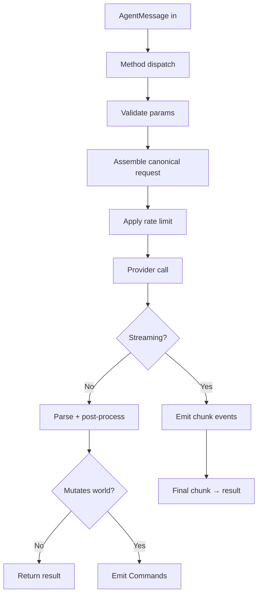

# AI API Plugin (`pkg/plugins/aiapi/`)

**Version:** 0.1.0
**Status:** Draft
**Layer:** concept

## Overview

The AI API Plugin is a **first-party reference plugin** that connects the engine's AI Assistant System (`l1-ai-assistant-system.md`) to remote large-language-model providers over HTTP. It is not an example in `examples/`; it ships as a real, supported package at `pkg/plugins/aiapi/` and is the canonical exemplar of the third-party plugin distribution model defined in `l1-plugin-distribution.md`.

The plugin abstracts over the small set of HTTP-based provider APIs that have converged on the OpenAI-compatible chat-completions schema (OpenAI itself, Anthropic Claude via Messages API, Google Gemini, and any locally-hosted server speaking the same protocol such as `llama.cpp`, `ollama`, or `vLLM`). It exposes the standard agent methods from `l1-ai-assistant-system.md` §4.5 (`chat`, `suggest_components`, `generate_scene`, etc.) and routes them to the configured provider.

This specification serves a dual purpose:

1. **Functional contract** for an AI integration that ships with the engine.
2. **Reference implementation** demonstrating how a non-trivial plugin uses the public SDK, declares capabilities, manages secrets, and runs in either delivery mode without behavioural change.

## Related Specifications

- [l1-plugin-distribution.md](l1-plugin-distribution.md) — Defines the manifest, lifecycle, and capability model this plugin uses.
- [l1-ai-assistant-system.md](l1-ai-assistant-system.md) — Defines the agent protocol, capability vocabulary, and standard methods this plugin implements.
- [l1-app-framework.md](l1-app-framework.md) — Plugin trait the AI API plugin implements.
- [l1-task-system.md](l1-task-system.md) — Background HTTP requests run on the engine's worker pool, never on the main schedule.
- [l1-error-core.md](l1-error-core.md) — Provider/HTTP errors map to the engine's structured error taxonomy (`E-PLUGIN-AIAPI-{NNN}`).
- [l1-event-system.md](l1-event-system.md) — Streaming responses are delivered as `AssistantStreamEvent` events.
- [l1-diagnostic-system.md](l1-diagnostic-system.md) — Per-provider latency, token counts, and error counters are published as diagnostics.
- [l1-definition-system.md](l1-definition-system.md) — `generate_ui` / `generate_scene` outputs are emitted as definition documents.

## 1. Motivation

The AI Assistant System defines **how** AI agents integrate with the editor; it leaves **which** agents are available unspecified. Developers wanting AI features today face three poor options:

1. Hand-roll an HTTP client per provider, duplicating retry/streaming/secret-management logic.
2. Depend on a third-party Go SDK per provider, fragmenting builds and pinning versions.
3. Wait for someone else to write the integration, blocking adoption.

A first-party AI API plugin solves all three:

- One unified client over the small set of HTTP shapes (OpenAI-compatible covers ~80% of the ecosystem).
- Stable interface on top of unstable provider APIs — provider changes are absorbed in the plugin, not the user's code.
- Showcases the plugin distribution model end to end: manifest, capabilities, both delivery modes, secret handling, error mapping.
- Local LLM support (via OpenAI-compatible local servers) means users without cloud accounts can still benefit.

It is intentionally **first-party but optional** — disabled by default, enabled per project, and freely replaceable with any community plugin implementing the same `l1-ai-assistant-system.md` contract.

## 2. Constraints & Assumptions

- Communication is **HTTP/HTTPS only**. Other transports (gRPC, WebSocket subscriptions) are out of scope for v1; they belong in dedicated provider-specific plugins if needed.
- The plugin runs **off the main game loop**. All HTTP I/O happens on the engine's worker pool (`l1-task-system.md`); cancellation is via `context.Context` propagated from the assistant manager.
- The plugin does **not** ship API keys. Credentials come from environment variables, an OS keyring, or a per-project encrypted store — the plugin reads from these sources but never writes them.
- The plugin is **editor-tier** by default (built behind `//go:build editor` per `l1-ai-assistant-system.md` §2). A headless variant for server-side AI use cases is a follow-up specification, out of scope here.
- The plugin assumes the OpenAI-compatible chat-completions schema as the **lingua franca**. Provider-specific shapes (Anthropic Messages, Google `generateContent`) are translated to/from this internal canonical format. Provider-only features that have no canonical equivalent (e.g., Gemini's native multimodal output) are exposed via per-provider extension methods.
- Streaming is supported for `chat` only. Other methods return whole responses.
- The plugin's behaviour is **deterministic with respect to its input contract** but not deterministic with respect to model output. Snapshot-based testing strategies must use a fake provider (see §4.9).

## 3. Core Invariants

- **INV-1**: API keys are never written to logs, error messages, telemetry, audit entries, or generated files. Redaction is applied at the message-formatting layer; tests verify redaction on every error path.
- **INV-2**: All HTTP requests carry a `context.Context` with a timeout (default 30 s, configurable per method). Cancelled or timed-out requests release their goroutine within one transport-RTT bound; no goroutine leaks per the `go-concurrency-goroutines-expert` rule set.
- **INV-3**: A single plugin instance handles concurrent requests safely. Provider-specific request bodies are constructed per-call from immutable config; mutable state (rate-limit token bucket, in-flight request map) is protected by `sync.Mutex` or atomic operations.
- **INV-4**: The plugin honours every capability declaration. Without `network.outbound`, the plugin refuses to load (it has no useful function). Without `world.commands`, methods that would emit Commands return `CapabilityDenied` errors instead of executing them.
- **INV-5**: Provider HTTP errors map to a finite, documented set of `E-PLUGIN-AIAPI-{NNN}` codes (`l1-error-core.md`). Unknown provider error shapes fall through to a generic `E-PLUGIN-AIAPI-999` with the raw response preserved in the diagnostic log only (never user-facing).
- **INV-6**: Streaming responses can be cancelled by the consumer at any chunk boundary; cancellation closes the underlying HTTP connection promptly and triggers `Cleanup` of the per-request state.
- **INV-7**: The plugin's behaviour is identical when loaded as `in-process` and as `out-of-process`. The same test suite runs in both modes; any divergence is a bug.
- **INV-8**: Rate limiting is enforced client-side per provider, in addition to the assistant manager's global rate limit. Exceeding either limit returns an explicit `RateLimited` error with the retry-after duration.
- **INV-9**: Token usage and cost data (from `usage` fields in provider responses) are recorded in diagnostics on every successful request, enabling cost dashboards and budget alerts at the application layer.

## 4. Detailed Design

### 4.1 Package Layout

```plaintext
pkg/plugins/aiapi/
├── plugin.go            # Plugin entrypoint: New(), Build, Ready, Finish, Cleanup
├── manifest.go          # Embedded manifest (//go:embed plugin.toml)
├── plugin.toml          # Manifest, see §4.2
├── config.go            # Config struct, JSON-Schema export
├── provider.go          # Provider interface; Selector
├── provider_openai.go   # OpenAI implementation
├── provider_anthropic.go
├── provider_gemini.go
├── provider_local.go    # OpenAI-compatible local server
├── canonical.go         # Internal canonical message/response/usage types
├── stream.go            # SSE/chunk-encoded streaming
├── credentials.go       # Env/keyring/encrypted-file loaders
├── ratelimit.go         # Token-bucket per provider
├── methods/             # One file per standard method
│   ├── chat.go
│   ├── suggest_components.go
│   ├── generate_scene.go
│   ├── generate_ui.go
│   ├── explain_entity.go
│   ├── diagnose_issue.go
│   ├── autocomplete.go
│   └── generate_code.go
├── errors.go            # E-PLUGIN-AIAPI-{NNN} mapping
└── testing/
    ├── fake_provider.go # In-memory provider for tests
    └── golden/          # Recorded provider responses
```

The plugin is organised so that adding a new provider means writing one `provider_<name>.go` file plus its registration; no other file needs to change.

### 4.2 Manifest

```toml
[plugin]
id          = "io.teratron.ecs-engine.aiapi"
version     = "0.1.0"
name        = "AI API Plugin"
description = "Connect the engine's AI Assistant System to OpenAI-compatible providers."
authors     = ["ECS Engine Core Team"]
license     = "MIT"
homepage    = "https://github.com/teratron/ecs-engine"
mode        = "in-process"

[compatibility]
engine_version = "^0.1.0"
go_version     = "^1.26"
platforms      = ["linux-amd64", "linux-arm64", "darwin-amd64", "darwin-arm64", "windows-amd64"]

[capabilities.required]
items = [
    "network.outbound",
    "events.publish.assistant.*",
    "events.subscribe.assistant.request.*",
    "metrics.publish",
]

[capabilities.optional]
items = [
    "world.commands",          # required for generate_* methods that produce entities
    "fs.write.project",        # required for generate_code
    "assets.write",            # required for generated definitions
]

[entry.in_process]
package_path = "github.com/teratron/ecs-engine/pkg/plugins/aiapi"
factory      = "New"

[config.schema]
# JSON-Schema embedded as a separate string literal; rendered by the editor
# as a settings form. See §4.3 for the schema content.
```

A second variant `plugin-oop.toml` is shipped alongside for users who want the same plugin in out-of-process mode; only the `mode` and `[entry]` block differ.

### 4.3 Configuration

```plaintext
Config
  active_provider:   string   // "openai" | "anthropic" | "gemini" | "local"
  providers:         map[string]ProviderConfig
  default_timeout_s: int      // per-request timeout; default 30
  rate_limit_rpm:    int      // requests-per-minute per provider; default 60
  rate_limit_tpm:    int      // tokens-per-minute; default 90000
  redact_logs:       bool     // default true
  cost_budget_usd:   float    // optional; emits alert when exceeded

ProviderConfig
  endpoint:        string     // base URL, e.g. https://api.openai.com/v1
  model:           string     // e.g. "gpt-4o-mini", "claude-sonnet-4-6", "gemini-2.5-pro"
  api_key_source:  string     // "env:OPENAI_API_KEY" | "keyring:openai" | "file:~/.config/ecs/openai.enc"
  organization_id: string     // optional, OpenAI only
  extra_headers:   map[string]string
  request_overrides:                   // canonical → provider-specific overrides
    temperature:        float?
    max_output_tokens:  int?
    response_format:    string?        // "text" | "json" | "json_schema"
```

The schema is exposed via the manifest's `[config.schema]` block so the editor renders a settings form. Sensitive fields (`api_key_source` value) are stored in plaintext (it is a *reference* to a secret, not the secret itself); the underlying secret never leaves its source.

### 4.4 Provider Abstraction

```plaintext
Provider interface:
  Name() string
  Capabilities() ProviderCaps     // streaming, function-calling, vision, JSON-schema, etc.
  Complete(ctx, CanonicalRequest) (CanonicalResponse, error)
  Stream(ctx, CanonicalRequest, chunkSink func(Chunk) error) error
  Embeddings(ctx, []string) ([][]float32, error)   // optional, returns ErrUnsupported

CanonicalRequest
  messages:        []CanonicalMessage   // role + content (text or content-parts)
  tools:           []CanonicalTool      // function definitions for tool-calling providers
  response_format: CanonicalFormat
  parameters:      map[string]any       // stop, temperature, top_p, etc.

CanonicalMessage
  role:    "system" | "user" | "assistant" | "tool"
  content: []ContentPart                // text, image-url, audio-data, tool_use, tool_result

CanonicalResponse
  message:    CanonicalMessage
  tool_calls: []CanonicalToolCall
  finish:     "stop" | "length" | "tool_use" | "filter"
  usage:      Usage  // input_tokens, output_tokens, cost_usd?
```

Each `provider_*.go` file translates between the canonical types and the provider's wire format. Translation is one-way per call (request out, response in); the canonical types are the only types that cross plugin boundaries.

### 4.5 Method Dispatch

A request from the assistant manager arrives as an `AgentMessage` (`l1-ai-assistant-system.md` §4.2). The plugin:

1. Looks up the method handler in a static `map[string]MethodHandler`.
2. Validates `params` against the method's JSON schema.
3. Builds method-specific system prompt and user message in canonical form.
4. Calls the active provider's `Complete` (or `Stream` for `chat`).
5. Post-processes the response — for `generate_scene` parses the model output as a definition; for `suggest_components` extracts a typed list; etc.
6. Returns a method-specific result envelope or emits world-mutation Commands tagged with the agent ID and request ID.



### 4.6 Streaming

For `chat`, the plugin calls `Provider.Stream` with a chunk sink. Each chunk is delivered as an `AssistantStreamEvent` on the event bus (`l1-event-system.md`). The event payload contains: request ID, sequence number, delta text, optional tool-call delta, and a `final` flag on the last chunk. The editor's chat panel subscribes to these events to render token-by-token output.

Cancellation: the consumer cancels by publishing an `AssistantCancelEvent` carrying the request ID. The plugin maintains a `map[RequestID]context.CancelFunc` (mutex-protected); the cancel call closes the underlying HTTP connection and the goroutine returns within one transport RTT.

### 4.7 Credentials and Secrets

The `credentials.go` module supports three sources, selected by the `api_key_source` prefix:

- `env:NAME` — read `os.Getenv("NAME")` at request time. Preferred for CI and dev.
- `keyring:label` — read from the OS keyring (DPAPI on Windows, Keychain on macOS, libsecret/kwallet on Linux). Preferred for end-user installs.
- `file:path` — read from an age-encrypted file (`age` from `filippo.io/age`); the passphrase is requested from the user once per session and cached in memory only. Preferred for portable setups.

In every case, the secret value is read into a `[]byte` that is zeroed via `defer crypto/subtle` operations after the HTTP request completes. The secret never crosses the plugin boundary in OOP mode — credentials are always loaded inside the plugin's process.

Log redaction: a `redactingWriter` wraps the structured logger and replaces any substring matching the configured key sources with `***`. Tests assert that no test output contains the literal test API key.

### 4.8 Error Mapping

Selected codes (full table in `l1-error-core.md`):

| Code | Meaning | Source |
| :--- | :--- | :--- |
| `E-PLUGIN-AIAPI-100` | Missing or invalid API key | Credential resolution |
| `E-PLUGIN-AIAPI-101` | Unsupported provider | Config validation |
| `E-PLUGIN-AIAPI-200` | HTTP 4xx (excluding 401, 429) | Provider |
| `E-PLUGIN-AIAPI-201` | HTTP 401 unauthorized | Provider |
| `E-PLUGIN-AIAPI-202` | HTTP 429 rate-limited | Provider, includes Retry-After |
| `E-PLUGIN-AIAPI-300` | HTTP 5xx | Provider |
| `E-PLUGIN-AIAPI-400` | Request timeout | Engine |
| `E-PLUGIN-AIAPI-401` | Request cancelled | Engine |
| `E-PLUGIN-AIAPI-500` | Response parse error (canonical translation) | Plugin |
| `E-PLUGIN-AIAPI-501` | Tool-call schema mismatch | Plugin |
| `E-PLUGIN-AIAPI-600` | Capability denied at runtime | Plugin |
| `E-PLUGIN-AIAPI-999` | Unknown provider error shape | Provider |

### 4.9 Testing Strategy

- **Unit**: each `provider_*.go` file has request-build and response-parse tests against golden fixtures (recorded real responses with API keys redacted).
- **Integration**: a `FakeProvider` implements the `Provider` interface from canned scripts (`map[promptHash]CannedResponse`), enabling deterministic tests of method dispatch, streaming, cancellation, and Command emission.
- **Race**: every concurrent code path runs under `go test -race` per RULES.md C28.
- **Fuzz**: provider response parsers are fuzzed with malformed JSON, truncated streams, and adversarial Unicode per RULES.md C28.
- **Mode parity** (INV-7): the integration test suite runs twice in CI — once with the plugin loaded in-process, once out-of-process — and asserts identical results. Out-of-process mode uses the real binary spawned by the test harness.
- **Live (optional)**: a CI job gated on a `live-ai` label runs against real providers using project secrets. It is not part of the default test pipeline.

### 4.10 Diagnostics and Cost

For every successful request the plugin publishes:

- `aiapi.requests_total{provider, method, status}`
- `aiapi.latency_ms{provider, method}` (histogram)
- `aiapi.tokens_input{provider}` and `aiapi.tokens_output{provider}` (counters)
- `aiapi.cost_usd{provider}` (counter, computed from per-model pricing tables embedded in the provider files)

If `cost_budget_usd` is set in config and crossed, the plugin emits a one-shot `AssistantBudgetExceeded` event. The editor surfaces it as a non-blocking warning.

### 4.11 Lifecycle Mapping

```plaintext
New() Plugin                 // Factory required by manifest; returns *AIAPIPlugin
Build(app *App)              // Load config, resolve provider, create resource
Ready(app *App) bool         // Returns false until credentials are resolved (non-blocking)
Finish(app *App)             // Register methods with AssistantManager, start rate-limiter goroutine
Cleanup(app *App)            // Cancel in-flight requests, close keyring handles, flush diagnostics
```

The `Ready` deferral handles the case where the OS keyring requires a one-time unlock prompt: the plugin returns `false` until the user has unlocked the keyring, allowing other plugins to proceed in parallel.

### 4.12 Extension Surface

Although the plugin ships with four providers, third-party packages may register additional ones at compile time:

```plaintext
// pseudo-code, illustrative only
aiapi.RegisterProvider("groq", groqProvider{})
```

The registration call adds a factory to the global provider registry; the user selects it in config like any built-in provider. This is the single extension point the plugin exposes; everything else (methods, transport, streaming) is fixed by the base contract.

## 5. Open Questions

- Should the plugin support **on-device inference** (e.g., loading GGUF models via a CGO binding) as a "provider", or is delegation to a local OpenAI-compatible server (`ollama`, `llama.cpp`) sufficient?
- Should the plugin offer a built-in **prompt template library** (versioned prompts shipped with the plugin), or leave prompt engineering to consumers?
- Should embedding generation be a first-class method (`embed`), enabling RAG patterns inside the engine, or is it scope creep for v1?
- Should the plugin expose a **reasoning-traces** event stream when providers return chain-of-thought content (Claude extended thinking, OpenAI reasoning summaries), and how should it be redacted in logs?
- For OOP mode, is gRPC streaming a more appropriate transport than chunked HTTP for streaming chat, given long-lived sessions?

## Canonical References

<!-- MANDATORY for Stable status. List authoritative source files that downstream agents
     MUST read before implementing this spec. Use relative paths from project root.
     Stub state — fill with concrete files when implementation begins (Phase 1+). -->

| Alias | Path | Purpose |
| :--- | :--- | :--- |

<!-- Empty table = no canonical sources yet. Populate one row per authoritative file
     when implementation lands (Phase 1+). Stable promotion requires ≥1 row. -->

## Document History

| Version | Date | Description |
| :--- | :--- | :--- |
| 0.1.0 | 2026-05-01 | Initial draft — first-party AI API plugin (`pkg/plugins/aiapi/`); reference implementation of `l1-plugin-distribution.md` |
| — | — | Planned examples: `examples/plugin/aiapi/` |
