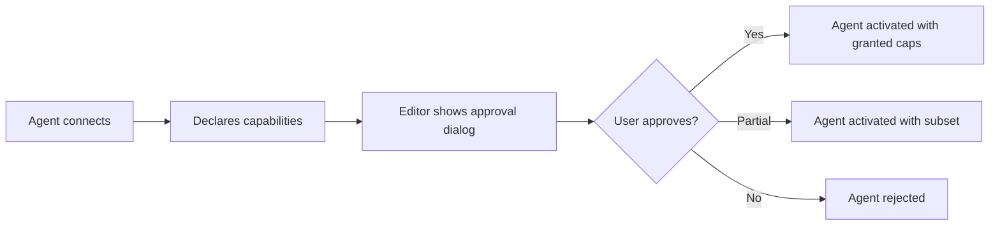
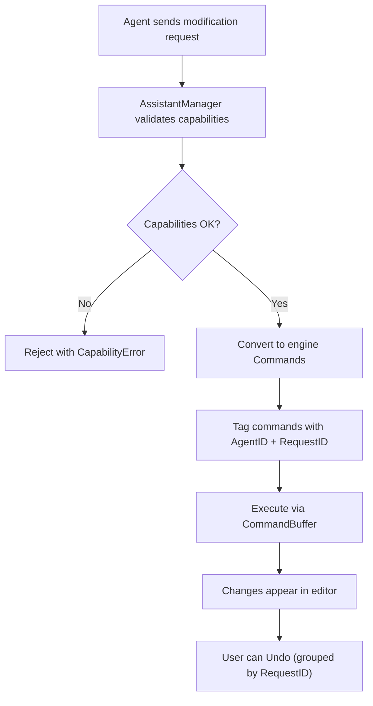

# AI Assistant System

**Version:** 0.2.0
**Status:** Draft
**Layer:** concept

## Overview

The AI Assistant System defines how AI agents integrate with the engine's editor as intelligent helpers. AI assistants connect as editor plugins, providing capabilities like code generation, scene composition, gameplay tuning, asset suggestions, and debugging assistance. The system uses a message-based protocol over local or remote transports, with a capability-based permission model that sandboxes what each agent can read, modify, or execute.

This is not about in-game AI (NPC behavior, pathfinding) — it is about developer-facing AI tools that accelerate game creation within the editor environment.

## Related Specifications

- [definition-system.md](l1-definition-system.md) — AI agents read and write definition files (UI, scenes, flows, templates)
- [app-framework.md](l1-app-framework.md) — AI assistant registers as an editor plugin via the plugin system
- [type-registry.md](l1-type-registry.md) — Agents query the type registry for component metadata and field info
- [scene-system.md](l1-scene-system.md) — Agents can compose and modify scenes programmatically
- [diagnostic-system.md](l1-diagnostic-system.md) — Agents receive diagnostics data for intelligent debugging

## 1. Motivation

Modern game development increasingly leverages AI for productivity. Without a structured integration point:

- Developers build ad-hoc scripts to connect AI services to the editor, with no standard protocol.
- AI agents have no way to understand the engine's type system, scene structure, or component metadata.
- There is no permission model — a poorly integrated AI tool could corrupt project data.
- Each AI provider (local LLM, cloud API, custom model) requires a different integration, fragmenting the ecosystem.
- The editor cannot offer intelligent features like "generate a UI layout from description" or "suggest component values" without deep AI integration.

The AI Assistant System provides a standardized plugin interface so that any AI backend — local or remote, open-source or proprietary — can enhance the editor with intelligent capabilities.

## 2. Constraints & Assumptions

- AI assistants are editor-only features. They do not exist in shipped games or headless builds. All AI code is behind the `editor` build tag.
- The engine does not bundle any AI model or depend on any AI service. The system provides the integration protocol; the actual AI backend is external.
- Communication with AI backends may involve network calls. These happen on background goroutines and never block the editor's main loop.
- AI assistants operate through the same editor interfaces as human users — they read/write definitions, spawn entities, and modify components through the standard command pipeline. No backdoor access.
- The permission model is opt-in: by default, an AI assistant has read-only access. Write permissions are granted per-scope by the user.

## 3. Core Invariants

- **INV-1**: AI assistants never bypass the ECS command pipeline. All world modifications go through standard commands, making them undoable and observable.
- **INV-2**: An AI assistant cannot execute actions beyond its granted capabilities. Capability violations are logged and rejected.
- **INV-3**: AI assistant plugins are loaded/unloaded at editor runtime without restarting the engine.
- **INV-4**: All AI-generated modifications are tagged with their source (agent ID + request ID) for auditability and undo grouping.
- **INV-5**: Network failures or AI backend unavailability must not crash or freeze the editor. All AI operations are asynchronous with timeouts.

## 4. Detailed Design

### 4.1 Plugin Architecture

An AI assistant registers as an `EditorPlugin` (see app-framework.md §4.10) at `LEVEL_EDITOR`:

```plaintext
AIAssistantPlugin
  Build(app *App):
    // Register the assistant manager resource
    // Add systems for processing agent messages
    // Register editor UI panels (chat, suggestions, diagnostics)

AssistantManager (Resource)
  agents:       map[AgentID]AgentConnection
  capabilities: map[AgentID]CapabilitySet
  request_log:  []AssistantRequest
```

Multiple AI agents can be registered simultaneously (e.g., a code assistant, a level design assistant, and a texture generation assistant). Each agent has an independent connection and capability set.

### 4.2 Agent Connection Protocol

Agents communicate via a message-based protocol over pluggable transports:

```plaintext
Transport interface:
  Connect(endpoint string) -> (Connection, error)
  Close()

Connection interface:
  Send(message AgentMessage) -> error
  Receive() -> (AgentMessage, error)
  IsAlive() -> bool

Supported transports:
  StdioTransport    // agent runs as a child process, communicates via stdin/stdout
  WebSocketTransport // agent runs as a service, communicates via WebSocket
  HTTPTransport      // stateless request/response via HTTP API
```

The protocol is JSON-based for maximum compatibility with AI tooling ecosystems:

```plaintext
AgentMessage
  id:       string              // unique request/response ID
  type:     MessageType         // request | response | notification | error
  method:   string              // the operation (e.g., "suggest_components", "generate_scene")
  params:   map[string]any      // method-specific parameters
  result:   any                 // response payload (for response type)
  error:    *AgentError         // error info (for error type)
```

### 4.3 Capability Model

Each agent declares its capabilities at registration. The user approves or restricts them:

```plaintext
Capability (bitfield):
  // Read capabilities
  ReadTypeRegistry       // query component types, fields, metadata
  ReadScenes             // read scene definitions and entity data
  ReadDefinitions        // read UI, flow, template definitions
  ReadAssetManifest      // list available assets and their metadata
  ReadDiagnostics        // access profiling data, error logs, frame stats

  // Write capabilities
  WriteDefinitions       // create or modify definition files
  WriteScenes            // modify scene entities and components
  SpawnEntities          // create new entities in the editor world
  ModifyComponents       // change component values on existing entities
  ExecuteCommands        // run arbitrary engine commands

  // Advanced capabilities
  FileSystemAccess       // read/write project files beyond definitions
  NetworkAccess          // make outbound network calls (for cloud AI)
  CodeGeneration         // generate Go source code files
```

**Capability request flow:**



Capabilities are persisted per-agent in the editor's project settings. Users don't re-approve on every session unless the agent requests new capabilities.

### 4.4 Context Provider

AI agents need context about the current editor state to give useful responses. The `ContextProvider` assembles relevant information:

```plaintext
ContextProvider
  fn GetEditorContext() -> EditorContext

EditorContext
  selected_entities:    []EntityInfo       // currently selected entities with components
  active_scene:         SceneInfo          // current scene metadata
  active_definition:    DefinitionInfo     // current definition being edited
  type_registry:        TypeRegistrySummary // available component types
  recent_commands:      []CommandRecord    // last N user actions (for intent inference)
  diagnostics:          DiagnosticsSummary // current errors, warnings, performance data
  project_structure:    ProjectTree        // asset directory tree
```

The context is assembled on-demand when an agent makes a request, filtered to only include data the agent has capability to read. This avoids sending the entire world state on every message.

### 4.5 Standard Agent Methods

A set of standard methods that agents can implement. Agents declare which methods they support:

| Method | Direction | Description | Required Capability |
| :--- | :--- | :--- | :--- |
| `suggest_components` | editor → agent | Suggest components for an entity given context | ReadTypeRegistry |
| `generate_scene` | editor → agent | Generate a scene from natural language description | ReadTypeRegistry + WriteScenes |
| `generate_ui` | editor → agent | Generate a UI definition from description | ReadTypeRegistry + WriteDefinitions |
| `explain_entity` | editor → agent | Explain what an entity does based on its components | ReadScenes + ReadTypeRegistry |
| `diagnose_issue` | editor → agent | Analyze a diagnostic and suggest fixes | ReadDiagnostics |
| `optimize_scene` | editor → agent | Suggest performance optimizations for current scene | ReadScenes + ReadDiagnostics |
| `generate_code` | editor → agent | Generate Go system code from description | CodeGeneration |
| `review_definition` | editor → agent | Review a definition file for issues | ReadDefinitions |
| `autocomplete` | editor → agent | Provide completions for property values | ReadTypeRegistry |
| `chat` | bidirectional | Free-form conversation with context | ReadTypeRegistry (minimum) |

Agents are not limited to standard methods — they can expose custom methods that the editor discovers at connection time via a `capabilities` handshake.

### 4.6 Modification Pipeline

When an AI agent wants to modify the world, it goes through the standard pipeline:



All modifications from a single agent request are grouped into one undo operation. The user can undo an entire AI-generated scene with a single Ctrl+Z.

### 4.7 Editor UI Integration

The AI assistant provides editor UI panels:

- **Chat Panel**: Free-form conversation with the active agent. Shows context-aware responses. Supports markdown rendering for code blocks and explanations.
- **Suggestions Panel**: Proactive suggestions based on current editor state (e.g., "This entity has Health but no DamageHandler — add one?"). Non-intrusive, dismissible.
- **Generation Preview**: When an agent generates a scene or UI, a preview is shown before applying. The user can accept, modify, or reject.
- **Agent Status Bar**: Shows connection status, active agent name, and current request progress.

### 4.8 Agent Discovery and Registry

Agents can be discovered from multiple sources:

```plaintext
AgentRegistry
  sources:
    - Local directory: project_root/.agents/         // project-specific agents
    - User directory:  ~/.config/ecs-engine/agents/  // user-wide agents
    - Remote catalog:  configurable URL               // community agent catalog (future)

AgentManifest (per agent, manifest.json)
  name:          string
  version:       string
  description:   string
  transport:     TransportConfig     // how to connect
  capabilities:  []Capability        // requested capabilities
  methods:       []string            // supported standard methods
  icon:          string              // path to icon asset
```

The editor scans agent directories at startup and presents available agents in a management panel where users can enable, disable, and configure each agent.

### 4.9 Security Considerations

- **Sandboxing**: Agents with `FileSystemAccess` are restricted to the project directory. Path traversal attempts are rejected.
- **Rate limiting**: The editor enforces rate limits on agent requests to prevent runaway agents from overwhelming the system (configurable, default: 60 requests/minute).
- **Audit log**: All agent actions are logged with timestamps, agent ID, method, and result. The log is stored in the project directory (`.editor/ai-audit.log`).
- **Timeout**: All agent requests have a configurable timeout (default: 30 seconds). Timed-out requests are cancelled and the agent is notified.
- **Data sensitivity**: The context provider never sends credentials, API keys, or `.env` file contents to agents, even if the agent has `FileSystemAccess`.

## 5. Open Questions

- Should agents be able to subscribe to editor events in real-time (e.g., "notify me when the user selects an entity") or only respond to explicit requests?
- Should the protocol be compatible with existing standards (e.g., Language Server Protocol, Model Context Protocol) or engine-specific?
- How should agent-generated assets (textures, models from generative AI) integrate with the asset pipeline?
- Should there be a marketplace/catalog for community agents, or is local-only sufficient?
- Should agents have access to the running game's state (not just editor state) for runtime debugging assistance?

## Document History

| Version | Date | Description |
| :--- | :--- | :--- |
| 0.1.0 | 2026-03-26 | Initial draft — AI assistant plugin architecture for editor |
| 0.2.0 | 2026-03-30 | Added C26 example correlation placeholder for the planned AI assistant stub example |
| — | — | Planned examples: `examples/app/ai_assistant_stub/` |
