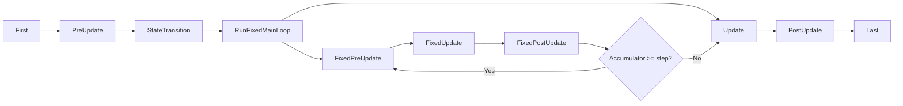

# App Framework

**Version:** 0.4.0
**Status:** Draft
**Layer:** concept

## Overview

The App framework is the top-level entry point for the engine. It provides a builder-pattern API for configuring the engine, registering plugins, adding systems, and running the main loop. Plugins are the primary extension mechanism — each plugin encapsulates a set of systems, resources, and configuration. The framework supports SubApps for isolated execution contexts (e.g., rendering), modular feature profiles via PluginGroups, and a well-defined main schedule ordering.

## Related Specifications

- [world-system.md](l1-world-system.md) — Each App (and SubApp) owns a World
- [system-scheduling.md](l1-system-scheduling.md) — Systems are organized into named schedules
- [event-system.md](l1-event-system.md) — Event clearing runs in First
- [definition-system.md](l1-definition-system.md) — App configuration and game flow expressible as JSON definitions
- [ai-assistant-system.md](l1-ai-assistant-system.md) — AI assistant registers as an editor plugin
- [plugin-distribution.md](l1-plugin-distribution.md) — Third-party extension of the internal Plugin trait: manifest, modes, capabilities, public SDK

## 1. Motivation

An ECS engine is more than entities and components — it needs a structured way to:

- Configure and assemble the engine from modular pieces.
- Define the order in which systems execute each frame.
- Support plugins that extend engine functionality without modifying core code.
- Isolate subsystems (like rendering) into their own execution contexts.
- Support different deployment profiles (headless server, 2D game, full 3D).

The App framework answers all of these needs with a single, composable entry point.

## 2. Constraints & Assumptions

- There is exactly one main App per engine instance.
- Plugins are added at startup, before the main loop begins. Hot-adding plugins at runtime is not supported.
- The main schedule order is fixed by the engine. Users add systems to the appropriate schedule slots.
- SubApps run after the main app's update cycle, not concurrently (concurrency is a future optimization).
- Zero external dependencies in the core framework. Platform-specific plugins may have dependencies.

## 3. Core Invariants

- **INV-1**: Plugins are initialized in dependency order. The lifecycle proceeds through Build → Ready → Finish phases for all plugins before the main loop begins.
- **INV-2**: A plugin cannot be added twice. Adding a duplicate plugin is an idempotent no-op (checked by type).
- **INV-3**: SubApp extract runs exactly once per frame, before the sub-app's schedule.
- **INV-4**: The main App always has at least one schedule (Main).

## 4. Detailed Design

### 4.1 App Builder

The App is constructed via a builder pattern — the App struct serves as the entry point with a fluent API for adding plugins, systems, and resources:

```
app = NewApp()
app.AddPlugins(DefaultPlugins)
app.InsertResource(GameSettings{Difficulty: Hard})
app.AddSystems(Update, move_player, check_collisions)
app.AddSystems(FixedUpdate, physics_step)
app.AddSystems(OnEnter[AppState.Playing], spawn_level)
app.InitState[AppState](AppState.Menu)
app.Run()
```

Builder methods:

```
App
  AddPlugins(plugins ...Plugin)
  AddSystems(schedule Label, systems ...System)
  InsertResource(resource)
  InitResource[T]()
  InitState[S](default S)
  SetRunner(runner RunnerFunc)
  Run()
  SubApp(label) -> *SubApp
```

### 4.2 Plugin Trait

A Plugin is any type that implements the Build method. Plugins declare dependencies on other plugins — the framework resolves and orders initialization accordingly.

```
Plugin interface:
  Build(app *App)

Optional lifecycle methods (detected via interface assertion):
  Ready(app *App) bool       // return false to defer initialization
  Finish(app *App)           // called after all plugins have built
  Cleanup(app *App)          // called on shutdown, reverse order
```

Lifecycle phases execute in order:

```
Phase 1: Build    — all plugins, in dependency-resolved order
Phase 2: Ready    — polled until all return true (with cycle detection)
Phase 3: Finish   — all plugins, in dependency-resolved order
Phase 4: [main loop runs]
Phase 5: Cleanup  — all plugins, in reverse order
```

### 4.3 Functions as Plugins

Any function with the signature `func(app *App)` is automatically a Plugin:

```
func MyFeaturePlugin(app *App) {
    app.InsertResource(MyConfig{...})
    app.AddSystems(Update, my_system)
}

app.AddPlugins(PluginFunc(MyFeaturePlugin))
```

### 4.4 Plugin Groups

A PluginGroup is an ordered collection of plugins with per-plugin enable/disable:

```
PluginGroup interface:
  Build() -> []Plugin

DefaultPlugins = PluginGroup:
  - LogPlugin
  - TaskPoolPlugin
  - TimePlugin
  - InputPlugin
  - WindowPlugin
  - AssetPlugin
  - ScenePlugin
  - RenderPlugin
  - AudioPlugin
  - StatePlugin
  - DiagnosticsPlugin

MinimalPlugins = PluginGroup:
  - LogPlugin
  - TaskPoolPlugin
  - TimePlugin
  - ScheduleRunnerPlugin     // headless loop with configurable tick rate
```

Plugin groups support customization:

```
app.AddPlugins(
    DefaultPlugins.Set(
        WindowPlugin{Title: "My Game", Width: 1280, Height: 720},
    ).Disable(AudioPlugin),
)
```

### 4.5 Main Schedule Order

Each frame, the main app runs schedules in this fixed order:

```
Startup (once):
  PreStartup -> Startup -> PostStartup

Per-frame:
  First
    - Event clearing (swap double buffers)
    - Time resource updates
  PreUpdate
    - Input processing
    - Asset loading callbacks
  StateTransition
    - Process all pending state transitions
    - Run OnExit / OnEnter / OnTransition schedules
  RunFixedMainLoop
    - Consume accumulated fixed time
    - For each step: FixedPreUpdate -> FixedUpdate -> FixedPostUpdate
  Update
    - User gameplay logic (default schedule for game systems)
  PostUpdate
    - Transform propagation
    - Hierarchy updates
    - Render data preparation
  Last
    - ClearTrackers (change detection reset)
    - Diagnostics collection
```



### 4.6 Startup Schedules

Startup schedules run exactly once before the main loop begins:

```
PreStartup -> Startup -> PostStartup
```

PreStartup is for engine internals that must be ready before user startup code. Startup is where most user initialization belongs. PostStartup runs after all startup systems, useful for validation or derived state computation.

### 4.7 SubApp

A SubApp is an isolated World instance with its own set of schedules. It communicates with the main app through an explicit extract function — a one-way copy from the main world to the sub-app world each frame.

```
SubApp
  - World         World
  - Schedules     map[Label]Schedule
  - ExtractFn     func(mainWorld *World, subWorld *World)

app.InsertSubApp(RenderApp, SubApp{
    ExtractFn: extract_render_data,
})
```

SubApp execution flow:

```
1. Main app completes its per-frame schedules (First through Last)
2. For each SubApp:
   a. Run ExtractFn(main_world, sub_world) — copy relevant data
   b. Run SubApp's own schedules
```

Primary use case: render world isolation. The render pipeline runs as a SubApp, isolating render state from gameplay state. This enables future pipelined rendering where the render SubApp processes frame N-1 while the main app processes frame N.

### 4.8 RunMode

The App supports different execution modes:

```
RunMode:
  Loop
    - WaitDuration  float64  // optional minimum frame time (0 = uncapped)
    - Runs the main loop continuously

  Once
    - Runs startup + one frame + cleanup
    - Useful for CLI tools, testing, and batch processing
```

### 4.9 Runner Function

The runner function is a customizable game loop function that receives the App. It controls how and when the main schedule is executed:

```
RunnerFunc = func(app *App) error

// Default runner: simple loop
func DefaultRunner(app *App) error {
    for !app.ShouldExit() {
        app.Update()
    }
    return nil
}

app.SetRunner(CustomRunner)
```

This allows users to integrate with external event loops, custom frame pacing, or test harnesses.

### 4.10 App Exit

The application exits when:

```
1. An AppExit event is sent (with exit code)
2. The runner function returns
3. All windows are closed (if using WindowPlugin)
```

Exit sequence:

```
1. Stop the main loop
2. Run Cleanup on all plugins (reverse registration order)
3. Drop all World resources
4. Return exit code
```

### 4.10 Leveled Plugin Initialization

Plugins register at specific initialization levels, executed in strict order. Each plugin responds only to the levels it cares about:

```plaintext
InitializationLevel:
  LEVEL_CORE       // archetype tables, type registry, allocators, math
  LEVEL_SERVERS    // system schedulers, render/physics/audio servers
  LEVEL_SCENE      // scene tree, resource loaders, component registration
  LEVEL_EDITOR     // inspector plugins, editor UI, debug tooling
```

The engine calls `Initialize(level)` on all plugins at each level in sequence, then proceeds to the next level. Shutdown runs `Uninitialize(level)` in reverse (EDITOR → SCENE → SERVERS → CORE), ensuring clean teardown order.

**Symmetric init/uninit**: Each plugin implements both directions. The signature forces handling cleanup — plugins cannot "forget" to release resources:

```plaintext
Plugin interface:
  Initialize(level InitializationLevel)
  Uninitialize(level InitializationLevel)
```

A plugin that only cares about CORE and EDITOR simply ignores calls at other levels.

**Editor init callbacks**: Plugins that need editor features but should not compile-time depend on editor types use deferred callbacks:

```plaintext
// During LEVEL_SERVERS initialization:
app.AddEditorInitCallback(func(editor *EditorInterface) {
    editor.RegisterInspectorPlugin(myPlugin)
})
```

The callback fires once the editor is ready (during LEVEL_EDITOR). This avoids circular dependencies between gameplay plugins and editor infrastructure. In headless/server builds where the editor is absent, these callbacks are simply never called.

**Build tag isolation**: Editor-only code is behind a build tag (`//go:build editor`). Plugins that register at LEVEL_EDITOR are entirely excluded from production builds, reducing binary size and eliminating dead code.

### 4.11 Deployment Architecture

The engine follows a **modular monolith** pattern. All ECS systems, rendering, audio, input, and UI execute within a single process and address space. This is a deliberate architectural constraint driven by performance:

- The game loop budget is under 16.6 ms per frame (60 FPS). Network calls (even localhost) add 1-2 ms latency per round-trip, consuming a significant portion of this budget.
- ECS relies on data locality — components packed in contiguous memory for cache efficiency. Serialization across process boundaries destroys this advantage.
- State synchronization between distributed systems in real-time is orders of magnitude more complex than in-process communication.

**Boundary rule**: No system that runs within the main game loop (`First` through `Last` schedules) may perform network I/O or cross-process communication. All inter-system communication uses in-process mechanisms: queries, events, messages, commands, and resources.

**Extensibility is achieved through Plugins**, not services. A plugin adds systems, resources, and components to the same World — zero-overhead integration at the cost of compile-time coupling.

**Backend services** (out of scope for the engine core, but anticipated as separate projects):

| Service | Purpose | Communication |
| :--- | :--- | :--- |
| Matchmaking / Lobby | Player session management | REST / WebSocket from game client |
| Player Profiles / Persistence | Accounts, inventory, save data | REST API + database |
| Asset CDN | Dynamic asset delivery, hot-reload in development | HTTP from AssetReader backend |
| Analytics / Telemetry | Player behavior data collection | Async fire-and-forget UDP/HTTP |
| Dedicated Game Server | Authoritative multiplayer instance | UDP (engine runs monolithically inside each instance) |

These services are separate Go binaries. They may share type definitions with the engine (via shared packages) but do not import engine internals. Communication crosses a network boundary and is always asynchronous from the game loop's perspective.

### 4.12 Service Registry

A lightweight service locator allows cross-system access without direct package imports:

```plaintext
ServiceRegistry (World resource)
  Register[T](service: T)
  Get[T]() -> (T, bool)              // returns (service, exists)
  GetRequired[T]() -> T              // panics if not registered

// Registration during plugin build:
func AudioPlugin.Build(app *App) {
    audioEngine := NewAudioEngine()
    app.World().Services().Register[AudioSystem](audioEngine)
}

// Access from any system:
func collision_sound(services: Res[ServiceRegistry], ...) {
    if audio, ok := services.Get[AudioSystem](); ok {
        audio.PlayOneShot(impactSound, position)
    }
}
```

Services are typed singletons — at most one instance per type. Unlike Resources (which are ECS data managed by the World), services are long-lived infrastructure objects (audio engine, render server, input manager) that exist outside the archetype/table storage.

**Optional access**: `Get[T]()` returns a bool, enabling graceful degradation. A system that optionally uses audio can check availability without panicking in headless builds where AudioPlugin is absent.

### 4.13 GameSystem Base Pattern

Top-level engine subsystems (input, audio, scene, rendering) share a common lifecycle interface beyond the plugin model:

```plaintext
GameSystem (interface)
  Update(time: GameTime)             // called every frame
  Draw(time: GameTime)               // called every frame (after Update)
  UpdateOrder() -> int               // execution priority (lower = earlier)
  DrawOrder() -> int
  Enabled() -> bool                  // if false, Update is skipped
  Visible() -> bool                  // if false, Draw is skipped

GameTime
  elapsed:     Duration              // time since app start
  delta:       Duration              // time since last frame
  frame_count: uint64                // monotonic frame counter
```

**Update vs Draw split**: Systems that need both simulation and rendering phases (e.g., SceneSystem updates the scene graph in Update, then renders in Draw) implement both. Systems that are simulation-only (InputManager) implement Update with a no-op Draw.

**Priority ordering**: `UpdateOrder` and `DrawOrder` return integers that determine execution sequence. The engine sorts all GameSystems by order before the frame loop begins. This provides a simple, explicit ordering for top-level subsystems — finer-grained ordering within a subsystem uses the ECS schedule (§4.2–4.6).

**Enabled/Visible toggles**: Allow runtime enable/disable of entire subsystems (e.g., disable audio during a loading screen, hide debug overlay). These are checked each frame — no system removal/re-addition needed.

## 5. Open Questions

- Should plugins support explicit dependency declaration (plugin A requires plugin B) with automatic ordering, or is registration order sufficient?
- Should SubApps support bidirectional data transfer, or is extract (main to sub) sufficient?
- How should plugin configuration errors (e.g., conflicting settings) be reported — panic at startup or structured error return?
- Should the engine provide a `NetworkPlugin` abstraction for game-server communication, or leave networking entirely to user code?

## Canonical References

<!-- MANDATORY for Stable status. List authoritative source files that downstream agents
     MUST read before implementing this spec. Use relative paths from project root.
     Stub state — fill with concrete files when implementation begins (Phase 1+). -->

| Alias | Path | Purpose |
| :--- | :--- | :--- |

<!-- Empty table = no canonical sources yet. Populate one row per authoritative file
     when implementation lands (Phase 1+). Stable promotion requires ≥1 row. -->

## Document History

| Version | Date | Description |
| :--- | :--- | :--- |
| 0.1.0 | 2026-03-25 | Initial draft |
| 0.2.0 | 2026-03-26 | Added deployment architecture: modular monolith, backend service boundary, no-network-in-loop rule |
| 0.3.0 | 2026-03-26 | Added leveled plugin initialization (CORE/SERVERS/SCENE/EDITOR), editor init callbacks, build tag isolation |
| 0.4.0 | 2026-03-26 | Added service registry, GameSystem base pattern with Update/Draw split |
| — | — | Planned examples: `examples/app/` |
