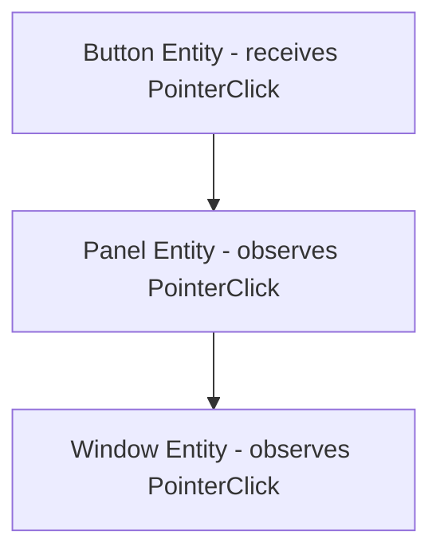

# Input System

**Version:** 0.3.0
**Status:** Draft
**Layer:** concept

## Overview

The input system provides a device-agnostic abstraction for keyboard, mouse, gamepad, and touch input. It operates on two layers: **Resources** for polling current state (`ButtonInput[T]` with pressed/just_pressed/just_released semantics) and **Events** for frame-granular input events. A pointer abstraction unifies mouse, touch, and pen into a single interaction model. A picking backend enables pointer-based hit testing against entities with observer-driven event bubbling through the entity hierarchy.

## Related Specifications

- [event-system.md](l1-event-system.md) — Input events use the engine's event system
- [hierarchy-system.md](l1-hierarchy-system.md) — Pointer events bubble through parent-child hierarchy
- [app-framework.md](l1-app-framework.md) — Input systems run in PreUpdate schedule

## 1. Motivation

Games must react to player input from diverse devices. Without a structured input system:

- Device-specific code scatters across gameplay logic.
- "Just pressed" semantics (fire-once per press) are reimplemented in every system.
- Hit testing (which entity did the user click?) has no standard solution.
- Supporting multiple input devices simultaneously (keyboard + gamepad) requires ad-hoc code.

The input system centralizes all of this into a consistent, extensible abstraction.

## 2. Constraints & Assumptions

- Input state is updated once per frame in the PreUpdate schedule, before gameplay systems run.
- "Just pressed" and "just released" flags are valid for exactly one frame, then cleared.
- All input types are represented as Resources and Events — no special system parameter types.
- The input system does not perform input mapping (binding actions to keys). That is a higher-level concern for a separate action-mapping specification.
- Zero external dependencies (C24).

## 3. Core Invariants

- **INV-1**: `JustPressed(key)` returns true for exactly one frame after the key transitions from released to pressed.
- **INV-2**: `JustReleased(key)` returns true for exactly one frame after the key transitions from pressed to released.
- **INV-3**: Input events are ordered within a frame — multiple presses/releases in a single frame are all recorded.
- **INV-4**: Pointer events propagate through the entity hierarchy in a well-defined order (deepest child first, then ancestors).
- **INV-5**: Input resources are cleared/updated by engine systems, not by user systems.

## 4. Detailed Design

### 4.1 ButtonInput[T] Resource

A generic resource parameterized by button type. Tracks three sets per frame:

```
ButtonInput[T]
  - pressed       Set[T]   // currently held down
  - just_pressed  Set[T]   // transitioned to pressed this frame
  - just_released Set[T]   // transitioned to released this frame

Methods:
  Press(button T)
  Release(button T)
  Pressed(button T) bool
  JustPressed(button T) bool
  JustReleased(button T) bool
  AnyPressed() bool
  AnyJustPressed() bool
  GetPressed() []T
  GetJustPressed() []T
  GetJustReleased() []T
  Clear()                   // called by engine at end of frame
```

Concrete instantiations: `ButtonInput[KeyCode]`, `ButtonInput[MouseButton]`, `ButtonInput[GamepadButton]`.

### 4.2 Device Types

**Keyboard:**

```
KeyCode — enumeration of physical key codes (KeyA..KeyZ, Digit0..Digit9,
          ArrowUp, Space, Enter, Escape, ShiftLeft, ControlLeft, etc.)

Events:
  KeyboardInput { KeyCode, Pressed bool }
```

**Mouse:**

```
MouseButton — Left, Right, Middle, Back, Forward, Other(uint16)

Resources:
  ButtonInput[MouseButton]
  CursorPosition { X, Y float64 } // window-relative pixel coordinates

Events:
  MouseButtonInput { Button MouseButton, Pressed bool }
  MouseMotion { DeltaX, DeltaY float64 }
  MouseWheel { X, Y float64 }
  CursorMoved { Position Vec2 }
  CursorEntered { WindowEntity Entity }
  CursorLeft { WindowEntity Entity }
```

**Gamepad:**

```
GamepadButton — South, East, North, West, LeftTrigger, RightTrigger,
                LeftBumper, RightBumper, DPadUp, DPadDown, DPadLeft,
                DPadRight, Start, Select, LeftStick, RightStick

GamepadAxis — LeftStickX, LeftStickY, RightStickX, RightStickY,
              LeftTrigger, RightTrigger

Resources:
  ButtonInput[GamepadButton]
  Axis[GamepadAxis]          // normalized -1.0 to 1.0 (or 0.0 to 1.0 for triggers)

Events:
  GamepadConnected { ID GamepadID }
  GamepadDisconnected { ID GamepadID }
  GamepadButtonInput { Gamepad GamepadID, Button GamepadButton, Pressed bool }
  GamepadAxisChanged { Gamepad GamepadID, Axis GamepadAxis, Value float64 }
```

**Touch:**

```
Events:
  TouchInput { Phase TouchPhase, ID uint64, Position Vec2, Force float64 }
  TouchPhase — Started, Moved, Ended, Cancelled
```

### 4.3 Input Update Flow

```
PreUpdate schedule:
  1. Read platform events from window backend
  2. Translate platform events into engine event types
  3. Clear just_pressed and just_released sets from previous frame
  4. For each input event:
     a. Update ButtonInput[T] resources (press/release)
     b. Update position resources (CursorPosition, Axis)
     c. Send corresponding engine events
```

### 4.4 Pointer Abstraction

Mouse, touch, and pen are unified into a single Pointer model for interaction:

```
PointerID — identifies a pointer (mouse = single pointer, touch = one per finger)

Pointer Events (entity-targeted):
  PointerOver   { PointerID, Entity, Position Vec2 }
  PointerOut    { PointerID, Entity }
  PointerDown   { PointerID, Entity, Button PointerButton }
  PointerUp     { PointerID, Entity, Button PointerButton }
  PointerClick  { PointerID, Entity, Button PointerButton }
  PointerMove   { PointerID, Entity, Delta Vec2 }
  DragStart     { PointerID, Entity }
  Drag          { PointerID, Entity, Delta Vec2 }
  DragEnd       { PointerID, Entity }
  DragEnter     { PointerID, Entity }
  DragLeave     { PointerID, Entity }
  DragDrop      { PointerID, Entity }
```

### 4.5 Picking Backend

Picking determines which entity a pointer is interacting with:

```
1. Each frame, the picking system projects pointer positions into the scene
2. Hit tests run against entities with a Pickable component
3. Results are sorted by depth (front to back)
4. The topmost hit entity receives the pointer event
5. Events bubble up through the entity hierarchy (see hierarchy-system.md)
6. Any entity in the chain can mark the event as handled to stop bubbling
```

Picking backends are pluggable — different backends for 2D sprites, 3D meshes, and UI rectangles. Each backend implements a hit-test function and registers it with the picking system.

### 4.6 Event Bubbling

When a pointer event targets an entity, it propagates upward:



At each level, observers registered on that entity can handle the event and optionally stop propagation. This matches the DOM event model: capture phase (top-down) is not supported; only bubble phase (bottom-up).

### 4.7 Action Mapping

While the core input system provides raw device state, an action mapping layer maps abstract actions to physical inputs:

```plaintext
ActionMap (Resource)
  actions: map[StringName]ActionBinding

ActionBinding
  inputs:   []InputBinding          // list of physical inputs that trigger this action
  deadzone: f32                     // per-action deadzone (not per-axis)

InputBinding
  device_filter: DeviceFilter       // ALL_DEVICES | Specific(DeviceID)
  source:        InputEventMatcher  // KeyCode, MouseButton, GamepadAxis, etc.
```

**Per-action deadzone**: The deadzone is configured per action mapping, not per raw axis. This makes action abstractions portable across controller types with different stick characteristics. A "move" action can have a 0.2 deadzone regardless of whether it is bound to a gamepad stick or a mouse delta.

### 4.8 Per-Device Action State

Each action tracks independent state per device, enabling local multiplayer:

```plaintext
ActionState
  pressed_physics_frame:  uint64    // frame number when pressed (physics tick)
  pressed_process_frame:  uint64    // frame number when pressed (render tick)
  released_physics_frame: uint64
  released_process_frame: uint64
  strength:               f32       // 0.0..1.0 (analog)
  devices:                map[DeviceID]DeviceActionState

DeviceActionState
  pressed:  bool
  strength: f32
```

**Physics-frame vs process-frame timestamps**: Systems can distinguish "was this pressed this physics step" from "was this pressed this render frame". This is critical for a split-rate engine where physics runs at a fixed rate (e.g., 60 Hz) and rendering at a variable rate (e.g., 144 Hz). A physics system checks `pressed_physics_frame`; a UI system checks `pressed_process_frame`.

**Per-device sub-states**: The same action (e.g., "jump") can be independently tracked per gamepad device. Player 1's "jump" on gamepad 0 is distinct from Player 2's "jump" on gamepad 1.

### 4.9 Input Accumulation

An option to merge consecutive compatible input events before processing:

```plaintext
InputSettings (Resource)
  accumulated_input: bool   // default: true
```

When enabled, consecutive mouse-motion events within the same frame are merged into a single event with summed deltas. This reduces event processing overhead without losing net movement data. Accumulation applies only to motion events — discrete events (key press/release) are never merged.

### 4.10 Input Event Transform

Positional input events (mouse, touch) can be transformed through a 2D transform:

```plaintext
InputEvent
  fn TransformedBy(transform: Affine2D) -> InputEvent
```

This transforms event positions through canvas/viewport transforms so UI nodes receive events in their local coordinate space. The UI system applies this automatically — user code rarely calls it directly.

### 4.11 Multi-Source Input Aggregation

The input system aggregates input from multiple platform-specific sources into a unified device model:

```plaintext
InputSource (interface)
  Devices() -> map[DeviceID]InputDevice
  Initialize(manager: *InputManager)
  Scan()       // discover new devices (e.g., gamepad connected)
  Update()     // poll device state, emit events
  Pause()      // suspend input (app backgrounded)
  Resume()     // resume input (app foregrounded)

InputManager
  sources:         []InputSource          // platform backends
  keyboards:       []KeyboardDevice
  pointers:        []PointerDevice
  gamepads:        []GamepadDevice
  sensors:         []SensorDevice         // accelerometer, gyroscope
  events:          []InputEvent           // aggregated per-frame events
  gesture_configs: map[GestureConfig]GestureRecognizer
```

Each platform (Desktop, Android, iOS, Web) provides an `InputSource` implementation that manages its own device lifecycle. The `InputManager` aggregates all sources, collecting devices and events into unified lists. This means:

- Desktop: SDL or platform-native source provides keyboard + mouse + gamepads.
- Android: Touch source + sensor source (accelerometer, gyro).
- Web: DOM event source with keyboard + pointer + gamepad API.

Multiple sources can coexist — e.g., a desktop build with both a native keyboard source and a remote-input source for mobile controller streaming.

### 4.12 Device Hot-Plug Lifecycle

Input devices follow a well-defined connection lifecycle:

```plaintext
Device States:
  Disconnected → Connected → Active → Paused → Active → Disconnected

InputSource.Scan():
  - Check for newly connected devices
  - Check for disconnected devices
  - Emit GamepadConnected / GamepadDisconnected events

InputSource.Pause():
  - All active devices transition to Paused
  - No events generated while paused
  - Device state frozen (no phantom key releases)

InputSource.Resume():
  - Paused devices transition back to Active
  - Full state resync (query current button/axis state)
  - Prevents stale "key still held" after app regain focus
```

**Full state resync on resume**: When the app regains focus, the input source queries the actual hardware state for all buttons and axes. This prevents ghost inputs — if a key was held when the app lost focus and released while backgrounded, the resume resync correctly reports it as released.

**Scan frequency**: `Scan()` is called once per frame in PreUpdate. On platforms where device enumeration is expensive (USB HID on some OSes), scanning can be throttled to every N frames via `InputSettings.ScanInterval`.

## 5. Open Questions

- How should input be handled during state transitions (e.g., should input be consumed when transitioning from Menu to Playing)?
- Should gamepads support per-player assignment natively, or is that a game-level concern?
- Should one-shot action connections be supported (action fires once then auto-unbinds), useful for UI flows like "wait for any key"?

## Canonical References

<!-- MANDATORY for Stable status. List authoritative source files that downstream agents
     MUST read before implementing this spec. Use relative paths from project root.
     Stub state — fill with concrete files when implementation begins (Phase 1+). -->

| Alias | Path | Purpose |
| :--- | :--- | :--- |

<!-- Empty table = no canonical sources yet. Populate one row per authoritative file
     when implementation lands (Phase 1+). Stable promotion requires ≥1 row. -->

## Document History

| Version | Date | Description |
| :--- | :--- | :--- |
| 0.1.0 | 2026-03-25 | Initial draft |
| 0.2.0 | 2026-03-26 | Added action mapping with per-action deadzone, per-device action state, physics/process frame timestamps, input accumulation, event transform |
| 0.3.0 | 2026-03-26 | Added multi-source input aggregation, device hot-plug lifecycle with state resync |
| — | — | Planned examples: `examples/input/` |
