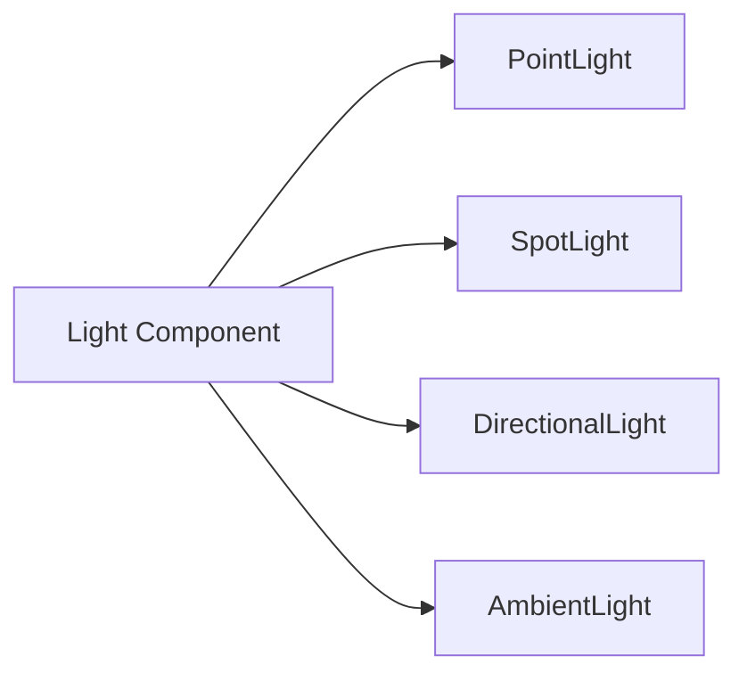

# Materials & Lighting

**Version:** 0.1.0
**Status:** Draft
**Layer:** concept

## Overview

Materials define the visual properties of a surface — which shader to use and what parameters to bind. Lighting components describe light sources and environmental illumination. Together they drive the shading pipeline: material parameters are combined with incoming light to produce final pixel colors.

## Related Specifications

- [Render Core](l1-render-core.md)
- [Mesh & Image](l1-mesh-and-image.md)
- [Camera & Visibility](l1-camera-and-visibility.md)

## 1. Motivation

A unified material model lets artists and developers describe surfaces declaratively. Separating light definitions from material parameters allows the engine to evaluate any combination of materials and lights without combinatorial explosion in user code.

## 2. Constraints & Assumptions

- The default shading model is PBR (metallic-roughness workflow).
- Custom materials may override the shading model entirely via custom shaders.
- Shadow map resolution and cascade count are configurable but bounded by GPU memory.
- Light counts are unlimited in the scene; the engine clusters or culls them per tile/frustum.

## 3. Core Invariants

1. Every material must reference a valid shader asset.
2. PBR parameter values must be clamped to physically plausible ranges (e.g., metallic in [0, 1]).
3. A directional light's cascaded shadow maps must cover at least the camera's near plane to the configured max distance.
4. Shadow-casting lights must have their shadow map resources allocated before the shadow pass executes.
5. Alpha mode determines which render phase an entity is assigned to — this mapping is not overridable.

## 4. Detailed Design

### 4.1 Material Asset

```plaintext
Material
  ├── shader: Handle<Shader>
  ├── alpha_mode: AlphaMode
  ├── double_sided: bool
  ├── parameters: MaterialParameters
  │     ├── textures: map<string, Handle<Image>>
  │     ├── floats:   map<string, f32>
  │     ├── vectors:  map<string, vec4>
  │     └── colors:   map<string, Color>
  └── render_phase_hint: Option<Phase>
```

Materials are assets loaded through the asset system. When a material changes, the engine invalidates affected bind groups and recompiles pipelines if the shader variant key changes.

### 4.2 PBR Parameters

The standard PBR material exposes:

| Parameter | Type | Default | Description |
| :--- | :--- | :--- | :--- |
| base_color | Color + Texture | white | Albedo |
| metallic | f32 + Texture | 0.0 | Metalness factor |
| roughness | f32 + Texture | 0.5 | Surface roughness |
| normal_map | Texture | flat | Tangent-space normals |
| emissive | Color + Texture | black | Self-illumination |
| occlusion | Texture | white | Ambient occlusion |

### 4.3 Alpha Modes

- **Opaque** — fully solid, written to depth buffer normally.
- **Mask(threshold)** — fragment discarded if alpha < threshold.
- **Blend** — standard alpha blending, rendered in Transparent phase.
- **Premultiplied** — premultiplied alpha blending.
- **Add** — additive blending for effects like fire and sparks.

Alpha mode determines render phase assignment:

```plaintext
Opaque, Mask      → Opaque / AlphaMask phase (front-to-back)
Blend, Premul, Add → Transparent phase (back-to-front)
```

### 4.4 Light Types



- **PointLight**: position, color, intensity, radius (attenuation range), optional shadow (cube map).
- **SpotLight**: position, direction, color, intensity, inner_angle, outer_angle, optional shadow (single map).
- **DirectionalLight**: direction, color, intensity, optional cascaded shadow maps.
- **AmbientLight / GlobalAmbientLight**: flat color added to all fragments.

### 4.5 Image-Based Lighting

- **EnvironmentMapLight**: a cube map (diffuse irradiance + specular pre-filtered) attached to an entity. Provides reflections and ambient lighting.
- **IrradianceVolume**: a 3D grid of spherical harmonic probes for baked global illumination. Entities sample the nearest probes based on world position.

### 4.6 Shadow Mapping

| Light Type | Shadow Technique | Map Count |
| :--- | :--- | :--- |
| Directional | Cascaded Shadow Maps | 1–4 cascades |
| Point | Cube Shadow Map | 6 faces |
| Spot | Single Shadow Map | 1 |

`CascadeShadowConfig` controls cascade count, split distances (logarithmic or manual), overlap factor, and map resolution. Shadow maps are rendered in a dedicated render graph pass before the main lighting pass.

### 4.7 Atmosphere, Fog & Skybox

- **Atmosphere**: a volumetric sky model computing scattering based on sun direction and altitude. Rendered into a lookup table each frame (or cached if sun position is static).
- **FogVolume**: axis-aligned volume with density, color, and falloff. **VolumetricFog** uses a froxel grid for per-cell density and lighting.
- **Skybox**: an `EnvironmentMapLight` cube map rendered as the background at infinite depth.

### 4.8 Material Specialization

Each unique combination of (shader, vertex_layout, alpha_mode, render_phase) produces a pipeline variant. The material system generates a specialization key and looks it up in the pipeline cache. See [Render Core — Pipeline Specialization](l1-render-core.md#46-pipeline-specialization).

## 5. Open Questions

1. Should the engine support a secondary specular-glossiness PBR workflow?
2. How many cascades should the default `CascadeShadowConfig` use?
3. What is the light count threshold before clustered shading becomes mandatory?

## Canonical References

<!-- MANDATORY for Stable status. List authoritative source files that downstream agents
     MUST read before implementing this spec. Use relative paths from project root.
     Stub state — fill with concrete files when implementation begins (Phase 1+). -->

| Alias | Path | Purpose |
| :--- | :--- | :--- |

<!-- Empty table = no canonical sources yet. Populate one row per authoritative file
     when implementation lands (Phase 1+). Stable promotion requires ≥1 row. -->

## Document History

| Version | Date | Description |
| :--- | :--- | :--- |
| 0.1.0 | 2026-03-25 | Initial draft from architecture analysis |
| — | — | Planned examples: `examples/3d/` |
