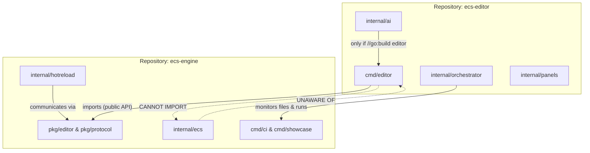
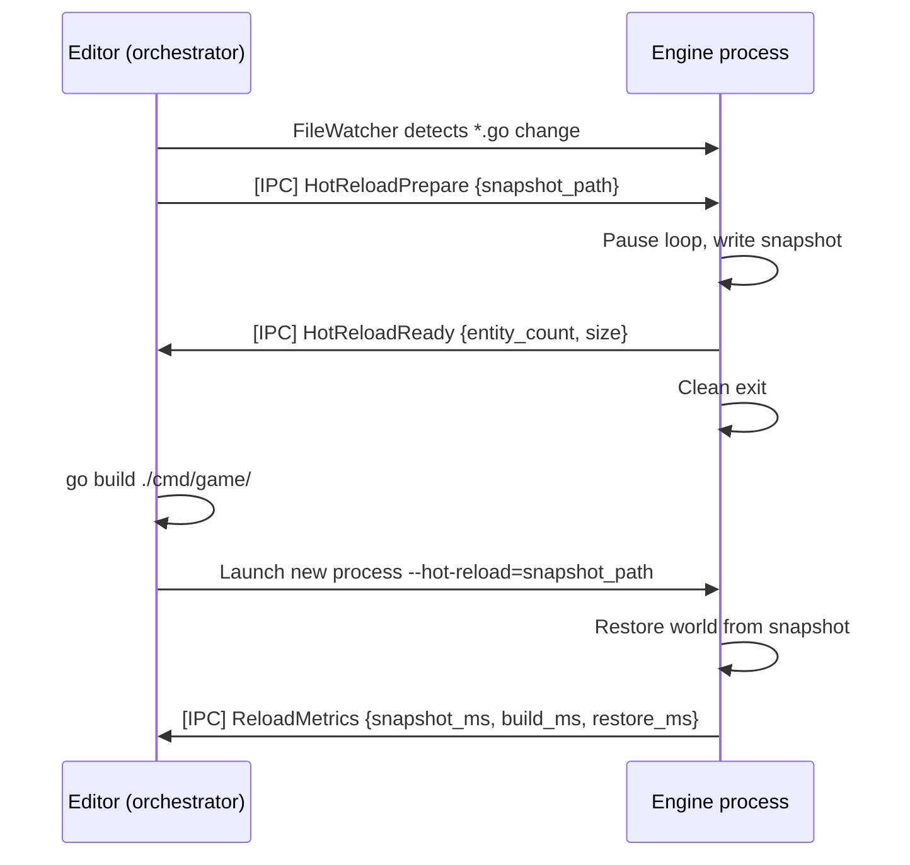

# Multi-Repository Architecture

| Metadata | Value |
| :--- | :--- |
| **Layer** | 1 (concept) |
| **Status** | RFC |
| **Version** | 1.3.0 |
| **Related Specifications** | [app-framework.md](app-framework.md), [hot-reload.md](hot-reload.md), [ai-assistant-system.md](ai-assistant-system.md), [definition-system.md](definition-system.md), [diagnostic-system.md](diagnostic-system.md) |

## Overview

The engine ecosystem is split across two independent Git repositories: **`ecs-engine`** (the core runtime) and **`ecs-editor`** (the GUI editor application). The engine repository is the single source of truth for all runtime behaviour, ECS kernel, asset pipeline, rendering, physics, audio, and networking. The editor repository is a consumer of the engine's public API — it is architecturally identical to any third-party game that happens to implement tooling rather than gameplay.

Communication between the two repositories occurs at three distinct levels: **compile-time** (Go module dependency), **runtime extension** (plugin interface contracts exported from the engine), and **process IPC** (hot-reload and live debugging protocol). Each level has a clearly defined boundary. The engine never imports the editor. The editor never imports `internal/` packages of the engine.

## 1. Motivation

The initial monorepo structure (`cmd/editor/` inside `ecs-engine`) creates three classes of problems that compound as the codebase grows:

**Boundary erosion.** When editor code lives in the same repository as internal engine code, the temptation (and accidental occurrence) of importing `internal/` packages from the editor is high. A separate repository makes this structurally impossible — `internal/` is not exported by Go module semantics.

**Release cycle mismatch.** The engine stabilises slowly; API breaking changes require a major version bump and migration guides. The editor iterates rapidly — UI panels, inspector widgets, agent integrations. Coupling both into one release tag means either the engine ships editor churn, or the editor blocks on engine freeze windows.

**Dogfooding failure.** If the editor has privileged access to engine internals, it never validates the public API surface that third-party game developers rely on. A separately-compiled editor that can only use `pkg/` packages acts as a continuous integration test for the engine's public contract.

The specifications already anticipated this boundary. `app-framework.md §4.10` introduces `//go:build editor` build tags. `ai-assistant-system.md` states AI assistant plugins are entirely behind `//go:build editor`. `definition-system.md §4.11` explicitly prohibits definitions from crossing network boundaries. The split is the natural consequence of following those constraints to completion.

## 2. Constraints & Assumptions

- The engine repository (`ecs-engine`) MUST compile, test, and pass benchmarks with zero knowledge of the editor repository.
- The editor repository (`ecs-editor`) MUST depend on `ecs-engine` as a standard Go module. No `internal/` imports, no `replace` directives in production releases.
- During active co-development, a `replace` directive in the editor's `go.mod` is permitted for local iteration only. It MUST NOT appear in tagged release commits.
- All editor-facing extension points in the engine are placed under `pkg/editor/`. This package is compiled unconditionally — it contains only interfaces and data types, no implementation.
- The IPC protocol types shared between both repositories are placed under `pkg/protocol/` in the engine repository. The editor imports this package to speak the hot-reload and diagnostics wire format.
- Build tag `//go:build editor` is used in the engine only to gate the registration of editor-level plugin hooks in `app/` and `definition/`. No other `internal/` package uses this tag.
- Versioning follows SemVer. A breaking change to any type in `pkg/editor/` or `pkg/protocol/` triggers a major version bump in `ecs-engine` and a corresponding forced upgrade in `ecs-editor`.
- The editor CI pipeline runs a job against the `@latest` published engine tag to detect drift within 24 hours of an engine release.

## 3. Core Invariants

- **INV-1**: `ecs-engine` has zero import paths pointing to `ecs-editor`. This is verifiable with `go list -deps` and enforced in engine CI.
- **INV-2**: `ecs-editor` has zero import paths pointing to any `internal/` package of `ecs-engine`. Enforced by Go module semantics — `internal/` is not exported across module boundaries.
- **INV-3**: `pkg/editor/` contains only interfaces, data types, and constants. No business logic, no ECS system registration, no direct World access.
- **INV-4**: `pkg/protocol/` contains only message types and their serialisation helpers. It has no dependency on any other engine package.
- **INV-5**: A game that does not import `pkg/editor/` or `pkg/protocol/` incurs zero overhead from the existence of either package.
- **INV-6**: All editor modifications to the game world go through the standard ECS command pipeline. The editor cannot bypass `CommandBuffer` via privileged API.

## 4. Detailed Design

### 4.1 Relationship Overview



### 4.2 Repository Structure Overview

```plaintext
ecs-engine/                         ecs-editor/
─────────────────────────────       ──────────────────────────────
internal/                           internal/
  ecs/                                panels/
  render/                               scene-hierarchy/
  physics/                              property-inspector/
  ...                                   asset-browser/
                                        console-log/
pkg/                                  viewport/
  math/           ◄── imported         gizmo/
  platform/       ◄── imported         undo-redo/
  diagnostic/     ◄── imported       assets/
  editor/         ◄── imported       cmd/
    plugin.go       (interfaces)       editor/
    inspector.go    (interfaces)         main.go
    gizmo.go        (interfaces)
    property.go     (data types)     go.mod
  protocol/       ◄── imported         require ecs-engine v0.x.0
    hotreload.go    (wire messages)     replace ecs-engine => ../ecs-engine
    diagnostics.go  (wire messages)
  codegen/
```

### 4.2 Communication Level 1 — Go Module Dependency (Compile-Time)

The editor depends on the engine as a versioned Go module. This is the only structural coupling between the two repositories.

```
// ecs-editor/go.mod (development)
module github.com/org/ecs-editor

go 1.26.1

require github.com/org/ecs-engine v0.3.0

// Local override during co-development only:
replace github.com/org/ecs-engine => ../ecs-engine
```

The `replace` directive MUST be removed before tagging any editor release. A CI gate in the editor repository checks that no `replace` directive targeting `ecs-engine` exists in `go.mod` on the `main` branch.

The editor's `main.go` constructs the engine using the same `App` builder pattern as any game:

```plaintext
func main():
    app = engine.NewApp()
    app.AddPlugins(engine.DefaultPlugins)
    app.AddPlugins(EditorPlugin{})          // editor's own plugin
    app.Run()
```

`EditorPlugin` builds entirely on `pkg/` APIs. It registers panels, gizmos, and asset handlers through the `pkg/editor/` interfaces described in §4.3.

### 4.3 Communication Level 2 — Plugin Extension API (Runtime)

The engine exports a set of interfaces under `pkg/editor/` that define the contract for editor plugins. These interfaces are the only channel through which the editor can extend engine behaviour at runtime.

#### 4.3.1 EditorPlugin Interface

```plaintext
// pkg/editor/plugin.go

EditorPlugin (interface)
  Build(app *App)
    // Called at LEVEL_EDITOR initialisation phase.
    // Registers panels, gizmos, inspector plugins.
    // All World modifications go through CommandBuffer.
```

The engine calls registered editor plugin callbacks during the `LEVEL_EDITOR` initialisation phase (see `app-framework.md §4.10`). In headless or production builds where no `EditorPlugin` is registered, these callbacks are never invoked — zero overhead.

#### 4.3.2 InspectorPlugin Interface

```plaintext
// pkg/editor/inspector.go

InspectorPlugin (interface)
  Handles(componentTypeID TypeID) -> bool
    // Returns true if this plugin can render an inspector for the given type.

  Render(entity Entity, component DynamicObject) -> PropertyList
    // Returns the list of editable properties for the component.
    // DynamicObject provides field access without exposing internal pointers.

PropertyInfo
  name:         string
  display_name: string
  type_hint:    string           // "float32", "Vec3", "Handle<Image>", etc.
  value:        any              // current value
  editable:     bool
  range:        Option[Range]    // min/max for numeric types
```

#### 4.3.3 GizmoPlugin Interface

```plaintext
// pkg/editor/gizmo.go

GizmoPlugin (interface)
  Handles(componentTypeID TypeID) -> bool

  Draw(entity Entity, component DynamicObject, gizmos GizmoWriter)
    // GizmoWriter exposes the same Gizmos API as diagnostic-system.md §4.6.
    // No direct access to the World.

  Interact(entity Entity, component DynamicObject, ray Ray3D) -> Option[GizmoHit]
    // Called when the user clicks in the viewport.
    // Returns hit data if this gizmo was clicked.
```

#### 4.3.4 DefinitionEditorPlugin Interface

```plaintext
// pkg/editor/definition.go
// Mirrors definition-system.md §4.10 exactly.

DefinitionEditorPlugin (interface)
  Handles(defType DefinitionType) -> bool
  Edit(node DefinitionNode)
  GetInspectorProperties(node DefinitionNode) -> []EditorProperty
```

#### 4.3.5 Registration

The editor registers all its plugins during `EditorPlugin.Build`:

```plaintext
func (p *EditorPlugin) Build(app *App):
    editorAPI = app.World().Services().Get[EditorInterface]()
    editorAPI.RegisterInspectorPlugin(TransformInspector{})
    editorAPI.RegisterGizmoPlugin(TransformGizmo{})
    editorAPI.RegisterDefinitionPlugin(UIDefinitionEditor{})
```

`EditorInterface` is a service (see `app-framework.md §4.12`) registered by the engine during `LEVEL_EDITOR` initialisation. In headless builds the service is absent; `Get[EditorInterface]()` returns `false` and registration is silently skipped.

### 4.4 Communication Level 3 — IPC Protocol (Process Runtime)

Hot-reload requires the editor process (the orchestrator) and the engine process (the game being edited) to communicate after they are running as separate OS processes. This protocol is defined in `pkg/protocol/` of the engine repository and imported by both the engine's `internal/hotreload/` package and the editor's orchestrator.

#### 4.4.1 Message Types

```plaintext
// pkg/protocol/hotreload.go

HotReloadPrepare
  // Editor → Engine. Request to pause the loop and write a snapshot.
  snapshot_path: string

HotReloadReady
  // Engine → Editor. Snapshot written successfully. Process may exit.
  snapshot_path:  string
  entity_count:   uint32
  snapshot_size:  uint64      // bytes

HotReloadFailed
  // Engine → Editor. Snapshot failed. Process continues running.
  reason: string

ShaderError
  // Engine → Editor. Shader compilation failed during shader hot-swap.
  file:    string
  line:    int
  message: string

ShaderReloaded
  // Engine → Editor. Shader successfully hot-swapped.
  path: string

ReloadMetrics
  // Engine → Editor. Timing report after a full reload cycle.
  snapshot_ms:   int64
  build_ms:      int64
  restore_ms:    int64
  entities_lost: []string     // component types dropped (not serialisable)
```

```plaintext
// pkg/protocol/diagnostics.go

NetworkAlert
  // Engine → Editor. A diagnostic threshold was crossed.
  metric:  string
  level:   AlertLevel         // Warning | Critical
  value:   float64
  message: string

DiagnosticSnapshot
  // Engine → Editor on request. Current values of all registered metrics.
  timestamp: int64
  metrics:   map[string]float64
```

#### 4.4.2 Transport

The IPC transport is a Unix domain socket (Linux/macOS) or a named pipe (Windows), selected at runtime by the platform layer. Messages are newline-delimited JSON. The engine writes the socket path into a file at `{project}/.hot-reload/ipc.sock` on startup; the editor reads this path and connects.

Message framing:

```plaintext
Each message is a single JSON object terminated by a newline character (\n).
The "type" field identifies the message kind.

{"type":"HotReloadReady","snapshot_path":"/tmp/.hot-reload/snapshot.bin","entity_count":1042,...}\n
```

This format is intentionally simple. Both sides use standard library `encoding/json` and `bufio.Scanner`.

#### 4.4.3 Rationale: Repository Location (Variant A)

While `pkg/protocol/` creates a transitive dependency between the editor and engine, we explicitly choose to maintain it within the engine repository (**Variant A**) for the following reasons:

- **Single Source of Truth (SSOT)**: The engine is the generator of the state being inspected/reloaded. Keeping the protocol definitions alongside the source of truth prevents drift.
- **Operational Simplicity**: A third repository (`ecs-protocol`) would require independent CI, tagging, and versioning for a very small set of files (~10 types), which is premature during the POC and pre-v1.0.0 phases.
- **Dependency Isolation**: `pkg/protocol/` has zero dependencies on other engine packages (INV-4). It is a "pure" package, making it trivial to extract later if the operational overhead becomes justified.

**Decision**: Re-evaluate the split into a dedicated repository only after the project reaches stable `v1.0.0`.

#### 4.4.3 Lifecycle



If the engine process exits unexpectedly before sending `HotReloadReady`, the editor detects the closed socket and reports the failure without launching a new process.

### 4.5 Package Topology Summary

```plaintext
ecs-engine/pkg/math/           — pure math, no engine deps
ecs-engine/pkg/platform/       — capability interfaces
ecs-engine/pkg/diagnostic/     — observability interfaces and store
ecs-engine/pkg/editor/         — extension interfaces (InspectorPlugin, GizmoPlugin, ...)
ecs-engine/pkg/protocol/       — IPC message types (no engine deps, only stdlib)
ecs-engine/pkg/codegen/        — code generation tool

ecs-editor/                    — imports all of the above, none of internal/
```

Dependency rules expressed as a DAG (arrows = "imports"):

```plaintext
pkg/protocol  ←  internal/hotreload  ←  internal/app
pkg/protocol  ←  ecs-editor (orchestrator)

pkg/editor    ←  internal/app (registers EditorInterface service)
pkg/editor    ←  ecs-editor (implements interfaces)

pkg/math
pkg/platform
pkg/diagnostic  ←  internal/{render,physics,audio,...}
                ←  ecs-editor (reads DiagnosticsStore via service)
```

No arrows point from `ecs-engine/internal/` toward `ecs-editor/`. This is structurally enforced by Go.

### 4.6 Versioning Contract

The engine uses SemVer. The contracts for each package tier are:

| Package tier | Breaking change policy |
| :--- | :--- |
| `pkg/math/` | Stable after v1.0.0. Changes require major bump. |
| `pkg/platform/` | Stable after v1.0.0. Interface additions are minor bumps. |
| `pkg/diagnostic/` | Stable after v1.0.0. New metric paths are minor bumps. |
| `pkg/editor/` | **Stable after v1.0.0.** Interface signature changes require major bump. New optional methods on existing interfaces are minor bumps (default no-op implementation provided). |
| `pkg/protocol/` | **Stable after v1.0.0.** New message types are minor bumps. Field additions to existing messages are minor bumps (JSON forward-compat). Field removals or type changes require major bump. |
| `internal/*` | No stability guarantee. Never imported by the editor. |

### 4.7 CI Strategy

**Engine repository CI** (runs on every commit and PR):

```plaintext
- go test ./...  -race
- go vet ./...
- go build ./...                         # ensures no import of editor packages
- grep -r 'ecs-editor' go.mod go.sum    # must find nothing
- go test ./pkg/editor/...               # interface compilation tests
- go test ./pkg/protocol/...             # serialisation roundtrip tests
- benchmarks (BenchmarkSpawn, BenchmarkIter, ...)
```

**Editor repository CI** (runs on every commit and PR, plus nightly):

```plaintext
# Standard build
- go test ./...  -race
- go vet ./...
- grep 'replace.*ecs-engine' go.mod      # must find nothing on main branch

# Drift detection (nightly job)
- go get github.com/org/ecs-engine@latest
- go build ./...
- go test ./...
# If this job fails, file an issue and notify maintainers.
```

The nightly drift detection job ensures that a breaking engine change is detected within 24 hours and does not silently accumulate.

### 4.8 Local Development Workflow

During periods of simultaneous engine and editor development, the `replace` directive provides a frictionless local loop:

```plaintext
workspace/
├── ecs-engine/     # local clone of engine repo
└── ecs-editor/     # local clone of editor repo
    └── go.mod
          replace github.com/org/ecs-engine => ../ecs-engine
```

Before opening a PR in `ecs-editor`, the developer removes the `replace` directive, runs `go get github.com/org/ecs-engine@<target-sha>` to pin the engine version, and verifies the build against the published module. This workflow is documented in the editor repository's `CONTRIBUTING.md`.

## 5. Open Questions

- [RESOLVED v1.1.0] Should `pkg/protocol/` live in a third, dedicated mini-repository? **Decision**: No. Variant A (engine repo) is chosen for operational simplicity. See §4.4.3.
- Should the IPC transport support WebSocket in addition to Unix sockets, to allow remote debugging of an engine process running on a different machine (e.g., Android device)?
- Should the editor have its own separate versioning scheme (independent SemVer), or should its version be coupled to the engine version it targets (e.g., `editor v0.3.x` requires `engine v0.3.x`)?
- Should `pkg/editor/` provide default no-op implementations of all interfaces to reduce boilerplate for minimal editor plugins?

## Document History

| Version | Date | Description |
| :--- | :--- | :--- |
| 0.1.0 | 2026-03-29 | Initial draft — repository split rationale, three-level communication model, pkg/editor/ and pkg/protocol/ contracts, versioning and CI strategy |
| 1.0.0 | 2026-03-29 | [Auto-promote] Baseline Multi-Repo Architecture stabilized for implementation. |
| 1.1.0 | 2026-03-29 | Fixed IPC Protocol repository decision (Variant A) — prioritized operational simplicity before v1.0.0. |
| 1.2.0 | 2026-03-29 | Demoted Stable → RFC: open questions unresolved, no validating code (C29), architecture may evolve. |
| 1.3.0 | 2026-03-30 | Added C26 example correlation placeholder for the planned multi-repository boundary stub |
| — | — | Planned examples: `examples/app/multi_repo_boundary/` |
