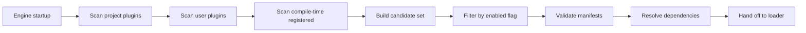
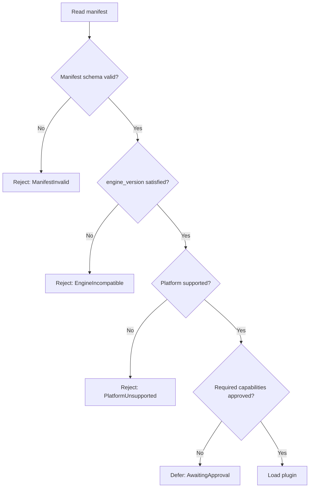
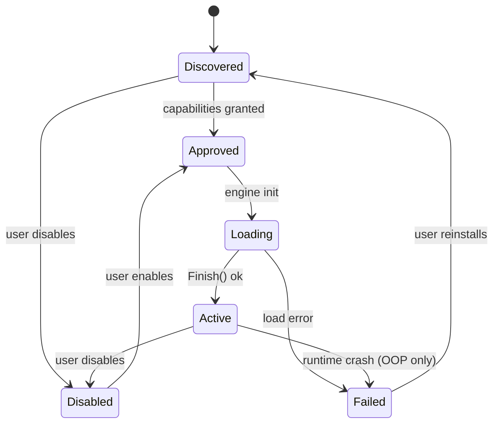

# Plugin Distribution System

**Version:** 0.1.0
**Status:** Draft
**Layer:** concept

## Overview

The Plugin Distribution System defines how third-party developers author, package, distribute, discover, and load plugins for the engine. It extends the internal `Plugin` trait described in `l1-app-framework.md` (which assumes compile-time linkage of trusted code) with the additional concerns of an open ecosystem: stable public SDK boundary, manifest format, engine compatibility matrix, capability-based sandboxing, and a uniform loading pipeline that supports both **in-process** (Go module) and **out-of-process** (subprocess via stdio/IPC) plugins.

The goal is a single contract that lets a third-party developer publish a plugin once and have it consumed identically by any engine application — headless server, editor, full game — provided the engine version satisfies the declared compatibility range and the user grants the requested capabilities.

## Related Specifications

- [l1-app-framework.md](l1-app-framework.md) — Internal Plugin trait, lifecycle phases (Build/Ready/Finish/Cleanup), and PluginGroup contract that this system extends to third-party authors.
- [l1-ai-assistant-system.md](l1-ai-assistant-system.md) — Defines the transport layer (Stdio/WebSocket/HTTP) and capability model that out-of-process plugins reuse.
- [l1-ai-api-plugin.md](l1-ai-api-plugin.md) — First-party reference plugin built on this distribution system (AI via REST API).
- [l1-compatibility-policy.md](l1-compatibility-policy.md) — Engine SemVer policy that the plugin manifest's `engine_version` constraint references.
- [l1-type-registry.md](l1-type-registry.md) — Plugins register their components/resources through the registry; symbol-export rules apply.
- [l1-error-core.md](l1-error-core.md) — Plugin load/runtime errors map to the engine's E-series taxonomy.
- [l1-multi-repo-architecture.md](l1-multi-repo-architecture.md) — Defines the `pkg/` boundary that the public Plugin SDK must respect.
- [l1-cli-tooling.md](l1-cli-tooling.md) — CLI sub-commands for scaffolding, validating, and managing third-party plugins.

## 1. Motivation

The internal Plugin trait (`l1-app-framework.md` §4.2) is sufficient for first-party features statically linked into a binary. It is **not** sufficient for an ecosystem where:

- Third-party developers publish plugins independently of the engine release cycle.
- A plugin built against engine `v1.4` must declare whether it is compatible with `v1.5` or requires a new release.
- A user installing a plugin from an unknown author needs a clear permission boundary — the plugin must not silently access the filesystem, the network, or other engine resources without explicit consent.
- Some plugins (heavy ML inference, vendor-locked SDKs in another language, untrusted code) cannot or should not be loaded in-process. They must run as subprocesses with the same lifecycle contract.
- A user needs a way to **list, install, enable, disable, and remove** plugins without rebuilding the engine binary.
- A plugin author needs a stable surface to compile against — engine internals (`internal/`) must remain free to change, while the public SDK (`pkg/plugin/`) provides a versioned contract.

Without this system, every third-party integration becomes a bespoke fork, a hand-written `main.go` patch, or an out-of-band hack with no security guarantees and no compatibility story.

## 2. Constraints & Assumptions

- The engine targets **Go 1.26+** (RULES.md C24). The Go `plugin` standard-library package (`.so` loading) is **not** used: it is Linux/macOS-only, brittle across Go toolchain versions, and incompatible with `cgo`/cross-compilation. In-process plugins are linked at **compile time** as Go modules, exactly like first-party plugins. Out-of-process plugins are independent binaries.
- A plugin distribution unit (PDU) is identified by a unique reverse-DNS-style ID (e.g., `com.example.aiapi`) plus a SemVer version.
- The public Plugin SDK lives under `pkg/plugin/` and follows the engine's compatibility policy (`l1-compatibility-policy.md`). Symbols inside `internal/` are off-limits to third parties.
- The engine does **not** ship a hosted plugin marketplace. Discovery is local-first; an optional remote catalogue is a configurable URL whose payload format is defined here but whose hosting is out of scope.
- Capability enforcement is a **trust-but-verify** model. In-process plugins compile against the public SDK; the engine cannot prevent them from importing arbitrary Go code at build time. Capabilities are enforced at runtime against engine-mediated APIs (filesystem, network, command pipeline) and at install time via manifest review. Code-level sandboxing of in-process plugins is out of scope.
- Out-of-process plugins are sandboxed at the OS level by the engine (working directory restriction, optional resource limits) and at the protocol level by capability gating on every message.
- The plugin loader runs during the engine's existing initialization levels (`l1-app-framework.md` §4.10) — no new lifecycle phase is introduced.
- Hot-reload of plugins at runtime is **not** in scope of this specification (deferred; see `l1-hot-reload.md`).

## 3. Core Invariants

- **INV-1**: Every third-party plugin is described by a `plugin.toml` manifest file. A plugin without a valid, schema-conformant manifest is rejected at load time.
- **INV-2**: Engine compatibility is enforced via SemVer constraints in the manifest's `engine_version` field. A plugin whose constraint does not include the running engine version is rejected before any plugin code is executed.
- **INV-3**: A plugin declares the full set of capabilities it requires in its manifest. The engine grants capabilities only after explicit user approval (or via a recorded prior approval). Runtime capability checks reject any operation outside the granted set; rejections are logged with plugin ID, requested capability, and call site.
- **INV-4**: In-process and out-of-process plugins share the same lifecycle contract (Build → Ready → Finish → Cleanup as in `l1-app-framework.md` §4.2) and the same capability model. A plugin author can switch its delivery mode without changing the plugin's logical behaviour.
- **INV-5**: Plugin IDs are globally unique within a single engine instance. Loading two plugins with the same ID is an error; the second load is rejected.
- **INV-6**: The public Plugin SDK (`pkg/plugin/`) follows engine SemVer. Breaking changes to the SDK require a major engine version bump and trigger the compatibility constraint mechanism (INV-2).
- **INV-7**: All world modifications by a plugin go through the standard Command pipeline (`l1-command-system.md`), tagged with the plugin ID. Plugins cannot mutate `World` storage directly. This invariant applies to both in-process and out-of-process plugins (out-of-process plugins issue commands via the protocol; the engine translates them to `Command` instances).
- **INV-8**: Out-of-process plugin failures (crash, timeout, transport disconnect) MUST NOT crash, freeze, or corrupt the host engine. The engine isolates the failure, marks the plugin as `Failed`, and continues operation; affected systems gracefully degrade (`l1-app-framework.md` §4.12 service registry "optional access" pattern).
- **INV-9**: A plugin's installed manifest is immutable per installed version. Editing the manifest of an installed plugin requires reinstalling the plugin. This prevents capability escalation by post-install manifest tampering.

## 4. Detailed Design

### 4.1 Plugin Distribution Unit (PDU)

A PDU is what a third-party author publishes. It is a directory (or archive) with this layout:

```plaintext
my-plugin/
├── plugin.toml          # Mandatory manifest
├── README.md            # Mandatory; rendered in plugin manager UI
├── LICENSE              # Mandatory
├── icon.png             # Optional; 256x256 PNG for UI
├── go.mod               # In-process plugins only
├── plugin.go            # In-process plugins only; exports New() entrypoint
└── bin/                 # Out-of-process plugins only
    ├── linux-amd64
    ├── darwin-arm64
    └── windows-amd64.exe
```

Two delivery modes are supported, distinguished by the manifest's `mode` field:

- **`in-process`**: the plugin is a Go module. The host application imports it and registers it through the SDK at compile time. Distribution is via standard Go modules (`go get github.com/author/my-plugin`).
- **`out-of-process`**: the plugin is one or more pre-built binaries. The engine launches the appropriate binary as a subprocess and communicates via the transport defined in the manifest. Distribution is via archives (tarball/zip) with checksums.

### 4.2 Manifest Schema (`plugin.toml`)

```plaintext
[plugin]
id              = string             # Reverse-DNS: "com.example.aiapi"
version         = string             # SemVer 2.0
name            = string             # Human-readable
description     = string             # Short summary
authors         = [string]           # ["Name <email>", ...]
license         = string             # SPDX identifier ("MIT", "Apache-2.0", ...)
homepage        = string             # Optional URL
mode            = string             # "in-process" | "out-of-process"

[compatibility]
engine_version  = string             # SemVer range: ">=1.4.0, <2.0.0"
go_version      = string             # Optional, in-process only
platforms       = [string]           # ["linux-amd64", "darwin-arm64", ...]

[capabilities.required]
items           = [string]           # ["network.outbound", "fs.read.project", ...]

[capabilities.optional]
items           = [string]           # Plugin functions degrade gracefully if denied

[entry.in_process]
package_path    = string             # "github.com/author/my-plugin"
factory         = string             # "New" — exported func returning Plugin

[entry.out_of_process]
binary          = string             # "bin/{os}-{arch}{ext}"
args            = [string]           # Optional CLI args
transport       = string             # "stdio" | "websocket" | "http"
endpoint        = string             # Required for websocket/http
checksum_sha256 = string             # SHA-256 of the binary archive

[config.schema]
# Optional JSON Schema for user-facing configuration.
# The plugin manager renders a form from this schema.
```

Only one of `[entry.in_process]` or `[entry.out_of_process]` is present, matching `mode`. Validation is performed by the `magic.spec`-style schema and by the CLI tool `ecs plugin validate` (`l1-cli-tooling.md`).

### 4.3 Capability Vocabulary

The capability set is defined here once; both this system and `l1-ai-assistant-system.md` (whose capability model this generalises) reference it:

| Capability | Scope | Default |
| :--- | :--- | :--- |
| `world.read` | Query entities, components, resources via the public Query API | granted |
| `world.commands` | Issue Commands (spawn, despawn, insert/remove components) | prompt |
| `world.resources.write` | Insert/replace global resources | prompt |
| `events.publish.{topic}` | Publish events on a topic; `*` matches any | prompt |
| `events.subscribe.{topic}` | Subscribe to a topic; `*` matches any | prompt |
| `fs.read.project` | Read files inside the project directory | prompt |
| `fs.write.project` | Write files inside the project directory | prompt |
| `fs.read.user` | Read files outside the project (user-selected paths only) | always-prompt |
| `fs.write.user` | Write files outside the project (user-selected paths only) | always-prompt |
| `network.outbound` | Open outgoing TCP/UDP/HTTP connections | prompt |
| `network.inbound` | Listen on a local port | always-prompt |
| `process.spawn` | Spawn child processes | always-prompt |
| `editor.ui` | Register editor UI panels and menus (editor builds only) | prompt |
| `assets.read` | Read project assets via AssetServer | prompt |
| `assets.write` | Add or modify assets in the project | prompt |
| `codegen` | Generate source files in the project | always-prompt |
| `time.realtime` | Read wall-clock time | granted |
| `metrics.publish` | Publish entries to the diagnostic system | granted |

`granted` capabilities are auto-allowed (low-risk, observable). `prompt` capabilities are decided once per plugin install and remembered. `always-prompt` capabilities trigger a confirmation dialog every time the plugin is enabled in a new session.

Capability strings are extensible. A plugin may declare a custom capability (`com.example.aiapi.cloud`) for documentation purposes; the engine treats unknown capabilities as `always-prompt` by default.

### 4.4 Discovery Pipeline



Sources, in order of precedence (later overrides earlier on ID collision, with a warning):

1. **Compile-time registered**: in-process plugins added via the host app's `main.go` calling `app.AddPlugins(...)`. Always discovered first; cannot be disabled at runtime (they are part of the binary).
2. **User directory**: `${XDG_CONFIG_HOME:-~/.config}/ecs-engine/plugins/<plugin-id>/` (Linux/macOS) or `%APPDATA%\ecs-engine\plugins\<plugin-id>\` (Windows). User-wide plugins.
3. **Project directory**: `<project-root>/.plugins/<plugin-id>/`. Project-specific plugins, version-controlled with the project.
4. **Configured paths**: additional directories listed in the project's `ecs.toml` (engine config) under `[plugins.search_paths]`.

Each scanned directory is expected to contain a `plugin.toml` at its root. Directories without a manifest are skipped silently.

### 4.5 Compatibility Resolution



The `engine_version` constraint follows Cargo/npm conventions:

- `^1.4.0` — compatible with `>=1.4.0, <2.0.0`.
- `~1.4.0` — compatible with `>=1.4.0, <1.5.0`.
- Explicit ranges `>=1.4.0, <1.7.0`.

Rejections produce a structured `E-PLUGIN-{NNN}` error (taxonomy in `l1-error-core.md`) and are surfaced in the plugin manager UI; they do not block engine startup unless the plugin is marked `required` in the project config.

### 4.6 Loading Pipeline

```plaintext
PluginManager (engine resource)
  registry:    map[PluginID]PluginRecord
  capabilities: map[PluginID]CapabilitySet
  state:       map[PluginID]PluginState  // Discovered | Approved | Loading | Active | Failed | Disabled
  audit:       []PluginAuditEntry
```

For each approved plugin:

1. **In-process**:
    - The host's `main.go` has already imported the plugin's package at compile time.
    - At runtime, the manager calls the plugin's exported `New() Plugin` factory and then proceeds through the standard `Build → Ready → Finish` lifecycle (`l1-app-framework.md` §4.2). The manager wraps the returned `Plugin` with a capability-enforcing proxy so that calls into the engine API are intercepted and checked.
2. **Out-of-process**:
    - The manager spawns the binary with the configured working directory restricted to the plugin's installation directory (or a temp scratch dir).
    - It establishes the transport (stdio/WebSocket/HTTP) and performs a handshake: engine sends `init` with engine version, host capabilities, and granted capability set; plugin replies with declared methods and protocol version.
    - The plugin's `Build/Ready/Finish` are invoked over the protocol. The engine creates a host-side proxy `Plugin` that forwards lifecycle calls and translates plugin-issued operations (queries, commands, events) into in-process equivalents.

The transport, message envelope, and method dispatch reuse the contract from `l1-ai-assistant-system.md` §4.2 — that protocol is generalised here as the engine's universal plugin protocol.

### 4.7 Public SDK Surface (`pkg/plugin/`)

```plaintext
pkg/plugin/
├── plugin.go            # Plugin, PluginGroup interfaces (re-exported from app framework public surface)
├── manifest.go          # Manifest struct, parse/validate
├── capability.go        # Capability constants, CapabilitySet
├── context.go           # PluginContext: scoped App handle exposing capability-checked APIs
├── command.go           # CommandIssuer abstraction for both in-process and out-of-process
├── event.go             # Event publish/subscribe surface
├── query.go             # Query helpers (re-exported subset of pkg/ecs/query)
├── log.go               # Structured logger scoped to the plugin
├── errors.go            # E-PLUGIN error helpers
└── transport/           # Out-of-process transport implementations
    ├── stdio.go
    ├── websocket.go
    └── http.go
```

A third-party in-process plugin imports only `pkg/plugin`. It never imports `internal/` or any non-public engine package. Anything not in the SDK is, by contract, unstable and subject to change between minor versions.

### 4.8 Plugin Lifecycle States



The `Failed` state is sticky for the session: the engine does not auto-restart a failed plugin. Users see the failure reason in the plugin manager and may explicitly retry.

### 4.9 Configuration Surface

A plugin may expose a JSON-Schema-described config block. The plugin manager renders a form for the user; values are persisted in the project's `ecs.toml`:

```plaintext
[plugins."com.example.aiapi"]
enabled  = true
config   = { provider = "anthropic", model = "claude-sonnet-4-6", max_tokens = 1024 }
```

At load time, the engine validates the saved config against the manifest's `[config.schema]` and passes it to the plugin via `PluginContext.Config()`.

### 4.10 CLI Integration

The engine CLI (`l1-cli-tooling.md`) gains the following subcommands:

```plaintext
ecs plugin scaffold <id>      # Generate a new plugin skeleton (manifest + Go module)
ecs plugin validate [path]    # Validate a manifest and surrounding layout
ecs plugin install <archive>  # Install OOP plugin to user or project dir
ecs plugin list               # List installed plugins, status, capabilities
ecs plugin enable|disable <id>
ecs plugin info <id>
ecs plugin remove <id>
ecs plugin doctor             # Diagnose load failures, capability conflicts, version mismatches
```

The same operations are also available through the editor's plugin manager UI.

### 4.11 Audit and Observability

Every plugin lifecycle transition and capability grant/denial is recorded in a per-project audit log (`<project>/.ecs/plugins-audit.log`). Each entry contains: timestamp, plugin ID + version, event type (`load`, `unload`, `capability-granted`, `capability-denied`, `crashed`), and a free-form details object. The audit log is append-only and is rotated by size (default 10 MB).

Diagnostic system (`l1-diagnostic-system.md`) integration: each active plugin contributes a metric group with load duration, message count (OOP), error count, and last failure reason.

### 4.12 Security Boundaries

- **In-process plugins** are trusted at the code level: they are linked into the binary by the host's `main.go`. The capability proxy mediates engine-API access but cannot stop a plugin from calling arbitrary Go code outside the SDK. Users installing in-process plugins are advised to audit the source or trust the publisher.
- **Out-of-process plugins** are isolated by the OS process boundary. The engine restricts the subprocess working directory, optionally applies resource limits (cgroups/JobObjects), and enforces capabilities on every protocol message. A malicious OOP plugin can only do what its granted capabilities allow plus what its OS user can do directly — it cannot reach into engine memory or bypass the command pipeline.
- **Manifest tampering** after install is detected by comparing the on-disk manifest checksum to the checksum recorded at install time. A mismatch demotes the plugin to `Discovered` and re-prompts for capability approval.

## 5. Open Questions

- Should the engine publish a reference catalogue server (with a documented JSON API) for plugin discovery, or is local-only discovery sufficient for v1?
- Should out-of-process plugins support **bidirectional event subscription** (engine pushes events to plugin) by default, or only on explicit `events.subscribe.{topic}` capability grant?
- How should two plugins that depend on each other (e.g., a UI panel plugin extending an AI plugin) declare and resolve cross-plugin dependencies — through manifest fields or runtime service-registry lookups?
- Should the engine offer a signed-manifest mechanism (e.g., minisign) to verify publisher identity, and if so, is signature verification mandatory or advisory?
- Should the engine support **language-agnostic** out-of-process plugins (Python, Node, Rust binaries) explicitly in the manifest, or treat them all uniformly as "binary + transport"?

## Canonical References

<!-- MANDATORY for Stable status. List authoritative source files that downstream agents
     MUST read before implementing this spec. Use relative paths from project root.
     Stub state — fill with concrete files when implementation begins (Phase 1+). -->

| Alias | Path | Purpose |
| :--- | :--- | :--- |

<!-- Empty table = no canonical sources yet. Populate one row per authoritative file
     when implementation lands (Phase 1+). Stable promotion requires ≥1 row. -->

## Document History

| Version | Date | Description |
| :--- | :--- | :--- |
| 0.1.0 | 2026-05-01 | Initial draft — third-party plugin distribution: manifest, modes, discovery, capabilities, public SDK |
| — | — | Planned examples: `examples/plugin/distribution/` |
