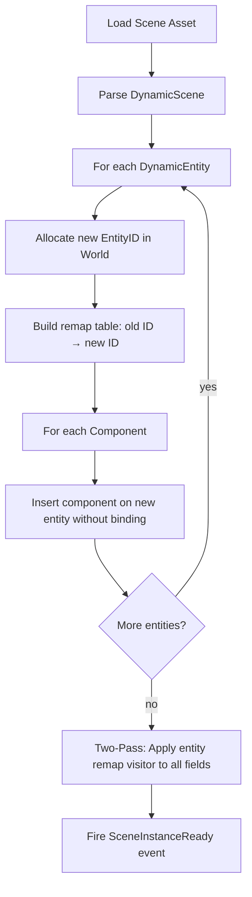

# Scene System

**Version:** 0.4.0
**Status:** Draft
**Layer:** concept

## Overview

The scene system captures and restores collections of entities with their components. It supports two representations: StaticScene (frozen World snapshot, fast but opaque) and DynamicScene (reflection-based, human-readable, serializable). Scenes integrate with the asset system for loading, saving, and hot-reloading.

## Related Specifications

- [asset-system.md](l1-asset-system.md) — Scenes are loaded as assets
- [world-system.md](l1-world-system.md) — Scenes are extracted from and instantiated into a World
- [entity-system.md](l1-entity-system.md) — Entity remapping during scene instantiation
- [component-system.md](l1-component-system.md) — Component reflection for DynamicScene
- [definition-system.md](l1-definition-system.md) — Scene definitions as JSON, extending DynamicScene with richer semantics

## 1. Motivation

Games need to persist and restore world state for saving, loading, level streaming, and editor workflows. A scene system must:
- Serialize a subset of the World to a portable format.
- Instantiate scenes multiple times (prefab pattern) with unique entity IDs.
- Support both fast binary snapshots and human-editable text formats.
- Remap entity references within components when spawning into a live World.

## 2. Constraints & Assumptions

- DynamicScene depends on the reflection/type-registry system to discover component fields.
- StaticScene is a direct memory snapshot and is NOT portable across engine versions.
- Scene instantiation always produces new entity IDs; it never overwrites existing entities.
- Components that contain entity references must register a remapping visitor.

## 3. Core Invariants

1. **Entity uniqueness.** Spawning a scene never reuses an existing live entity ID.
2. **Reference integrity.** All entity references in spawned components point to valid remapped entities.
3. **Filter consistency.** A SceneFilter applied during extraction and during instantiation produces the same component set.
4. **Asset identity.** A scene loaded as an asset can be spawned multiple times independently.
5. **Two-Pass Loading.** Scene loading MUST use a two-pass strategy: first create all entities and their basic components, then execute deferred binding of cross-references.

## 4. Detailed Design

### 4.1 Scene Types

```plaintext
Scene Types
├── StaticScene
│   ├── binary blob of archived World data
│   ├── fast to load and instantiate
│   └── not human-readable, not editable
└── DynamicScene
    ├── collection of DynamicEntity records
    ├── uses reflection for serialization
    └── human-readable (JSON/RON), editable
```

### 4.2 DynamicScene Structure

```plaintext
DynamicScene
  entities: []DynamicEntity

DynamicEntity
  id:         EntityID              -- original entity ID (pre-remap)
  components: []ReflectedComponent  -- type-erased component data
```

Each `ReflectedComponent` stores the type name and its field values as a reflected value tree, making it serializable without compile-time knowledge of the component type.

### 4.3 DynamicSceneBuilder

Extracts entities from a live World into a DynamicScene:

```plaintext
DynamicSceneBuilder
  fn from_world(world: &World) -> Self
  fn extract_entity(entity: EntityID) -> &mut Self
  fn extract_entities(iter: Iterator[EntityID]) -> &mut Self
  fn with_filter(filter: SceneFilter) -> &mut Self
  fn build() -> DynamicScene
```

The builder uses the World's type registry to reflect each component on the selected entities.

### 4.4 SceneFilter

Controls which component types are included or excluded:

```plaintext
SceneFilter
  fn allow(type_id: TypeID) -> Self       -- whitelist a type
  fn deny(type_id: TypeID) -> Self        -- blacklist a type
  fn allow_all() -> Self
  fn deny_all() -> Self
```

When both allow and deny are specified, deny takes precedence. This lets users exclude internal bookkeeping components (e.g., computed transforms) from serialized scenes.

### 4.5 Scene Instantiation and Entity Remapping



The remap table ensures that if Entity 5 in the scene file referenced Entity 3, and Entity 3 was remapped to Entity 1042, then the reference in Entity 5's components is updated to 1042.

### 4.6 SceneSpawner

```plaintext
SceneSpawner (World resource)
  fn spawn(scene_handle: Handle[DynamicScene]) -> InstanceID
  fn spawn_static(scene_handle: Handle[StaticScene]) -> InstanceID
  fn despawn_instance(instance: InstanceID)
  fn get_instance_entities(instance: InstanceID) -> []EntityID
```

Each spawn call returns an `InstanceID` that groups all entities created from that instantiation, enabling bulk operations like despawning an entire prefab instance.

### 4.7 Serialization Formats

| Format | Use Case                | Characteristics            |
| :----- | :---------------------- | :------------------------- |
| JSON   | Editor, debugging       | Human-readable, diffable   |
| Binary | Runtime, distribution   | Compact, fast to parse     |

The format is determined by the file extension or meta file settings. Both formats use the same reflection data; only the encoding differs.

### 4.8 Prefab Pattern

A prefab is simply a scene asset spawned multiple times. Each spawn produces independent entities with unique IDs. Modifications to the prefab asset (via hot-reload) can optionally propagate to live instances by despawning and re-spawning, though this is an opt-in behavior.

### 4.9 SceneInstanceReady Event

Fired when all entities from a `spawn()` call have been fully inserted into the World:

```plaintext
SceneInstanceReady
  instance_id: InstanceID
  scene_handle: Handle[DynamicScene]
  entities: []EntityID
```

Systems can listen for this event to perform post-spawn setup (e.g., wiring up runtime state).

### 4.10 Interned Array Serialization

DynamicScene serialization uses interned arrays to minimize file size and memory:

```plaintext
SerializedScene
  names:      []string        // deduplicated pool of type names and property names
  variants:   []Value         // deduplicated pool of property values
  node_paths: []NodePath      // deduplicated pool of hierarchy paths
  entities:   []SerializedEntity

SerializedEntity
  name:       index -> names[]
  components: []SerializedComponent

SerializedComponent
  type_name:  index -> names[]
  properties: [](name_index, value_index)   // pairs of indices into names[] and variants[]
```

Each entity stores indices into the shared pools rather than inline strings or values. When a scene has 100 entities all with a `Transform` component, the string `"Transform"` appears once in the `names` array, not 100 times. This applies to the binary serialization format; the human-readable JSON format may use inline values for readability.

### 4.11 Scene Load Context

Scene instantiation accepts a context parameter that controls how entities are created:

```plaintext
SceneLoadContext:
  Runtime         // normal gameplay — no editor metadata, no undo tracking
  EditorPreview   // editor viewport preview — lightweight metadata, no undo
  EditorMain      // main edited scene — full metadata, undo/redo tracking
```

Instead of a global "am I in editor mode" flag, context is passed per-instantiation. This allows the same scene to be simultaneously loaded for gameplay (Runtime) and editor inspection (EditorMain) with different behavior. The context determines:

- Whether entities receive editor-only marker components.
- Whether property changes are recorded in the undo/redo history.
- Whether debug visualization components are attached.

### 4.12 Format Versioning

Scene files carry explicit version metadata for forward compatibility:

```plaintext
SceneHeader
  format_version:        uint32   // current format version
  format_version_compat: uint32   // minimum version that can read this file
```

When saving, the serializer checks whether any new-format features are actually used. If not, it writes at the older `format_version_compat` level, avoiding unnecessary breakage of older tools. When loading, the deserializer checks `format_version` against its known range and rejects files from the future with a clear error message.

Each format version bump requires a corresponding roundtrip test (serialize → deserialize → compare) in the test suite.

### 4.13 Symmetric Pack/Unpack API

The `SerializedScene` exposes both a build API (for packing) and a query API (for unpacking) over the same interned data:

```plaintext
// Build API (packing a scene)
builder.AddName(name) -> nameIndex
builder.AddValue(value) -> valueIndex
builder.AddEntity(nameIndex) -> entityIndex
builder.AddComponent(entityIndex, typeIndex, properties)

// Query API (reading without instantiation)
scene.EntityCount() -> int
scene.EntityName(idx) -> string
scene.ComponentCount(entityIdx) -> int
scene.ComponentType(entityIdx, compIdx) -> string
scene.PropertyValue(entityIdx, compIdx, propIdx) -> Value
```

This enables tools that inspect, diff, or merge scene files without instantiating runtime objects — critical for version control integration and batch processing.

### 4.14 Multi-Scene Hierarchy

Scenes can form a parent-child hierarchy, enabling level streaming and modular world composition:

```plaintext
Scene
  parent:   *Scene              // nil for root scene
  entities: []Entity
  children: []Scene
  offset:   Vec3                // local offset relative to parent
  world_matrix: Mat4            // computed: parent.world_matrix * offset
```

**Scene offset**: Each child scene carries an offset applied to all its entities. This enables:
- Level streaming: load adjacent areas as child scenes at spatial offsets.
- Instancing: the same scene definition spawned at different world positions.
- Editor multi-scene: multiple scenes open simultaneously, each at its own position.

**World matrix propagation**: When a scene's offset changes, `world_matrix` is recomputed recursively for all children. Entity transforms within a scene are relative to the scene's world matrix, not the global origin. This avoids floating-point precision issues in large worlds (entities are always close to their scene origin).

**Lifecycle**: Adding/removing child scenes triggers entity registration/deregistration with the world's processor system. The parent scene manages the lifecycle — despawning a parent despawns all children recursively.

### 4.15 Entity Metadata

Entities carry optional debug-friendly metadata beyond a raw numeric ID:

```plaintext
Entity
  id:     uint64          // generational index (fast, primary key)
  guid:   UUID            // persistent across save/load (optional, editor-only)
  name:   string          // human-readable label (optional, debug/editor)
```

**GUID**: A 128-bit universally unique identifier assigned to entities in editor mode. Unlike the runtime `id` (which is reused via generational indexing), the GUID is stable across save/load cycles and is used for scene merging, prefab overrides, and editor cross-references. In production builds, GUIDs are stripped to save memory.

**Name**: A human-readable label for debugging. Stored as an optional component (not part of the core Entity struct) to avoid memory overhead on unnamed entities. The diagnostic system and editor inspector display entity names; gameplay code should reference entities by ID, not by name.

## 5. Open Questions

1. Should DynamicScene support partial updates (merge into existing entities) or only full spawns?
2. How should scene inheritance work — can a scene reference a parent scene and override specific components?
3. What happens when a scene references component types not registered in the current engine build?
4. Should the interned array format support shared string pools across multiple scene files (e.g., a project-wide dictionary)?

## Document History

| Version | Date | Description |
| :--- | :--- | :--- |
| 0.1.0 | 2026-03-25 | Initial draft from architecture analysis |
| 0.2.0 | 2026-03-26 | Added interned arrays, load context, format versioning, symmetric pack/unpack API |
| 0.3.0 | 2026-03-26 | Added multi-scene hierarchy with offsets, entity metadata (GUID + name) |
| 0.4.0 | 2026-04-20 | Added two-pass loading invariant based on 3D Engine analysis |
| — | — | Planned examples: `examples/scene/` |
