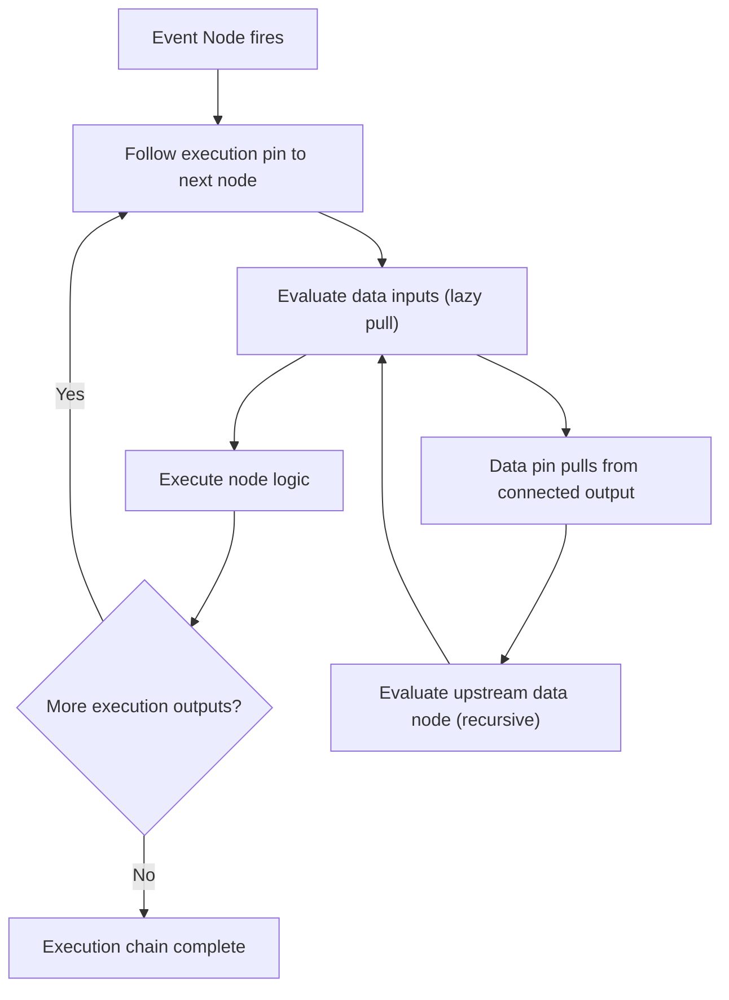

# Visual Graph System

| Metadata | Value |
| :--- | :--- |
| **Layer** | 1 (concept) |
| **Status** | Draft |
| **Version** | 0.1.0 |
| **Related Specifications** | [definition-system.md](l1-definition-system.md), [scripting-system.md](l1-scripting-system.md), [multi-repo-architecture.md](l1-multi-repo-architecture.md), [type-registry.md](l1-type-registry.md), [event-system.md](l1-event-system.md), [command-system.md](l1-command-system.md), [query-system.md](l1-query-system.md), [component-system.md](l1-component-system.md), [system-scheduling.md](l1-system-scheduling.md), [app-framework.md](l1-app-framework.md) |

## Overview

The Visual Graph System provides engine-side infrastructure for **node-based visual programming** — the runtime data model, interpreter, and public API that enable a GUI editor (in the external `ecs-editor` repository) to offer a Blueprint-style graph editing experience. The engine does not implement the visual editor itself; it exposes the "door" — the graph data model, execution engine, serialization format, and `pkg/editor/` interfaces — so that the editor (or any other consumer of the public API) can build a full node-graph UI on top.

Visual graphs are a new definition type (`"graph"`) in the [Definition System](l1-definition-system.md). A graph file is a JSON document describing nodes, pins, connections, and subgraph references. The engine loads these files as assets, interprets them at runtime within the ECS schedule, and supports hot-reload for instant iteration.

This is a higher-level authoring mechanism complementary to the deferred [Scripting System](l1-scripting-system.md). Where scripting targets programmers who want text-based rapid iteration, visual graphs target designers and technical artists who prefer spatial, connection-based logic authoring — assembling behavior from pre-built blocks without writing code.

## 1. Motivation

Every modern game engine offers some form of visual scripting: Unreal Engine's Blueprints, Unity's Visual Scripting (Bolt), Godot's VisualScript. The pattern is proven — it dramatically lowers the barrier for non-programmers to author gameplay logic, AI behaviors, UI interactions, and event handling.

The ECS engine's existing stack provides:

| Workflow | Mechanism | Gap |
| :--- | :--- | :--- |
| Data-driven content | Definition System (JSON) | Covers UI, scenes, flows, templates — but no arbitrary logic |
| Code iteration | Hot-reload (Go restart) | Fast (~1.2s) but requires Go knowledge |
| Arbitrary logic | Scripting System (deferred) | Not implemented; text-based; targets programmers |

Visual graphs fill the gap: **arbitrary logic authored without code knowledge**, with instant visual feedback. Specifically:

- **Designers** wire up gameplay behaviors (enemy AI, door triggers, quest logic) by connecting nodes.
- **Technical artists** create material graphs, particle behaviors, and animation state machines.
- **Prototypers** rapidly test game mechanics by rearranging node connections.
- **The editor** gets a universal canvas for visualizing and editing any graph-structured data in the engine.

The engine must own the graph runtime (data model + interpreter) to ensure:

1. Graphs execute within the ECS schedule with proper access tracking.
2. Graph serialization is part of the asset pipeline (hot-reload, versioning).
3. The graph node registry reflects the actual engine API (components, events, actions).
4. Debugging tools (breakpoints, traces) work through the existing `pkg/protocol/` IPC channel.

## 2. Constraints & Assumptions

- Graphs are serialized as JSON definition files (definition type `"graph"`), consistent with the Definition System.
- All World mutations from graph execution go through CommandBuffers (same as scripting and definitions).
- Graph execution is bounded — a configurable node-execution limit prevents infinite loops from freezing the frame.
- The graph interpreter runs on the main thread within the `Update` schedule. Parallel graph execution is a future optimization.
- Node types are discovered at runtime through the TypeRegistry. The engine provides a built-in node set; plugins can register custom nodes.
- The graph system is fully optional — removing it has zero impact on core engine functionality. It is loaded as a plugin (`GraphPlugin`).
- The visual editor UI is NOT part of this specification. This spec defines only the engine-side "door" — the data model, interpreter, and `pkg/editor/` interfaces.
- Graph files must be loadable and executable without the editor running (headless/production mode).

## 3. Core Invariants

- **INV-1 (ECS Compliance)**: Graph execution produces ECS commands through the standard CommandBuffer pipeline. Graphs never bypass the command system for World mutations.
- **INV-2 (Bounded Execution)**: Every graph execution per frame is bounded by a configurable node-step limit. Exceeding the limit suspends the graph and logs a warning — it never freezes the engine.
- **INV-3 (Type Safety)**: Every pin connection is validated at load time — output pin type must be assignable to input pin type. Invalid connections are rejected during schema validation, not at runtime.
- **INV-4 (Deterministic Order)**: Given the same graph and the same input state, execution produces the same sequence of commands. No undefined node evaluation order within a single execution pass.
- **INV-5 (Hot-Reload)**: Modifying a graph definition file triggers re-interpretation of all instances using that graph, preserving per-instance variable state where types have not changed.
- **INV-6 (Editor Independence)**: The graph interpreter runs identically with or without an editor connected. The `pkg/editor/` interfaces are optional consumers, not required providers.
- **INV-7 (No Engine Coupling)**: The graph plugin depends on public engine APIs only. Removing `GraphPlugin` from the app builder produces a valid engine build with zero graph-related overhead.

## 4. Detailed Design

### 4.1 Graph Data Model

The core data model is technology-agnostic and maps directly to the JSON serialization format:

```plaintext
GraphDefinition
  id:           string                // unique graph identifier
  name:         string                // human-readable name
  description:  string                // purpose/documentation
  category:     GraphCategory         // Gameplay | AI | UI | Animation | Material | Custom
  variables:    []VariableDecl        // graph-local variables
  nodes:        []Node                // all nodes in this graph
  connections:  []Connection          // all pin-to-pin connections
  subgraphs:    map[string]GraphRef   // embedded subgraph references
  metadata:     GraphMetadata         // editor layout hints (positions, zoom, comments)

Node
  id:           string                // unique within this graph
  type:         string                // registered node type name (e.g., "ecs.ForEach", "math.Add")
  display_name: string                // optional override for visual display
  position:     [float, float]        // editor canvas position (layout hint, not runtime)
  pins:         []Pin                 // inputs and outputs
  properties:   map[string]any        // node-specific constant values (configured in editor)
  comment:      string                // developer annotation

Pin
  id:           string                // unique within the node
  name:         string                // display name
  direction:    Input | Output
  kind:         Execution | Data
  data_type:    string                // type name for Data pins (e.g., "float32", "Vec3", "Entity")
  default_value: any                  // fallback when no connection exists (Data pins only)
  is_array:     bool                  // accepts/produces multiple values

Connection
  from_node:    string                // source node ID
  from_pin:     string                // source pin ID (must be Output)
  to_node:      string                // target node ID
  to_pin:       string                // target pin ID (must be Input)
```

**Pin Kinds:**

- **Execution pins** (white arrows in UE Blueprints): control the order of node execution. A node with an execution input runs only when its predecessor explicitly triggers it. Execution flows form a chain — the imperative control flow of the visual script.
- **Data pins** (colored by type): carry values between nodes. Data pins are evaluated lazily — the value is computed when the consuming node needs it during its execution step.

### 4.2 Node Type Taxonomy

Nodes are organized into categories that map to ECS concepts. The engine provides a built-in set; plugins can register additional node types.

```plaintext
Category: Event (entry points — no execution input, only execution output)
  OnUpdate              — fires every frame; provides DeltaTime
  OnFixedUpdate         — fires on fixed timestep
  OnStateEnter(state)   — fires when a state machine enters a state
  OnStateExit(state)    — fires when a state machine exits a state
  OnEvent(event_type)   — fires when a typed ECS event is received
  OnComponentAdded(T)   — fires when a component is added to the owning entity
  OnComponentRemoved(T) — fires when a component is removed
  OnCollisionEnter      — fires on collision start (requires physics)
  OnCollisionExit       — fires on collision end
  OnInput(action)       — fires on input action (key press, button, axis)
  Custom                — plugin-registered event nodes

Category: Action (produce ECS commands — have execution input and output)
  SpawnEntity           — spawn an entity from a template or component set
  DespawnEntity         — despawn an entity
  SetComponent(T)       — set component values on an entity
  InsertComponent(T)    — add a component to an entity
  RemoveComponent(T)    — remove a component from an entity
  SendEvent(T)          — emit a typed event
  TransitionState(S)    — trigger a state machine transition
  PlayAudio             — play a sound
  Log                   — log a debug message
  SetVariable           — set a graph-local or entity-local variable
  Custom                — plugin-registered action nodes

Category: Query (iterate entities — have execution input and loop body output)
  ForEach(T1, T2, ...)  — iterate all entities with components T1, T2, ...
  GetEntity(entity)     — get components from a specific entity
  FindByName(name)      — find entity by Name component
  GetChildren           — iterate children of an entity
  GetParent             — get parent entity

Category: Data (pure functions — no execution pins, only data pins)
  Math: Add, Subtract, Multiply, Divide, Modulo, Abs, Clamp, Lerp, Min, Max
  Vector: MakeVec3, BreakVec3, Normalize, Dot, Cross, Distance, Length
  Logic: And, Or, Not, Equals, Greater, Less, GreaterEqual, LessEqual
  String: Concat, Format, Contains, Length, Substring
  Conversion: ToFloat, ToInt, ToString, ToBool
  Utility: Random, RandomRange, Sin, Cos, Atan2
  Custom: plugin-registered pure function nodes

Category: Flow Control (control execution flow — execution pins only)
  Branch            — if/else: one execution input, condition data input, True/False outputs
  ForLoop           — counted loop: start, end, step → body execution + index output
  WhileLoop         — condition loop: body repeats while condition is true
  Sequence          — execute multiple outputs in order (Then 0, Then 1, ...)
  Gate              — pass/block execution based on a bool state
  DoOnce            — execute the body only on the first trigger per instance
  Delay             — defer execution to a future frame (coroutine-like)
  SwitchOnInt       — multi-way branch on integer value
  SwitchOnString    — multi-way branch on string value
  SwitchOnEnum      — multi-way branch on enum value

Category: Variable (access graph-local or entity-local state)
  GetVariable(name)   — read a variable value (data output only)
  SetVariable(name)   — write a variable value (execution + data input)

Category: Component (access component fields)
  GetComponent(T)     — get a component's data from an entity (data output)
  SetComponent(T)     — set a component's data on an entity (action, execution pins)
  BreakComponent(T)   — decompose a component into individual field data outputs
  MakeComponent(T)    — compose individual field values into a component data output

Category: SubGraph (composition)
  SubGraph(ref)       — execute another graph as a single node (input/output pins mirror subgraph interface)
```

### 4.3 Execution Model

Graph execution follows a hybrid flow model combining imperative execution chains with lazy data evaluation:



**Execution Rules:**

1. **Entry**: An Event node fires based on an ECS trigger (frame tick, event, component change).
2. **Execution chain**: The engine follows execution pin connections sequentially. Each node in the chain runs its logic and passes control to the next node via its execution output pin.
3. **Data pull**: When a node executes, it pulls values from its data input pins. If a data input is connected to another node's data output, that node is evaluated on-demand. Data nodes (pure functions) have no side effects — they are computed each time a consumer pulls their output.
4. **Branching**: Flow control nodes (Branch, ForLoop) direct execution to one of multiple execution output pins based on runtime conditions.
5. **Termination**: An execution chain ends when it reaches a node with no outgoing execution pin, or when the node-step limit is reached.
6. **Multiple entry points**: A single graph can have multiple Event nodes. Each fires independently when its trigger condition is met.

**Integration with ECS Schedule:**

```plaintext
GraphExecutionSystem
  Schedule:     Update
  Parameters:   Query[GraphInstance, GraphState], Res[NodeRegistry], Commands
  Logic:
    For each entity with a GraphInstance component:
      1. Check which Event nodes should fire this frame
      2. For each triggered event, execute the graph starting from that node
      3. Collect all emitted Commands into the entity's CommandBuffer
      4. Track execution step count; suspend if limit exceeded
```

### 4.4 Graph Instance Component

Each entity that runs a visual graph has a `GraphInstance` component:

```plaintext
GraphInstance
  graph:          Handle[GraphDefinition]   // asset reference to the graph definition
  variables:      map[string]any            // per-instance variable state
  state:          GraphInstanceState        // Active | Suspended | Error
  error_message:  string                    // populated if state == Error
  step_count:     uint32                    // nodes executed this frame (reset each frame)
  step_limit:     uint32                    // max nodes per frame (default: 10000)
  debug:          GraphDebugState           // breakpoints, trace buffer (empty if no debugger)

GraphInstanceState
  Active     — executing normally
  Suspended  — paused (step limit hit, Delay node, or debugger breakpoint)
  Error      — runtime error occurred; graph disabled until manually re-enabled
```

### 4.5 Node Registry

The engine maintains a runtime registry of all available node types. This registry is the source of truth that the editor queries to populate its node palette.

```plaintext
NodeRegistry
  Register(descriptor: NodeDescriptor)
  Unregister(type_name: string)
  Get(type_name: string) -> Option[NodeDescriptor]
  List() -> []NodeDescriptor
  ListByCategory(category: string) -> []NodeDescriptor
  Search(query: string) -> []NodeDescriptor

NodeDescriptor
  type_name:      string                   // unique identifier (e.g., "ecs.ForEach")
  display_name:   string                   // human-readable name
  category:       string                   // Event | Action | Query | Data | Flow | Variable | Component | SubGraph
  description:    string                   // tooltip/documentation
  pins:           []PinDescriptor          // static pin definitions
  dynamic_pins:   bool                     // whether pins can change at runtime (e.g., ForEach adds pins per component type)
  properties:     []PropertyDescriptor     // configurable constant values
  icon:           string                   // optional icon identifier for editor
  color:          string                   // optional category color hint for editor

PinDescriptor
  id:             string
  name:           string
  direction:      Input | Output
  kind:           Execution | Data
  data_type:      string                   // TypeRegistry type name
  default_value:  any
  is_array:       bool
  is_optional:    bool                     // data input that doesn't require a connection
```

**Auto-Registration**: The graph plugin scans the TypeRegistry at startup and auto-generates node descriptors for:

- Every registered component type → `GetComponent[T]`, `SetComponent[T]`, `BreakComponent[T]`, `MakeComponent[T]` nodes
- Every registered event type → `OnEvent[T]`, `SendEvent[T]` nodes
- Every registered state type → `OnStateEnter[S]`, `OnStateExit[S]`, `TransitionState[S]` nodes

This means the editor's node palette automatically reflects the engine's current type landscape — including types registered by third-party plugins.

### 4.6 Graph Serialization (Definition Type: "graph")

Visual graphs are serialized as a new definition type in the Definition System:

```plaintext
{
    "definition": "graph",
    "version": "1.0",
    "metadata": {
        "name": "enemy_patrol_behavior",
        "description": "Basic enemy patrol AI",
        "tags": ["ai", "enemy", "patrol"],
        "category": "Gameplay"
    },
    "content": {
        "variables": [
            { "name": "patrol_speed", "type": "float32", "default": 3.5 },
            { "name": "waypoint_index", "type": "int", "default": 0 }
        ],
        "nodes": [
            {
                "id": "evt_update",
                "type": "event.OnUpdate",
                "position": [100, 200],
                "pins": [
                    { "id": "exec_out", "name": "Execute", "direction": "output", "kind": "execution" },
                    { "id": "dt", "name": "DeltaTime", "direction": "output", "kind": "data", "data_type": "float32" }
                ]
            },
            {
                "id": "get_transform",
                "type": "component.GetComponent",
                "position": [300, 200],
                "properties": { "component_type": "Transform" },
                "pins": [
                    { "id": "entity", "name": "Entity", "direction": "input", "kind": "data", "data_type": "Entity" },
                    { "id": "transform", "name": "Transform", "direction": "output", "kind": "data", "data_type": "Transform" }
                ]
            },
            {
                "id": "move_toward",
                "type": "math.MoveToward",
                "position": [500, 200],
                "pins": [
                    { "id": "exec_in", "name": "Execute", "direction": "input", "kind": "execution" },
                    { "id": "exec_out", "name": "Execute", "direction": "output", "kind": "execution" },
                    { "id": "current", "name": "Current", "direction": "input", "kind": "data", "data_type": "Vec3" },
                    { "id": "target", "name": "Target", "direction": "input", "kind": "data", "data_type": "Vec3" },
                    { "id": "speed", "name": "Speed", "direction": "input", "kind": "data", "data_type": "float32" },
                    { "id": "result", "name": "Result", "direction": "output", "kind": "data", "data_type": "Vec3" }
                ]
            }
        ],
        "connections": [
            { "from_node": "evt_update", "from_pin": "exec_out", "to_node": "move_toward", "to_pin": "exec_in" },
            { "from_node": "get_transform", "from_pin": "transform", "to_node": "move_toward", "to_pin": "current" }
        ],
        "editor_metadata": {
            "zoom": 1.0,
            "scroll": [0, 0],
            "comments": [
                { "text": "Main patrol loop", "position": [80, 150], "size": [600, 300] }
            ]
        }
    }
}
```

**`editor_metadata`** is stored in the graph file but ignored by the runtime interpreter. It preserves the visual layout (node positions, zoom, comments) so the editor can restore the canvas state.

### 4.7 Engine-Side Extension Points ("The Door")

The engine exposes interfaces under `pkg/editor/` that the external `ecs-editor` repository implements. These are the "door" — the editor has no other way to interact with the graph system.

#### 4.7.1 GraphEditorPlugin Interface

```plaintext
// pkg/editor/graph.go

GraphEditorPlugin (interface)
  OnGraphOpened(graph: GraphDefinition)
    // Called when the editor opens a graph for editing.
    // Allows the engine to prepare debugging state.

  OnGraphClosed(graphID: string)
    // Called when the editor closes a graph.
    // Engine cleans up debug state.

  OnNodeSelected(graphID: string, nodeID: string) -> NodeInspection
    // Called when the editor selects a node.
    // Returns current runtime values for inspection.

  OnConnectionChanged(graphID: string, change: ConnectionChange) -> ValidationResult
    // Called when the editor adds/removes a connection.
    // Engine validates type compatibility and returns errors or warnings.

  OnPropertyChanged(graphID: string, nodeID: string, property: string, value: any) -> ValidationResult
    // Called when the editor changes a node property.
    // Engine validates the value.

NodeInspection
  node_id:       string
  node_type:     string
  pin_values:    map[string]any          // current runtime values at each pin
  execution_count: uint64                // how many times this node has executed
  last_error:    string                  // last error if any

ConnectionChange
  action:       Add | Remove
  connection:   Connection

ValidationResult
  valid:        bool
  errors:       []string
  warnings:     []string
```

#### 4.7.2 NodeRegistryQuery Interface

```plaintext
// pkg/editor/graph.go

NodeRegistryQuery (interface)
  ListAllNodes() -> []NodeDescriptor
    // Returns all registered node types for the editor's node palette.

  SearchNodes(query: string, category: string) -> []NodeDescriptor
    // Filtered search for the "add node" context menu.

  GetNodeDescriptor(typeName: string) -> Option[NodeDescriptor]
    // Full descriptor for a specific node type.

  GetCompatibleNodes(pinType: string, pinDirection: Direction) -> []NodeDescriptor
    // Given a pin the user is dragging from, return nodes with compatible pins.
    // This powers the "drag a wire and release" → context menu workflow.

  GetTypeHierarchy(typeName: string) -> []string
    // Returns assignable types (e.g., Vec3 is assignable to any, float32 is assignable to float64).
    // Used for connection validation and smart suggestions.
```

#### 4.7.3 GraphDebugger Interface

```plaintext
// pkg/editor/graph.go

GraphDebugger (interface)
  SetBreakpoint(graphID: string, nodeID: string) -> error
  RemoveBreakpoint(graphID: string, nodeID: string) -> error
  ListBreakpoints(graphID: string) -> []string

  StepOver(graphID: string) -> GraphExecutionFrame
  StepInto(graphID: string) -> GraphExecutionFrame     // enters subgraph
  Continue(graphID: string) -> error

  GetExecutionTrace(graphID: string, maxFrames: int) -> []GraphExecutionFrame
  GetVariableValues(graphID: string, entityID: Entity) -> map[string]any
  GetPinValue(graphID: string, nodeID: string, pinID: string, entityID: Entity) -> any

GraphExecutionFrame
  node_id:       string
  node_type:     string
  pin_values:    map[string]any
  step_index:    uint32
  timestamp:     int64
```

### 4.8 IPC Protocol Extensions

The graph debugging protocol extends `pkg/protocol/` for editor-engine communication:

```plaintext
// pkg/protocol/graph.go

GraphBreakpointHit
  // Engine → Editor. Execution paused at a breakpoint.
  graph_id:     string
  node_id:      string
  entity_id:    uint64
  frame:        GraphExecutionFrame

GraphExecutionTraceEvent
  // Engine → Editor. Real-time execution trace (when tracing is enabled).
  graph_id:     string
  entity_id:    uint64
  frames:       []GraphExecutionFrame

GraphRuntimeError
  // Engine → Editor. A graph encountered a runtime error.
  graph_id:     string
  node_id:      string
  entity_id:    uint64
  error:        string
  pin_values:   map[string]any

GraphLiveUpdate
  // Editor → Engine. Push a graph modification for immediate preview.
  graph_id:       string
  change_type:    NodeAdded | NodeRemoved | ConnectionAdded | ConnectionRemoved | PropertyChanged
  payload:        any                    // change-specific data
```

### 4.9 Integration with Existing Systems

```plaintext
System                    Integration Point
────────────────────────────────────────────────────────────────────────────────
Definition System         New definition type "graph"; loaded/validated/hot-reloaded as definition asset
Type Registry             Auto-generates node descriptors from registered types (components, events, states)
Command System            All graph mutations emit Commands (spawn, despawn, set_component, send_event)
Event System              Event nodes subscribe to typed ECS events; Action nodes can send events
Query System              ForEach/Get nodes create ECS queries for entity iteration
Component System          Component nodes get/set component data via the standard API
System Scheduling         GraphExecutionSystem runs in Update schedule; ordering configurable via system sets
App Framework             GraphPlugin registers the system, node registry, and editor interfaces as services
Multi-Repo Architecture   pkg/editor/graph.go + pkg/protocol/graph.go = the engine's public "door"
Asset System              Graph definitions are loaded as assets; hot-reload triggers re-interpretation
Scripting System          Independent but complementary; a future ScriptNode could execute text scripts within a graph
```

### 4.10 Plugin Registration

```plaintext
GraphPlugin (implements Plugin)
  Build(app *App):
    // Register resources
    app.InitResource(NodeRegistry{})
    app.InitResource(GraphInterpreter{})

    // Register built-in node types
    registry = app.World().Resource[NodeRegistry]()
    registerBuiltinNodes(registry)
    autoRegisterFromTypeRegistry(registry, app.World().Resource[TypeRegistry]())

    // Register systems
    app.AddSystems(Update, graphExecutionSystem)
    app.AddSystems(PostUpdate, graphDebugSyncSystem)      // only if editor connected

    // Register editor interfaces (the "door")
    editorAPI = app.World().Services().Get[EditorInterface]()
    if editorAPI.IsPresent():
      editorAPI.RegisterGraphEditor(GraphEditorPluginImpl{})
      editorAPI.RegisterNodeRegistryQuery(NodeRegistryQueryImpl{})
      editorAPI.RegisterGraphDebugger(GraphDebuggerImpl{})

    // Register definition type
    defSystem = app.World().Services().Get[DefinitionSystem]()
    defSystem.RegisterDefinitionType("graph", GraphDefinitionLoader{})
```

### 4.11 Custom Node Registration (Third-Party Plugins)

Third-party plugins can register custom nodes to extend the visual graph palette:

```plaintext
// Example: AI plugin registers custom behavior tree nodes

AIGraphNodesPlugin (implements Plugin)
  Build(app *App):
    registry = app.World().Resource[NodeRegistry]()

    registry.Register(NodeDescriptor{
      type_name:    "ai.BehaviorSelector",
      display_name: "Selector",
      category:     "AI",
      description:  "Runs children in order until one succeeds",
      pins: [
        PinDescriptor{ id: "exec_in", name: "Execute", direction: Input, kind: Execution },
        PinDescriptor{ id: "exec_out", name: "Success", direction: Output, kind: Execution },
        PinDescriptor{ id: "exec_fail", name: "Failure", direction: Output, kind: Execution },
      ],
      dynamic_pins: true,   // user can add child execution outputs
    })
```

## 5. Open Questions

- Should graphs support **macros** (inline expansion) in addition to subgraphs (call semantics)?
- Should there be a **compiled mode** where a graph is statically analyzed and converted to an optimized Go function at build time, avoiding interpreter overhead?
- Should the graph system support **animation graphs** (blend trees, state machines) as a specialized graph category, or should that remain a separate system?
- Should **material/shader graphs** be included in this system, or are they fundamentally different (GPU pipeline vs CPU ECS logic)?
- Should graph variables support **entity references** that survive hot-reload (stable entity addressing)?
- What is the maximum graph complexity that the interpreter should handle per frame before recommending conversion to native Go code?
- Should the `Delay` flow control node use a coroutine model (suspend/resume graph state across frames) or a timer-component model (schedule a deferred event)?

## Canonical References

<!-- MANDATORY for Stable status. List authoritative source files that downstream agents
     MUST read before implementing this spec. Use relative paths from project root.
     Stub state — fill with concrete files when implementation begins (Phase 1+). -->

| Alias | Path | Purpose |
| :--- | :--- | :--- |

<!-- Empty table = no canonical sources yet. Populate one row per authoritative file
     when implementation lands (Phase 1+). Stable promotion requires ≥1 row. -->

## Document History

| Version | Date | Description |
| :--- | :--- | :--- |
| 0.1.0 | 2026-05-01 | Initial draft: graph data model, node taxonomy, execution model, serialization format, pkg/editor/ interfaces ("the door"), IPC protocol extensions, integration map |
