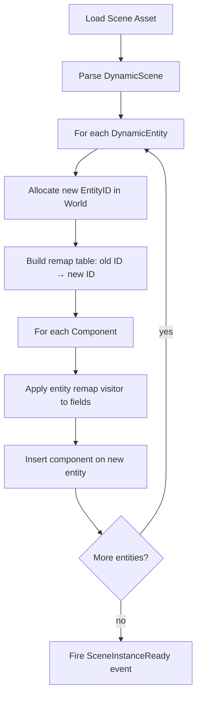

# Scene System

**Version:** 0.1.0
**Status:** Draft
**Layer:** concept

## Overview

The scene system captures and restores collections of entities with their components. It supports two representations: StaticScene (frozen World snapshot, fast but opaque) and DynamicScene (reflection-based, human-readable, serializable). Scenes integrate with the asset system for loading, saving, and hot-reloading.

## Related Specifications

- [asset-system.md](asset-system.md) — Scenes are loaded as assets
- [world-system.md](world-system.md) — Scenes are extracted from and instantiated into a World
- [entity-system.md](entity-system.md) — Entity remapping during scene instantiation
- [component-system.md](component-system.md) — Component reflection for DynamicScene

## 1. Motivation

Games need to persist and restore world state for saving, loading, level streaming, and editor workflows. A scene system must:
- Serialize a subset of the World to a portable format.
- Instantiate scenes multiple times (prefab pattern) with unique entity IDs.
- Support both fast binary snapshots and human-editable text formats.
- Remap entity references within components when spawning into a live World.

## 2. Constraints & Assumptions

- DynamicScene depends on the reflection/type-registry system to discover component fields.
- StaticScene is a direct memory snapshot and is NOT portable across engine versions.
- Scene instantiation always produces new entity IDs; it never overwrites existing entities.
- Components that contain entity references must register a remapping visitor.

## 3. Core Invariants

1. **Entity uniqueness.** Spawning a scene never reuses an existing live entity ID.
2. **Reference integrity.** All entity references in spawned components point to valid remapped entities.
3. **Filter consistency.** A SceneFilter applied during extraction and during instantiation produces the same component set.
4. **Asset identity.** A scene loaded as an asset can be spawned multiple times independently.

## 4. Detailed Design

### 4.1 Scene Types

```plaintext
Scene Types
├── StaticScene
│   ├── binary blob of archived World data
│   ├── fast to load and instantiate
│   └── not human-readable, not editable
└── DynamicScene
    ├── collection of DynamicEntity records
    ├── uses reflection for serialization
    └── human-readable (JSON/RON), editable
```

### 4.2 DynamicScene Structure

```plaintext
DynamicScene
  entities: []DynamicEntity

DynamicEntity
  id:         EntityID              -- original entity ID (pre-remap)
  components: []ReflectedComponent  -- type-erased component data
```

Each `ReflectedComponent` stores the type name and its field values as a reflected value tree, making it serializable without compile-time knowledge of the component type.

### 4.3 DynamicSceneBuilder

Extracts entities from a live World into a DynamicScene:

```plaintext
DynamicSceneBuilder
  fn from_world(world: &World) -> Self
  fn extract_entity(entity: EntityID) -> &mut Self
  fn extract_entities(iter: Iterator[EntityID]) -> &mut Self
  fn with_filter(filter: SceneFilter) -> &mut Self
  fn build() -> DynamicScene
```

The builder uses the World's type registry to reflect each component on the selected entities.

### 4.4 SceneFilter

Controls which component types are included or excluded:

```plaintext
SceneFilter
  fn allow(type_id: TypeID) -> Self       -- whitelist a type
  fn deny(type_id: TypeID) -> Self        -- blacklist a type
  fn allow_all() -> Self
  fn deny_all() -> Self
```

When both allow and deny are specified, deny takes precedence. This lets users exclude internal bookkeeping components (e.g., computed transforms) from serialized scenes.

### 4.5 Scene Instantiation and Entity Remapping



The remap table ensures that if Entity 5 in the scene file referenced Entity 3, and Entity 3 was remapped to Entity 1042, then the reference in Entity 5's components is updated to 1042.

### 4.6 SceneSpawner

```plaintext
SceneSpawner (World resource)
  fn spawn(scene_handle: Handle[DynamicScene]) -> InstanceID
  fn spawn_static(scene_handle: Handle[StaticScene]) -> InstanceID
  fn despawn_instance(instance: InstanceID)
  fn get_instance_entities(instance: InstanceID) -> []EntityID
```

Each spawn call returns an `InstanceID` that groups all entities created from that instantiation, enabling bulk operations like despawning an entire prefab instance.

### 4.7 Serialization Formats

| Format | Use Case                | Characteristics            |
| :----- | :---------------------- | :------------------------- |
| JSON   | Editor, debugging       | Human-readable, diffable   |
| Binary | Runtime, distribution   | Compact, fast to parse     |

The format is determined by the file extension or meta file settings. Both formats use the same reflection data; only the encoding differs.

### 4.8 Prefab Pattern

A prefab is simply a scene asset spawned multiple times. Each spawn produces independent entities with unique IDs. Modifications to the prefab asset (via hot-reload) can optionally propagate to live instances by despawning and re-spawning, though this is an opt-in behavior.

### 4.9 SceneInstanceReady Event

Fired when all entities from a `spawn()` call have been fully inserted into the World:

```plaintext
SceneInstanceReady
  instance_id: InstanceID
  scene_handle: Handle[DynamicScene]
  entities: []EntityID
```

Systems can listen for this event to perform post-spawn setup (e.g., wiring up runtime state).

## 5. Open Questions

1. Should DynamicScene support partial updates (merge into existing entities) or only full spawns?
2. How should scene inheritance work — can a scene reference a parent scene and override specific components?
3. What happens when a scene references component types not registered in the current engine build?

## Document History

| Version | Date       | Description                              |
| :------ | :--------- | :--------------------------------------- |
| 0.1.0   | 2026-03-25 | Initial draft from architecture analysis |
