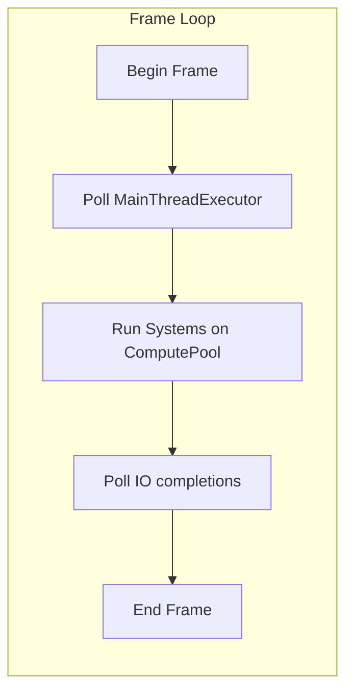

# Task System

**Version:** 0.1.0
**Status:** Draft
**Layer:** concept

## Overview

The task system provides structured parallelism for the engine. Rather than exposing raw threads, it offers worker pools, scoped tasks, and parallel iteration primitives. All concurrency flows through this system, giving the engine control over thread counts, priority, and scheduling.

## Related Specifications

- [system-scheduling.md](system-scheduling.md) — Systems are dispatched as tasks onto worker pools
- [asset-system.md](asset-system.md) — Asset loading uses the IO pool for async operations

## 1. Motivation

Game engines must exploit multi-core hardware, but uncontrolled thread creation leads to oversubscription and contention. A task system provides:
- Bounded parallelism matching available cores.
- Separation of CPU-bound work (systems) from IO-bound work (asset loading, networking).
- Safe patterns for borrowing stack data across parallel tasks.
- A main-thread executor for work that cannot leave the main thread (GPU submission, window events).

## 2. Constraints & Assumptions

- The engine never spawns raw OS threads for gameplay logic; all parallelism goes through task pools.
- Compute pool size is bounded to physical core count minus one (main thread).
- IO pool threads are allowed to grow because they spend most time waiting.
- Scoped tasks must complete before the scope exits so stack borrows remain valid.
- The main thread executor is polled each frame, not run on a background thread.

## 3. Core Invariants

1. **No oversubscription.** Compute pool threads never exceed the configured maximum.
2. **Scope safety.** All tasks spawned within a scope complete before the scope returns.
3. **Main-thread affinity.** Tasks queued to the main-thread executor run only on the main thread.
4. **Graceful shutdown.** Pool shutdown drains queued tasks and joins all worker threads.

## 4. Detailed Design

### 4.1 Worker Pool Types

Two pool types serve different workload profiles:

```plaintext
TaskPools
├── ComputePool
│   ├── bounded thread count (default: physical_cores - 1, min 1)
│   ├── work-stealing deque per thread
│   └── intended for: system execution, parallel queries, physics
└── IOPool
    ├── unbounded (threads spawn on demand, idle threads expire)
    └── intended for: file reads, network requests, asset decoding
```

### 4.2 Thread Pool Configuration

Pool sizes are configurable at engine startup:

```plaintext
TaskPoolConfig
  compute_threads: Option[uint]      -- None = auto-detect
  io_min_threads:  uint              -- minimum kept alive (default: 1)
  io_max_threads:  uint              -- hard cap (default: 512)
  percent_of_cores: Option[float]    -- alternative: use 75% of cores for compute
```

When `percent_of_cores` is set, `compute_threads` is derived as `floor(physical_cores * percent)`.

### 4.3 Scoped Tasks

A scope borrows data from the calling stack and spawns child tasks that may reference it. The scope blocks until all children finish.

```plaintext
scope(pool, |spawner| {
    let shared_slice = &data[..]
    spawner.spawn(|| process(shared_slice[0..100]))
    spawner.spawn(|| process(shared_slice[100..200]))
})  // <-- blocks here until both tasks complete
```

Because the scope does not return until all tasks finish, borrowed references remain valid for the duration.

### 4.4 Parallel Slice Operations

Two convenience functions built on scoped tasks:

- **par_chunk_map(slice, chunk_size, fn)** — Divides the slice into fixed-size chunks. Each chunk is processed by one task. Returns collected results.
- **par_splat_map(slice, max_tasks, fn)** — Divides the slice into at most `max_tasks` roughly equal parts. Useful when you want to control task count rather than chunk size.

Both functions are synchronous — they block until all chunks are processed.

### 4.5 Parallel Iterator

A `ParallelIterator` trait enables batch-based parallel iteration:

```plaintext
trait ParallelIterator[T]:
    fn next_batch() -> Option[BatchIter[T]]
```

The scheduler calls `next_batch()` repeatedly, handing each batch to an idle worker. When `next_batch()` returns None, iteration is complete. This pull-based model avoids pre-splitting and adapts to uneven workloads.

### 4.6 Task Handles

Spawning an async task returns a `TaskHandle[T]`:

```plaintext
TaskHandle[T]
  fn poll() -> Option[T]       -- non-blocking check
  fn block_on() -> T           -- blocking wait
  fn detach()                  -- fire-and-forget, result is discarded
  fn is_finished() -> bool
```

Dropping a handle without calling `detach()` or consuming the result cancels the task if it has not yet started, or detaches it if already running.

### 4.7 Main Thread Executor

Some operations must occur on the main thread (windowing APIs, GPU command submission). A dedicated single-threaded executor accepts closures:

```plaintext
MainThreadExecutor
  fn execute(fn) -> TaskHandle[T]
```

The main loop polls this executor each frame. Tasks queued here are guaranteed to run on the thread that owns the OS window and graphics context.



### 4.8 Batched Dispatcher

To minimize overhead for fine-grained parallel operations (e.g., iterating thousands of components), the system uses a batched dispatcher:

```plaintext
Dispatcher.ForBatched(items, batch_size, func(batch))
  count = items.length / batch_size
  current_batch_index = AtomicInt(0)

  // Start workers
  ParallelFor(worker_count, func():
    while (idx = current_batch_index.Add(1)) < count:
      process(items[idx * batch_size : (idx+1) * batch_size])
  )
```

- **Atomic Stealing**: Workers use a single atomic increment to "claim" the next batch, reducing contention compared to per-item stealing.
- **Adaptive Batching**: The system can adjust `batch_size` dynamically based on the complexity of the task (e.g., smaller for heavy computations, larger for simple memory copies).

### 4.9 Work Stealing and TryCooperate

When the main thread (or any thread) blocks on a task group, it does not enter a busy-wait or sleep state. Instead, it attempts to "cooperate" by stealing pending batches from the compute pool:

```plaintext
TaskHandle.BlockOn()
  while !is_finished():
    if batch = pool.TryStealBatch():
      execute(batch)
    else:
      yield()   // only yield if the pool is truly empty but task isn't finished
```

This ensures that the thread waiting for the result actively contributes to its completion, maximizing CPU utilization and minimizing "tail latency" caused by slow worker threads.

### 4.10 Task Priorities and Fairness

The compute pool maintains multiple priority levels (Critical, Normal, Low):
1. Workers always prefer batches from higher priority deques.
2. To prevent starvation, long-running tasks must periodically "check-in" or yield.
3. The IO pool is excluded from work-stealing to prevent blocking compute threads on high-latency IO operations.

## 5. Open Questions

1. How should long-running compute tasks yield to avoid stalling the pool?
2. Should there be a third pool type for GPU compute dispatch?
3. How to elegantly handle Go's goroutine preemption vs. fixed worker thread pinning?

## Document History

| Version | Date | Description |
| :--- | :--- | :--- |
| 0.1.0 | 2026-03-25 | Initial draft from architecture analysis |
| 0.2.0 | 2026-03-26 | Added Batched Dispatcher, Work Stealing (TryCooperate), and priority levels |
