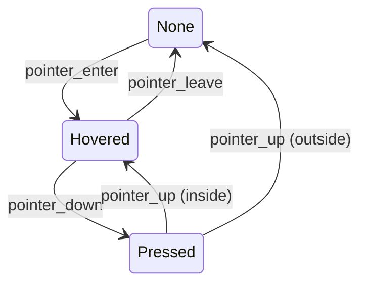

# UI System

**Version:** 0.1.0
**Status:** Draft
**Layer:** concept

## Overview

The UI system provides a declarative, component-driven interface layer rendered on top of all 3D and 2D content. Every UI element is an entity with a Style component defining flexbox layout properties. The hierarchy system drives parent-child layout relationships. Interaction state (hover/press) is computed each frame for picking and focus management. Text is rendered via a glyph-caching pipeline with font atlas optimization. A separate render pass composites UI geometry last, ensuring it is always visible. The system provides primitives from which widget libraries can be built.

## Related Specifications

- [hierarchy-system.md](hierarchy-system.md) — Parent-child relationships drive layout tree
- [render-core.md](render-core.md) — UI render pass and font atlas management
- [input-system.md](input-system.md) — Pointer and keyboard events for interaction
- [math-system.md](math-system.md) — Rect, Vec2, and color types

## 1. Motivation

Every game needs menus, HUDs, health bars, inventories, and debug panels. Building UI from ECS entities and components lets the same query, event, and scheduling infrastructure serve both gameplay and interface logic. Without a built-in UI system:
- Every project would implement its own layout engine.
- Interaction (hover, click, focus) would be inconsistent.
- Text rendering and font management would be duplicated across projects.
- Rendering order between UI and the game scene would be undefined.

## 2. Constraints & Assumptions

- UI nodes are regular entities — they participate in the standard ECS world.
- Layout uses a flexbox algorithm (equivalent to Taffy/Morphorm), not CSS cascade.
- Style values are explicit on each entity; there is no inheritance or cascading.
- Layout is only recomputed when Style or hierarchy changes (dirty flag optimization).
- UI rendering occurs in a separate pass after all game rendering.
- Pointer events on UI nodes take priority over 3D/2D picking; a UI node that covers a 3D object blocks pointer events to that object.

## 3. Core Invariants

- **INV-1**: Layout is recomputed only when Style or hierarchy changes (dirty flag).
- **INV-2**: UI rendering happens after all game rendering (separate render pass).
- **INV-3**: Interaction state (hover/press) is updated in PreUpdate before user systems run.
- **INV-4**: Text glyphs are cached in a font atlas — same text with same font/size reuses cached glyphs.

## 4. Detailed Design

### 4.1 Layout Engine

A flexbox-based layout algorithm (equivalent to Taffy or Morphorm) computes position and size for every UI node, operating over the entity hierarchy.

Layout computation:
1. Collect all root UI nodes (entities with Node but without ChildOf pointing to another UI node).
2. Traverse top-down, resolving flex properties.
3. Write computed `LayoutRect` (position, size in logical pixels) to each entity.

Layout runs in `PostUpdate`, after user systems have modified Style components. A dirty-flag system ensures only modified subtrees are re-laid-out.

Layout proceeds in three phases each frame:

```plaintext
Measure  ->  Layout  ->  Render
  |            |          |
  |            |          +-- generate quads, text meshes
  |            +-- compute position and size from constraints
  +-- intrinsic size measurement (text shaping, image dimensions)
```

### 4.2 Style Component

Every UI node carries a Style component defining its layout behavior:

```
Style {
    Display:        Display          // Flex, Grid, None
    Position:       PositionType     // Relative, Absolute
    Overflow:       Overflow         // Visible, Hidden, Scroll
    Direction:      Direction        // LTR, RTL, Inherit
    FlexDirection:  FlexDirection    // Row, Column, RowReverse, ColumnReverse
    FlexWrap:       FlexWrap         // NoWrap, Wrap, WrapReverse
    JustifyContent: JustifyContent   // FlexStart, Center, FlexEnd, SpaceBetween, SpaceAround, SpaceEvenly
    AlignItems:     AlignItems       // FlexStart, Center, FlexEnd, Stretch, Baseline
    AlignSelf:      AlignSelf        // Auto, FlexStart, Center, FlexEnd, Stretch
    AlignContent:   AlignContent     // FlexStart, Center, FlexEnd, Stretch, SpaceBetween, SpaceAround
    Width:          Val              // Px, Percent, Auto, Vw, Vh
    Height:         Val
    MinWidth:       Val
    MinHeight:      Val
    MaxWidth:       Val
    MaxHeight:      Val
    Margin:         UiRect
    Padding:        UiRect
    Border:         UiRect
    Gap:            Size             // Row gap, column gap
    FlexGrow:       float32
    FlexShrink:     float32
    FlexBasis:      Val
    AspectRatio:    *float32
}
```

No CSS cascade — every value is explicit on the entity. Defaults are sensible (Display: Flex, FlexDirection: Column).

### 4.3 UI Node Hierarchy

UI nodes use the standard entity hierarchy via `ChildOf`:

```
commands.Spawn(Node{}, Style{...}).WithChildren(func(b ChildBuilder) {
    b.Spawn(Node{}, Style{...}, Text{ Value: "Hello" })
    b.Spawn(Node{}, Style{...}, ImageNode{ Image: handle })
})
```

- Layout is computed from the root down through children.
- Sibling order in the `Children` list determines visual order (later = on top).
- Reparenting a UI node triggers layout recomputation of both old and new subtrees.
- A `Node` entity without a parent `Node` is a root-level UI element positioned relative to the viewport.

### 4.4 Interaction

The Interaction component is automatically updated each frame for nodes that have it:

```
Interaction:
    None     // No interaction
    Hovered  // Pointer is over this node
    Pressed  // Pointer is down on this node
```



```
FocusPolicy:
    Block    // This node absorbs pointer events (default)
    Pass     // Events pass through to nodes behind
```

- Interaction state is computed in `PreUpdate` using pointer position and the layout tree (INV-3).
- Hit testing walks the layout tree in reverse render order (top-most first).
- Picking integration: UI nodes participate in the engine's picking system for consistent ray/pointer queries.
- The `Interaction` state machine transitions are driven solely by input events — user code may read the state but must not write it directly.

### 4.5 UI Components

Built-in node types:

- **Node** — Base UI entity. Has Style and LayoutRect. Renders nothing by itself.
- **Text** — Renders text. Carries font handle, size, color, alignment, and line wrapping settings.
- **ImageNode** — Renders an image asset. Supports 9-slice scaling.
- **Button** — A Node with Interaction that responds to clicks. Commonly combined with Text or ImageNode children.
- **ScrollView** — A clipping container with scrollable overflow. Manages scroll offset and optional scrollbar entities.

These are convenience bundles, not special types:

| Widget | Components |
| :--- | :--- |
| Button | `Node` + `Interaction` + `BackgroundColor` + child `Text` |
| Text | `Node` + `TextFont` + `TextColor` + `TextLayout` |
| ImageNode | `Node` + `ImageHandle` + `ImageMode` |
| ScrollView | `Node` + `Overflow(Scroll)` + `ScrollOffset` |

### 4.6 Text Rendering

Text layout and rendering pipeline:

1. **Font loading** — TTF and OTF fonts loaded as assets. A default font is provided by the engine.
2. **Text shaping** — Text + font + size produce a list of positioned glyphs.
3. **Atlas lookup** — Each glyph is checked against the `FontAtlas`; missing glyphs are rasterized and packed. Same font + size + glyph combination is cached (INV-4). Atlas is grown or rebuilt when full.
4. **Mesh generation** — Glyph quads with atlas UVs are assembled into a mesh.
5. **Multi-font support** — A single Text node can contain spans with different fonts/sizes/colors via `TextSection` slices.

```
Text {
    Sections:   []TextSection
    Alignment:  TextAlignment   // Left, Center, Right
    Wrapping:   TextWrapping    // WordWrap, CharWrap, NoWrap
    LineHeight: float32
}

TextSection {
    Value:    string
    Font:     Handle[Font]
    FontSize: float32
    Color:    Color
}
```

Two text paths exist:
- **UI text** — positioned by the layout engine within a `Node`.
- **Text2D** — world-space text (see 2D Rendering spec).

### 4.7 Visual Styling

Per-entity visual properties (not part of layout computation):

- **BackgroundColor** — Solid color fill behind the node.
- **BorderColor** — Color of the border (width defined in Style.Border).
- **BorderRadius** — Corner rounding: `BorderRadius { TopLeft, TopRight, BottomLeft, BottomRight: Val }`.
- **Outline** — An outline drawn outside the border (does not affect layout).
- **Gradient** — Can replace BackgroundColor: `Gradient { Kind: Linear(angle) | Radial(center), Stops: [](float32, Color) }`.

### 4.8 Z-Ordering

UI elements render on top of the 3D/2D game scene:

- **Default order**: Children render on top of parents; later siblings render on top of earlier siblings (painter's algorithm following hierarchy traversal order, depth-first pre-order).
- **ZIndex component**: Overrides the default order.
  - `ZIndex { Local: int }` — relative to siblings.
  - `ZIndex { Global: int }` — relative to all UI nodes.
- Z-ordering is resolved during the UI render pass, not during layout.

### 4.9 UI Camera

UI has a dedicated camera configuration:

```
UiCameraConfig {
    ShowUI: bool  // Toggle UI rendering for this camera
}
```

- By default, the primary camera renders UI.
- In multi-camera setups, UiCameraConfig controls which camera the UI is drawn on.
- UI layout is computed in logical pixels, independent of camera projection.
- The UI render pass uses an orthographic projection matching the viewport dimensions.

### 4.10 UI Picking and Event Bubbling

The UI picking backend tests pointer position against the computed layout rects of all interactive nodes, front to back. The topmost hit receives the event. Events then bubble up the hierarchy: a `Pressed` event on a button inside a panel first triggers on the button, then propagates to the panel unless stopped. Clipping is achieved via scissor rects derived from `Overflow: Hidden` nodes.

### 4.11 Ghost Nodes (Experimental)

A `GhostNode` component marks a node as layout-invisible. Its children are laid out as if they were children of the ghost's parent. This enables logical grouping (e.g., a "form field" wrapper) without affecting visual layout.

### 4.12 Focus Management

Interactive nodes can receive keyboard/gamepad focus:
- `TabIndex` controls navigation order.
- The `Focused` component marks the currently focused entity.
- Arrow keys and tab cycle focus; pressing enter/space activates the focused element.
- Focus order follows the hierarchy unless explicitly overridden by a `TabIndex` component.

### 4.13 Accessibility

Basic accessibility support:

- An accessibility tree is generated from the UI entity hierarchy.
- Text nodes expose their content to screen readers.
- Interaction nodes expose their role (button, input, etc.).
- Focus order follows hierarchy traversal order by default, overridable with TabIndex.
- This is a foundational layer — full accessibility compliance is a future goal.

## 5. Open Questions

- Should we support a CSS-like styling cascade? This would reduce boilerplate but adds complexity and diverges from the ECS-explicit philosophy.
- Widget library (checkbox, slider, dropdown, text input) — should it be a separate plugin or built into the core UI system?
- Should the layout engine support CSS Grid subgrid for nested grid alignment?
- How should animations on UI properties (opacity fade, position slide) integrate with the animation system?
- Is a virtual-scrolling container needed as a built-in, or can it be implemented in user space?

## Document History

| Version | Date | Description |
| :--- | :--- | :--- |
| 0.1.0 | 2026-03-25 | Initial draft from Bevy analysis |
