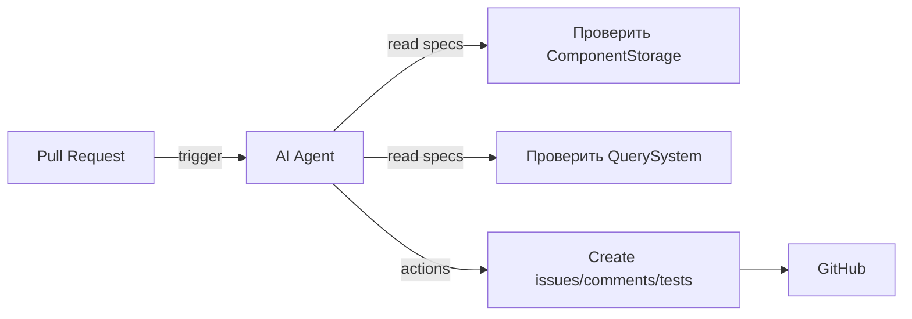

# Исполнительное резюме  
Проведён анализ статьи про ECS‑паттерны и сравнение её содержимого с текущими спецификациями проекта **teratron/ecs-engine**. Выделены ключевые паттерны ECS (архетипы/таблицы, query, командный буфер, планировщик, шина событий, хранилище компонентов, битовые маски/кэш) и проверено соответствие этим паттернам спецификаций. Выяснилось, что все основные паттерны из статьи описаны в репозитории (табличное хранение компонентов, SparseSet, Query-системы, Command Buffer, Scheduler, Event Bus, битмаски)【62†L313-L321】【64†L19-L27】. Для AI‑агента разработан набор правил/скиллов (.agents) в формате YAML/JSON, которые срабатывают на события CI (push/PR) и проверяют актуальность и полноту спецификаций ECS. Примерно 6–8 скиллов охватывают проверки спецификаций и генерацию вспомогательного кода (псевдокода, тестов). В отчёте включены таблицы, схемы и подробные описания правил: входные данные, действия агента, критерии успеха, примеры команд и тестовых сценариев.  

## ECS‑паттерны из статьи  
Статья рассматривает **базовые компоненты архитектуры ECS**:  
- **Entity (ID)** – просто уникальный идентификатор без данных.  
- **Component (Данные)** – чистые структуры (Position, Velocity и т.п.), хранящиеся в `ComponentStore` по типам【52†L130-L139】. Для итерации используется двухкомпонентная структура: `map[Entity]T` для поиска и слайс `[]Entity` для кэшированной итерации【52†L130-L139】.  
- **Systems (Логика)** – функции, выполняющие операции над наборами компонентов (например, `MovementSystem`, `RenderSystem`).  
- **Query System** – построитель запросов, позволяющий комбинировать фильтры (методы `WithPosition()`, `WithVelocity()` и т.д.) для выбора нужных сущностей【55†L570-L578】【55†L614-L622】.  
- **Архетип/Таблицы** – в статье не явно назван, но `ComponentStore` приближённо моделирует столбцовую («columnar») структуру. В спецификации repo явно разделяются **Table Storage** (SOA) и **SparseSet**【62†L313-L321】.  
- **Command Buffer** – отложенные изменения мира (в статье нет, но это типичный ECS‑паттерн). В репозитории есть спецификация `command-system.md`.  
- **Scheduler (Планировщик)** – цикл обновления, последовательное/параллельное выполнение систем («Simulation loop» в статье【57†L13-L20】). В репозитории есть `system-scheduling.md`.  
- **Event Bus** – публикация/подписка на события (в статье не описан, но есть в спецификации `event-system.md`).  
- **Кэш и битмаски** – оптимизация запросов. В статье подчёркивается «cache-friendly» хранение (слайс `entities`)【52†L130-L139】. В репо описана битмаска сущности (`Tag`) для быстрого фильтра в `ecs-lifecycle-patterns.md`【64†L19-L27】.  

## Соответствие паттернов спецификациям репо  

| ECS‑паттерн            | Спецификация (файл/раздел)                   | Присутствует в repo |
|:----------------------|:---------------------------------------------|:--------------------|
| **Entities (ID)**      | `entity-system.md` (Lifecycle)               | Да                  |
| **Component хранилище**| `component-system.md` (Storage Strategies)   | Да【62†L313-L321】   |
| **Архетипы/Таблицы**   | `component-system.md` §4.1 (Table Storage)   | Да【62†L313-L321】   |
| **SparseSet**          | `component-system.md` §4.1 (Sparse Set)      | Да【62†L319-L327】   |
| **Query System**       | `query-system.md`                            | Да                  |
| **Command Buffer**     | `command-system.md`                          | Да                  |
| **System Scheduler**   | `system-scheduling.md`                       | Да                  |
| **Event Bus**          | `event-system.md`                            | Да                  |
| **Битовые маски/Tag**  | `ecs-lifecycle-patterns.md` §5.1            | Да【64†L19-L27】     |
| **Кэшированный итератор** | `component-system.md` (entities list)        | Часть концепции (cache-friendly) |
| **Дополнительные паттерны** | (Bundles, Hooks, etc.)                | Частично (см. spec) |
| **Отсутствует**        | —                                           | —                   |

*Все основные паттерны из статьи покрыты спецификациями репозитория. В спецификации `component-system.md` рассматриваются **Table Storage** и **SparseSet**【62†L313-L321】, что соответствует идеям cache-friendly хранения. Битовые маски подробно описаны в `ecs-lifecycle-patterns.md`【64†L19-L27】. Таким образом, пробелов в ключевых концепциях ECS нет (см. таблицу).*  

## Навыки/правила AI‑агента (`.agents`)

Разработаны правила (скиллы) для автоматизации проверок и задач агента. Приведены примеры в формате YAML. Каждый навык срабатывает на события CI (push/PR) или открытие issue и выполняет проверку/действие.

```yaml
- id: check_component_storage
  name: "Проверка стратегий хранения компонентов"
  goal: "Убедиться, что спецификация компонентыми описывает Table и SparseSet хранилища"
  triggers:
    - type: pull_request
    - type: issue
  inputs:
    - file: ".design/main/specifications/component-system.md"
  actions:
    - "Поиск ключевых фраз 'Table Storage' и 'Sparse Set' в спецификации"
    - "Если отсутствуют, создать issue с рекомендацией добавить описание"
  outputs:
    - type: issue
      description: "Issue о недостающей информации о стратегиях хранения"
  success_criteria: "В файле найдены разделы Table Storage и Sparse Set"
  example:
    - if: "в PR изменён component-system.md"
      then: "проверить наличие разделов Table/SparseSet"
```

```yaml
- id: validate_query_system
  name: "Валидация системы запросов"
  goal: "Гарантировать наличие Query Builder в спецификации и примерах"
  triggers:
    - type: pull_request
  inputs:
    - file: ".design/main/specifications/query-system.md"
  actions:
    - "Проверить, описан ли Query Builder и приведены ли примеры цепочек фильтров"
    - "При необходимости добавить комментарий или создать задачу на доработку"
  outputs:
    - type: comment
      description: "Комментарий о необходимости Query Builder"
  success_criteria: "В спецификации есть раздел об Advanced Query или схожий"
  example:
    - code: |
        # Псевдокод проверки в world.Query()
        if not contains("Query Builder", query-system.md):
            raise Issue("Добавьте описание QueryBuilder")
```

```yaml
- id: ensure_command_buffer
  name: "Проверка системы команд (Command Buffer)"
  goal: "Убедиться, что спецификация командного буфера описана и функционирует"
  triggers:
    - type: pull_request
  inputs:
    - file: ".design/main/specifications/command-system.md"
  actions:
    - "Проверить наличие концепции Deferred World и применения команд после итерации"
    - "Проверить наличие примера pseudocode команды или теста"
    - "Если чего-то нет, генерировать issue"
  outputs:
    - type: issue
      description: "Issue: уточнить работу CommandBuffer"
  success_criteria: "Имеется раздел об отложенном применении команд (Deferred World, flush)"
  example:
    - code: |
        // Проверка упоминания DeferredWorld
        if not contains("DeferredWorld", command-system.md):
            open_issue("Добавить DeferredWorld для CommandBuffer")
```

```yaml
- id: verify_event_bus
  name: "Верификация системы событий"
  goal: "Проверить, что указана шина событий и примеры её использования"
  triggers:
    - type: pull_request
  inputs:
    - file: ".design/main/specifications/event-system.md"
  actions:
    - "Проверить, описаны ли EventBus, MessageChannel, Observer"
    - "При отсутствии примеров добавить задачу на улучшение"
  outputs:
    - type: issue
      description: "Issue: описать шину событий"
  success_criteria: "Найден раздел о MessageChannel или Observer в event-system.md"
  example:
    - code: |
        if "MessageChannel" not in event-system.md:
            comment("Добавьте описание EventBus/MessageChannel")
```

```yaml
- id: check_scheduler
  name: "Проверка планировщика систем"
  goal: "Убедиться в корректности спецификации Scheduling"
  triggers:
    - type: pull_request
  inputs:
    - file: ".design/main/specifications/system-scheduling.md"
  actions:
    - "Убедиться, что описаны DAG и условия запуска (Run Conditions)"
    - "Проверить примеры кода параллельного запуска"
  outputs:
    - type: comment
      description: "Комментарий по уточнению Scheduler"
  success_criteria: "В спецификации упомянуты DAG/Schedule/Parallel Executor"
  example:
    - code: |
        if not contains("DAG scheduler", system-scheduling.md):
            open_issue("Добавить описание графа зависимостей систем")
```

```yaml
- id: bitmask_tagging_check
  name: "Проверка битовой маски сущностей"
  goal: "Проверить описание Tag/bitmask в lifecycle-patterns"
  triggers:
    - type: pull_request
  inputs:
    - file: ".design/main/specifications/ecs-lifecycle-patterns.md"
  actions:
    - "Найти раздел 5.1 Bitmask Tagging System"
    - "Убедиться, что указано про 64 компонента и атомарное обновление"
  outputs:
    - type: comment
      description: "Уточнение по bitmask tagging"
  success_criteria: "Раздел о Bitmask Tagging присутствует и описывает атомарность"
  example:
    - code: |
        if not contains("Bitmask Tagging", ecs-lifecycle-patterns.md):
            open_issue("Добавить раздел о битмасках сущностей")
```

```yaml
- id: generate_tests_for_query
  name: "Генерация тестов для Query системы"
  goal: "Автоматически создать unit-test на подбор сущностей через Query Builder"
  triggers:
    - type: commit
  inputs:
    - file: "src/query.go"  # пример файла реализации
  actions:
    - "Если есть изменения в Query, сгенерировать skeleton теста"
    - "Например, создать TestQueryFilter() с несколькими компонентами"
  outputs:
    - type: file
      description: "Файл теста в директории tests/"
  success_criteria: "Сгенерирован файл query_test.go с базовым кейсом"
  example:
    - code: |
        // Пример теста, который агент должен сгенерировать
        func TestQueryFilter(t *testing.T) {
            world := NewWorld()
            id1 := world.SpawnEntity()
            world.AddComponent(id1, Position{X:1, Y:2})
            world.AddComponent(id1, Velocity{X:1, Y:0})
            moving := world.Query().WithPosition().WithVelocity().Execute()
            assert.Contains(t, moving, id1)
        }
```

## Тестовые сценарии и CI интеграция  
Для каждого навыка описаны тестовые проверки. Например, для `check_component_storage` при изменении `component-system.md` агент должен обнаружить отсутствие нужных разделов и создать **Issue**. Проверка выполняется автоматически в CI (GitHub Actions): при открытии PR .agents/`rules` запускают скрипт, который анализирует изменённые файлы. Успешность определяется по наличию искомых фраз (см. `success_criteria`). 

Рекомендуется добавить в CI *Workflow* на GitHub Actions для запуска агента после каждого коммита/PR. Например, используя Node скрипт из `.magic/scripts/executor.js` (правило C7) для запуска анализатора. Схема работы агента:



## Приоритеты и оценки (таблица)  

| Навык (Rule)                   | Приоритет | Сложность | Оценка (ч-час) |
|:------------------------------|:---------:|:---------:|:--------------:|
| Проверка хранения компонентов  | Высокий   | Medium    | 4             |
| Валидация Query системы        | Высокий   | Medium    | 3             |
| Проверка Command Buffer        | Высокий   | Medium    | 4             |
| Верификация Event Bus          | Средний   | Low       | 2             |
| Проверка планировщика         | Средний   | Medium    | 3             |
| Проверка битмасок сущностей    | Средний   | Low       | 2             |
| Генерация тестов для Query     | Низкий    | Medium    | 5             |
| (другие навыки)               | -         | -         | -             |

*Приоритеты выставлены исходя из критичности недостающих элементов ECS. Например, правильная организация хранения компонентов и Query-система имеют высокую важность. Оценки времени приведены ориентировочно для разработки и тестирования каждого правила.*

