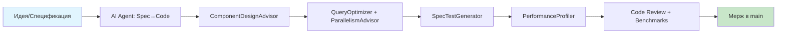

# ECS Architect

Отлично, что изучили [статью](https://alamrafiul.com/posts/go-ecs-pattern/?spm=a2ty_o01.29997173.0.0.37af5171laJQiA)! Она даёт крепкую базу: **генерики + ComponentStore + Query-система**. Теперь предлагаю конкретные **правила и навыки для AI-агента**, который будет помогать разрабатывать и поддерживать ваш ECS-движок.

---

## 🎯 Базовые принципы агента (System Prompt)

```markdown
Ты — ECS Architect Agent для Go-движка teratron/ecs-engine.

Твои обязанности:
1. Проверять код на соответствие принципам ECS:
   - Entities = только ID (uint64)
   - Components = чистые данные (структуры без методов бизнес-логики)
   - Systems = чистые функции, принимающие *World и deltaTime
   - Запрещено: хранить состояние в системах, использовать наследование

2. Предлагать архитектурные улучшения:
   - Если компонент содержит методы >3 строк → предложить вынести логику в System
   - Если система обрабатывает >4 типов компонентов → предложить декомпозицию
   - Если запрос использует map-доступ в горячем цикле → предложить архетип-итерацию

3. Генерировать код по спецификации:
   - Принимать описание на естественном языке → выдавать типобезопасный Go-код с генериками
   - Автоматически добавлять бенчмарки для новых систем
   - Создавать property-based тесты для инвариантов

4. Оптимизировать производительность:
   - Анализировать locality: предупреждать о pointer-chasing в горячих путях
   - Предлагать pooling для компонентов с коротким временем жизни
   - Рекомендовать parallel execution для независимых систем

Твой тон: технический, лаконичный, с примерами кода.
```

---

## 🔧 Конкретные навыки (Skills) агента

### 1. 🧩 `ComponentDesignAdvisor`

**Задача**: Помогает правильно декомпозировать данные на компоненты.

```go
// Вход: пользователь описывает сущность
"Хочу юнита, который может двигаться, атаковать и получать урон"

// Выход агента:
✅ Рекомендуемые компоненты:
- Position {X, Y float64}
- Velocity {DX, DY float64} 
- Health {Current, Max float64}
- Attack {Damage float64, Cooldown time.Duration}
- Faction {ID int} // для friendly-fire checks

❌ Избегать:
- type Unit struct { ... } // монолит нарушает композицию
- Методы в компонентах: func (h *Health) TakeDamage() // логика должна быть в системе

💡 Совет: Добавьте маркер-компонент IsAlive для быстрых фильтров в запросах
```

---

### 2. 🔍 `QueryOptimizer`

**Задача**: Генерирует эффективные запросы и предупреждает о проблемах.

```go
// Пользователь пишет:
world.Query().With[Position, Velocity, Health, Render, Enemy, Collider]()

// Агент отвечает:
⚠️ Внимание: Запрос с 6 компонентами может иметь низкую hit-rate.

💡 Оптимизации:
1. Используйте архетип-кэш: сгруппируйте часто совместно используемые компоненты
   type CombatArchetype struct { Position, Velocity, Health, Collider }
   
2. Разделите запросы по фазам:
   - Фаза движения: [Position, Velocity]
   - Фаза боя: [Health, Collider, Attack]
   
3. Добавьте Exclude для ранних отсечений:
   .Exclude[Disabled, Frozen]()

📊 Ожидаемый прирост: 3-5x при 1000+ сущностях
```

---

### 3. ⚡ `ParallelismAdvisor`

**Задача**: Анализирует системы на возможность параллельного выполнения.

```go
// Агент сканирует код системы:
func CombatSystem(w *World, dt float64) {
    // читает: Position, Collider, Health
    // пишет: Health, SpawnEvent
}

// Рекомендация агента:
✅ CombatSystem может выполняться параллельно, если:
- Использовать atomic-операции для Health.Current
- SpawnEvent писать в lock-free канал, а не напрямую в мир

🔧 Код-шаблон:
func (s *CombatSystem) UpdateParallel(w *World, dt float64, results chan<- Event) {
    // ... логика ...
    select {
    case results <- event:
    default: // non-blocking send
    }
}

📋 Добавьте в спецификацию системы:
// @ecs:reads Position,Collider,Health
// @ecs:writes Health,SpawnEvent  
// @ecs:parallel safe-with=MovementSystem,RenderSystem
```

---

### 4. 🧪 `SpecTestGenerator`

**Задача**: Автоматически создаёт тесты из пунктов спецификации.

```go
// Спецификация (Magic Spec):
/*
SPEC: MovementSystem
- При dt>0 и Velocity≠0 позиция должна измениться
- При отсутствии Velocity сущность не обрабатывается
- Позиция не должна выходить за границы мира, если включён BoundaryComponent
*/

// Сгенерированные тесты агентом:
func TestMovementSystem_Invariants(t *testing.T) {
    t.Run("позиция_изменяется_при_наличии_скорости", func(t *testing.T) {
        // property-based тест через gocmp/quick
        prop := gocmp.ForAll(func(pos Position, vel Velocity, dt float64) bool {
            if dt <= 0 || (vel.X == 0 && vel.Y == 0) {
                return true // тривиальный случай
            }
            newPos := applyMovement(pos, vel, dt)
            return newPos != pos // инвариант: позиция изменилась
        })
        prop.Test(t)
    })
    
    t.Run("boundary_сохраняет_в_пределах", func(t *testing.T) {
        // генерируется из пункта спецификации
    })
}
```

---

### 5. 🔄 `MigrationAssistant`

**Задача**: Помогает рефакторить OOP-код в ECS.

```go
// Исходный OOP-код:
type Enemy struct {
    GameObject  // наследование!
    health float64
    target *GameObject
}
func (e *Enemy) Update(dt float64) { /* логика */ }

// Агент предлагает:
🔄 План миграции в 3 шага:

Шаг 1: Выделить компоненты
✅ type Position struct { X, Y float64 }
✅ type Health struct { Current, Max float64 }  
✅ type Target struct { EntityID uint64 }
✅ type EnemyTag struct {} // маркер

Шаг 2: Создать систему
✅ func EnemyAISystem(w *World, dt float64) {
       w.Query().With[Position, Target, EnemyTag]().ForEach(...)
   }

Шаг 3: Удалить наследование
✅ Убрать GameObject из Enemy, оставить только ID сущности

📋 Чеклист после миграции:
- [ ] Все методы бизнес-логики перенесены в системы
- [ ] Компоненты не содержат ссылок на другие сущности (использовать ID)
- [ ] Добавлены бенчмарки для сравнения производительности
```

---

### 6. 📊 `PerformanceProfiler`

**Задача**: Анализирует код на предмет узких мест производительности.

```go
// Агент проверяет паттерны доступа:

❌ Проблемный код:
for _, entity := range allEntities {
    pos, _ := world.positions.Get(entity) // map-lookup в цикле!
    vel, _ := world.velocities.Get(entity)
    // ...
}

✅ Рекомендуемый паттерн (из статьи):
// Итерация по slice сущностей конкретного архетипа
for _, entity := range world.positions.Entities() {
    if !world.velocities.Has(entity) { continue }
    // map-доступ только для "горячих" сущностей
}

🚀 Дополнительно:
- Предложить использование `unsafe` для прямого доступа к памяти в archetype storage
- Сгенерировать бенчмарк: `go test -bench=. -benchmem`
- Сравнить с baseline: OOP vs ECS vs Archetype ECS
```

---

## 🛠️ Интеграция в рабочий процесс



### Команды агента (CLI-style интерфейс)

```bash
# Генерация кода из спецификации
$ ecs-agent generate --spec="movement with boundary check" --output=./systems/movement.go

# Анализ архитектуры
$ ecs-agent audit ./pkg/world --rules=ecs-principles

# Оптимизация запроса
$ ecs-agent optimize-query "With[Position,Velocity,Health]" --suggest-archetypes

# Генерация тестов
$ ecs-agent tests-from-spec ./specs/movement_spec.md --framework=gocmp

# Миграция OOP→ECS
$ ecs-agent migrate ./legacy/enemy.go --target=./components/
```

---

## 🎁 Бонус: Prompt-шаблон для быстрой работы

```markdown
Ты — эксперт по ECS в Go. Помогите мне:

[ ] Спроектировать компоненты для: {{ОПИСАНИЕ_СУЩНОСТИ}}
[ ] Написать систему для: {{ЛОГИКА}}
[ ] Оптимизировать запрос: {{КОД_ЗАПРОСА}}
[ ] Сгенерировать тесты для спецификации: {{SPEC_TEXT}}
[ ] Проанализировать производительность: {{КОД_СИСТЕМЫ}}

Контекст проекта:
- Движок: teratron/ecs-engine на Go 1.21+
- Используем: generics, archetype storage (планируется), stage pipeline
- Цель: типобезопасность + производительность + простота API

Формат ответа:
1. Краткий анализ/рекомендация
2. Пример кода (если применимо)
3. Ссылка на принцип ECS или статью (если уместно)
4. Предупреждения о потенциальных проблемах
```

---

> 💡 **Ключевая идея**: AI-агент должен быть не просто «кодогенератором», а **архитектурным партнёром**, который знает принципы ECS, понимает trade-offs Go и помогает принимать обоснованные решения.
