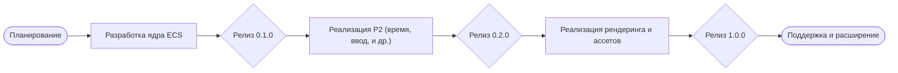

# Исполнительное резюме  

Проект **ECS Engine** – это спецификация высокопроизводительного ECS‑движка на Go, созданная в рамках методологии «Magic Spec» для валидации архитектуры Bevy (Rust) в Go【26†L251-L259】【26†L265-L270】. В настоящий момент репозиторий представляет собой набор проектных документов и скриптов, но **не содержит реализованного кода на Go**: это «боевая проверка» спецификаций, где реальный код специально отсутствует【38†L287-L290】. В спецификациях (см. раздел P1) описаны ключевые модули движка – мир (*World*), сущности, компоненты, системы запросов, планировщик систем, буфер команд, шина событий, реестр типов и т.д.【46†L262-L270】【46†L271-L280】. Однако многие детали остаются не реализованными, отсутствуют тесты, CI/CD и релизы.  

**Основные выводы:** текущий статус проекта – прототип архитектуры в виде спецификаций. Архитектура ECS чётко разбита на слои (ядро ECS, фреймворк, графика, инструменты)【46†L262-L270】, но фактическая реализация отстутствует. Документация представлена в формате SDD (спецификаций) с «боевыми» правилами разработки【38†L287-L290】. Качество кода оценить невозможно (его нет), тестов и сборок нет, технический долг велик (нет реализации базовых функций). Для развития проекта необходимо сосредоточиться на реализации ядра, налаживании инфраструктуры и доводке спецификаций до законченного состояния.  

**Рекомендации по улучшению:** приоритет – реализовать сущности, компоненты и работу системы на Go; затем добавить системы запросов, планирования и буфер команд. Параллельно разработать простые тесты для основных операций. Внедрить CI (GitHub Actions), настроить семантический релиз и документацию кода. Дальнейшая очередь – фреймворк (время, ввод, состояния), графика (рендеринг) и дополнительные модули по приоритетам. Ниже приведены предложения по каждому из этих направлений, а также архиректурные диаграммы и планы релиза.  

## Обзор архитектуры и модулей проекта  

Цель проекта – реализовать **модульный, дата-ориентированный ECS**, вдохновлённый Bevy, с использованием преимуществ Go (горутин, каналов и т.д.)【26†L265-L270】. Согласно спецификациям, ядро ECS включает:  

- **World/Система мира**: глобальное хранилище сущностей, компонентов и ресурсов, с отслеживанием изменений【46†L262-L270】.  
- **Entity/Система сущностей**: генерация уникальных ID, создание/уничтожение сущностей, пулл генерационных ID【46†L268-L272】.  
- **Component/Система компонентов**: регистрация типов компонентов, различные стратегии хранения (архетипы, таблицы), хуки на создание/удаление【46†L271-L275】.  
- **Query/Система запросов**: механизм доступа к сущностям по комбинации компонентов, фильтрация, параллельная итерация【46†L277-L280】.  
- **System Scheduling/Планирование систем**: декларация систем, построение DAG зависимостей, параллельное исполнение систем по условиям запуска【46†L281-L284】.  
- **Command/Система команд**: отложенные мутации (добавление/удаление компонентов и сущностей) через буфер команд с поздним применением【46†L285-L290】.  
- **Event/Система событий**: публикация/подписка на события, наблюдатели, всплытие событий через иерархию сущностей【46†L291-L294】.  
- **TypeRegistry/Реестр типов**: метаинформация о полях, динамическая сериализация, рефлексия по типам компонентов【46†L295-L298】.  

Эти модули описаны в спецификациях P1 («ECS Core») и P2 («Framework»), а также в соседних документах. Например, **world-system.md** содержит концепцию мира, **entity-system.md** – поведение сущностей, а **system-scheduling-go.md** – планирование систем в Go【46†L262-L270】【46†L281-L284】.  

Однако в текущем репозитории **фактически отсутствует кодовая реализация** этих модулей – спецификации служат только для проектирования. Это подчёркивается правилами разработки: в разделе RULES.md прямо сказано, что в спецификациях *«не должно быть реального кода»*, только псевдокод и описания【38†L287-L290】. Соответственно, нельзя оценить качество кода или тесты (их нет), но можно проанализировать структуру и требования.  

**API и паттерны.** Проект использует классические паттерны ECS: сущность – это просто ID (возможно с поколением), компонент – чистая структура данных, а системы представляют собой функции или объекты, итерирующиеся по сущностям с определённым набором компонентов. Ожидаемый пользовательский API будет, вероятно, позволять создавать сущности и компоненты через методы World/Entity, а также регистрировать системы с указанием необходимых компонентов. Например:  

```go
world := NewWorld()
id := world.SpawnEntity()
world.AddComponent(id, Position{X:0, Y:0})
world.AddComponent(id, Velocity{X:1, Y:0})
world.AddSystem(func(e Entity, comps QueryComponents) {
    // ... обработка компонентов в системе ...
})
```

Под капотом должна использоваться **архетипно-табличная модель** хранения данных (как в Bevy или EnTT), чтобы добиться скорости и эффективной сортировки сущностей по компонентам.

**Конкурентность и производительность.** Основной упор ожидается на использование горутин и каналов Go для параллелизма в системах. Планировщик должен строить DAG систем и запускать независимые системы параллельно (согласно пункту C3 правил)【38†L326-L334】. Узким местом могут стать синхронизация данных при использовании командных буферов и обработка событий. Нужно заранее продумать стратегию блокировок или использование структур типа concurrent map. Также стоит учитывать, что большая часть репозитория – это сценарии (скрипты на PowerShell/Shell【26†L318-L322】), а не Go-код: это указывает на отсутствие реального исполняемого кода.

**CI/CD и тесты.** Текущий репозиторий не содержит секции CI, тестов или конфигураций GitHub Actions/Других инструментов. Нет даже базового `make`-скрипта или Dockerfile. Среда разработки не настроена. Необходимо добавить:

- Настройку **CI** (например, GitHub Actions) для сборки, линтинга и запуска тестов на каждом коммите.  
- Тесты для основных компонентов (Entity, Component, SystemScheduler и т.д.). Даже простейшие юнит-тесты проверят создание сущностей, добавление компонентов, выполнение систем.  
- Документацию (GoDoc) для кода.  

## Оценка качества, документации и техдолга  

- **Качество кода:** нельзя оценить из-за отсутствия кода. Единственным «исходным файлом» является `README.md`, который рассказывает о целях проекта【26†L251-L259】. Спецификации написаны по правилам SDD, но уровень их завершённости разный. Большинство файлов в `specifications` находятся в статусе Draft (0.X.0)【46†L262-L270】, т.е. нуждаются в доработке.  
- **Документация:** есть обширные проектные спецификации, но нет практических руководств для разработчика или пользователей. README содержит лишь общие цели и упоминание о Bevy и MagicSpec【26†L251-L259】. Не хватает понятного гида «как начать работу», примеров кода или диаграмм классов. Сама структура папок (.agents, .design и т.д.) мало чем знакома среднему разработчику.  
- **Тестовое покрытие:** отсутствует полностью (нет кода, нет тестов). Это критический технический долг. Следует внедрить автоматику тестирования практически с нуля.  
- **Безопасность:** так как кода нет, уязвимостей на данный момент нет. Однако при реализации стоит учесть: избежать условных гонок (особенно с горутинами), контролировать доступ к общим данным (локи или безблоковые структуры), безопасно сериализовать данные, проверять границы и типы в рефлексии.  
- **Технический долг:** очень велик. Проект требует реализации базовых сущностей, что само по себе – колоссальный объём работ. Текущие спецификации дают картину, но ещё не все модули подробно проработаны (см. статусы Draft в INDEX.md【46†L262-L270】). Также следует уяснить, что Magic Spec – инструмент, и его скрипты (в `.agents/` и `.design/`) нужно поддерживать отдельно: они не могут заменить написание конечного Go-кода.  

## Предложения по улучшению  

Ниже приведён перечень ключевых улучшений и фич с их приоритетами, обоснованием, примером реализации, сложностью и оценкой трудоёмкости. Каждое улучшение опирается на проанализированные спецификации и общие практики разработки ECS.  

- **Реализация ядра ECS (P1 – Архетипы, Сущности, Компоненты)**  
  - *Цель*: Перевести спецификации `world-system.md`, `entity-system.md`, `component-system.md` в рабочий код на Go. Создать структуры `World`, `EntityID`, хранилище компонентов (например, мапа ID→компонент или таблицы архетипов).  
  - *Обоснование*: Без ядра ECS дальнейшая разработка невозможна. Это база, на которой всё остальное строится.  
  - *Пример*:  

    ```go
    type EntityID uint32
    type World struct {
        nextID EntityID
        entities map[EntityID]struct{}
        components map[string]map[EntityID]interface{} // по типам компонентов
    }
    func (w *World) Spawn() EntityID {
        id := w.nextID; w.nextID++
        w.entities[id] = struct{}{}
        return id
    }
    func (w *World) AddComponent(id EntityID, comp interface{}) {
        t := reflect.TypeOf(comp).String()
        if _, ok := w.components[t]; !ok {
            w.components[t] = make(map[EntityID]interface{})
        }
        w.components[t][id] = comp
    }
    ```

  - *Сложность*: **Medium**. Придётся реализовать генерацию ID, хранение компонентов, возможна оптимизация через массивы или битмапы.  
  - *Оценка*: ~80–120 ч (человек-часов) – базовый функционал.  
  - *Риски/Зависимости*: Нужен чёткий выбор модели хранения (архетипы или мапы). Может потребоваться рефакторинг при добавлении многопоточного доступа.  

- **Система запросов и фильтрации (Query System)**  
  - *Цель*: Реализовать `query-system-go.md`: давать возможность системам быстро находить сущности с нужными компонентами.  
  - *Обоснование*: Без эффективного Query невозможно писать системы, фильтрующие сущности по компонентам. Это прямо указано в спецификации ECS Core【46†L277-L280】.  
  - *Пример*:  

    ```go
    func (w *World) Query(componentTypes ...string) []EntityID {
        // Находим сущности, у которых есть все указанные компоненты
        var result []EntityID
        for id := range w.entities {
            ok := true
            for _, t := range componentTypes {
                if _, has := w.components[t][id]; !has {
                    ok = false; break
                }
            }
            if ok {
                result = append(result, id)
            }
        }
        return result
    }
    ```

  - *Сложность*: **High**. Прямой алгоритм O(N*M) может быть медленным. Требуется оптимизация (индексы, битовые маски) для производительности.  
  - *Оценка*: ~100–150 ч.  
  - *Риски/Зависимости*: Сложность увеличивается при множестве компонент и потоковом обновлении. Возможно использование bitmask/Set-операций (как в Bevy) для ускорения.  

- **Планировщик систем и параллельное выполнение**  
  - *Цель*: На основе спецификации `system-scheduling-go.md` создать механизм регистрации и запуска систем. Выстроить граф зависимостей (DAG) между системами и выполнять их параллельно, где возможно.  
  - *Обоснование*: ECS ставит задачу выполнения систем в определённом порядке или параллельно. Правила C3 указывают на параллелизм【38†L326-L334】. Нужен надежный scheduler.  
  - *Пример псевдокода*:  

    ```go
    type System func(w *World)
    func RunSystems(world *World, systems []System) {
        // Простейший пример: последовательно
        for _, sys := range systems { sys(world) }
    }
    // Позже: построить DAG по зависимостям компонентов или explicit order
    ```

  - *Сложность*: **High**. Потребуется анализ зависимостей (например, через указание «run after/before»), модели конкурентности (sync.WaitGroup, каналы).  
  - *Оценка*: ~120–180 ч.  
  - *Риски/Зависимости*: Уровень сложности высок, риск гонок при конкурентном доступе к данным. Может понадобиться система блокировок или «снимков» компонентов.  

- **Буфер команд (Command Buffer)**  
  - *Цель*: Реализовать `command-system-go.md`: возможность безопасно модифицировать мир (добавление/удаление сущностей, компонентов) внутри систем, с отложенным применением команд.  
  - *Обоснование*: Это стандартный паттерн ECS для избежания модификации коллекций во время итерации. Спецификация выделяет `command-system.md` для этого【46†L287-L290】.  
  - *Пример*:  

    ```go
    type Command interface { Execute(w *World) }
    type CommandBuffer struct { cmds []Command }
    func (cb *CommandBuffer) SpawnEntity() EntityID {
        id := EntityID(len(cb.cmds)) // заглушка
        cb.cmds = append(cb.cmds, CommandFunc(func(w *World) { w.Spawn() }))
        return id
    }
    // По завершении: применяем все команды
    func (cb *CommandBuffer) Flush(w *World) {
        for _, cmd := range cb.cmds { cmd.Execute(w) }
        cb.cmds = nil
    }
    ```

  - *Сложность*: **Medium**.  
  - *Оценка*: ~40–60 ч.  
  - *Риски/Зависимости*: Нужно аккуратно вызвать Flush после каждой «фиксации» (как после tick). Системы должны использовать буфер вместо прямого доступа.  

- **Система событий (Event Bus)**  
  - *Цель*: Реализовать `event-system-go.md`: подписку/публикацию событий между системами и сущностями.  
  - *Обоснование*: Полезна для реактивной обработки (см. `event-system.md`【46†L291-L294】). Позволяет реализовать паттерн Observer в ECS.  
  - *Пример*:  

    ```go
    type Event interface{}
    type EventBus struct { subs map[string][]chan Event }
    func (eb *EventBus) Publish(eventType string, e Event) {
        for _, ch := range eb.subs[eventType] { ch <- e }
    }
    func (eb *EventBus) Subscribe(eventType string, handler func(Event)) {
        ch := make(chan Event, 8)
        eb.subs[eventType] = append(eb.subs[eventType], ch)
        go func() { for ev := range ch { handler(ev) } }()
    }
    ```

  - *Сложность*: **Medium**.  
  - *Оценка*: ~60–80 ч.  
  - *Риски/Зависимости*: Необходимо контролировать утечки горутин (закрывать каналы) и избежать дедлоков.  

- **Тесты и CI/CD**  
  - *Цель*: Ввести автоматику сборки и тестирования.  
  - *Обоснование*: Без CI легко вносить ошибки незаметно. Качество кода упадёт без обратной связи.  
  - *Пример*: Написать юнит-тесты с помощью `testing` (например, проверка `Spawn()`, `AddComponent()`), настроить GitHub Actions на запуск `go test`, `go fmt`, `go vet` при каждом PR.  
  - *Сложность*: **Low**.  
  - *Оценка*: ~20–40 ч.  
  - *Риски/Зависимости*: Нужно подготовить минимальную реализацию функций, иначе нечего тестировать. CI/CD потребует знаний YAML и GitHub Actions.  

- **Документация и примеры**  
  - *Цель*: Дописать README и примеры использования, добавить диаграммы классов и флоу (Mermaid).  
  - *Обоснование*: Проект станет понятнее новым разработчикам. Сейчас README и INDEX заполнены спецификациями, а не учебным материалом.  
  - *Пример*: Добавить кодовые примеры на Go, пояснить сущности и системы.  
  - *Сложность*: **Low**.  
  - *Оценка*: ~30–50 ч.  
  - *Риски/Зависимости*: Требует завершённой реализации API.  

- **Фреймворк (P2: Время, ввод, состояние и пр.)**  
  - *Цель*: Реализовать подсистемы из P2 по приоритетам (система иерархий, время, ввод, смена состояний, обнаружение изменений, приложение).  
  - *Обоснование*: Эти подсистемы нужны для создания полного фреймворка (как Bevy). Без них нельзя легко строить игру или приложение.  
  - *Пример*: Система времени, которая через FixedUpdate обновляет физику и отрывает таймеры.  
  - *Сложность*: **High** (несколько подмодулей).  
  - *Оценка*: ~150–200 ч суммарно.  
  - *Риски/Зависимости*: Многие завязаны на платформу (например, ввод зависит от ОС). Можно имплементировать только основу (часы, обработчики нажатий) и расширять позже.  

- **Миграция и обратная совместимость**  
  - *Цель*: Предусмотреть механизм миграции версий спецификаций (см. `Command C12`【38†L388-L392】) и план релизов.  
  - *Обоснование*: Спецификации могут меняться – нужен чёткий переход между версиями API/DSL.  
  - *Пример*: Переход с версии 0.1.0 на 1.0.0 с изменением сигнатур (Semantic Versioning).  
  - *Сложность*: **Medium**.  
  - *Оценка*: ~40–60 ч (документирование миграций).  
  - *Риски/Зависимости*: При крупных изменениях многие примеры и существующий код устареют.  

## Приоритетный бэклог (таблица)  

| Приоритет | Улучшение | Цель / Описание | Сложность | Оценка (ч-час) |
| :---: | :--- | :--- | :---: | :---: |
| P1        | Реализация ядра (World, Entity, Component) | Создать структуры World, EntityID, хранение компонентов【46†L262-L270】 | Medium  | 100 |
| P1        | Система запросов (Query System)            | Поиск сущностей по компонентам (фильтрация)【46†L277-L280】         | High    | 120           |
| P1        | Планировщик систем                        | Запуск систем по DAG, параллельное исполнение                    | High    | 150           |
| P2        | Буфер команд                              | Отложенные мутации (CommandBuffer) 【46†L287-L290】               | Medium  | 50            |
| P2        | Система событий                           | Паттерн Observer для ECS (EventBus)【46†L291-L294】             | Medium  | 60            |
| P2        | Тесты и CI/CD                             | Юнит-тесты, Actions, линтинг                                    | Low     | 30            |
| P3        | Документация и примеры                    | README, GoDoc, примеры использования                             | Low     | 40            |
| P3        | Система времени и ввод (P2)               | Реализация gametime, таймеров, ввод (Keyboard/Mouse)【46†L307-L314】 | Medium  | 80            |
| P3        | Система смены состояний (P2)             | Hierarchical State Machines (FSM), переходы【46†L315-L322】      | Medium  | 80            |
| P4        | Остальные подсистемы (рендер, ассеты и т.д.) | Render (графика), Assets, Audio, UI по очереди (см. P3–P6)   | High    | 200+          |

*(Ссылки в таблице на исходные спецификации иллюстрируют назначение модулей, напр.: **World** и **Entity** – `world-system.md`/`entity-system.md`【46†L262-L270】, **Query** – `query-system.md`【46†L277-L280】, **Command** – `command-system.md`【46†L287-L290】, **Event** – `event-system.md`【46†L291-L294】.)*

## План миграции и релиза  

Ниже приводится примерный план-график по фазам развития проекта (миграция от дизайна к реализации и релизам). Его можно представить в виде диаграммы Mermaid:



- **Фаза 1 (Foundation)**: полная реализация ядра ECS (World, Entity, Component, Query, System Scheduler, CommandBuffer). Выпуск версии **0.1.0**.  
- **Фаза 2 (Framework)**: добавление систем P2 (игровое время, ввод, состояния, change-detection, App). Выпуск версии **0.2.0**.  
- **Фаза 3 (Графика и Ассеты)**: модули рендеринга (render-graph, камера, материалы), ассеты (загрузчики, сцены). Предрелиз версии **1.0.0-RC** с акцентом на API совместимость (возможна стабилизация 0.x до 1.0).  
- **Фаза 4 (Release 1.0.0)**: стабильный релиз 1.0.0, включающий GUI/2D/звуковой движок, UI, инструменты и полную документацию.  

Таблица ниже обобщает этапы миграции и версионности:

| Этап          | Содержание                            | Цель релиза       | Примерная дата    |
|:-------------:|:--------------------------------------|:------------------|:-----------------:|
| Начальный     | Дизайн и SDD (черновики спецификаций) | —                 | февраль 2026      |
| Фаза 1        | Реализация ядра (Entity/Component/World) | 0.1.0 (Alpha)     | II кв. 2026       |
| Фаза 2        | Системы P2 (Время, Ввод, Состояния)    | 0.2.0 (Beta)      | IV кв. 2026       |
| Фаза 3        | Графика, Рендеринг, Ассеты            | 0.9.0 (RC)        | I пол. 2027       |
| Фаза 4        | Инструменты (UI, Отладка), Stabilization | 1.0.0             | II пол. 2027      |

*При любом изменении спецификации следует соблюдать семантическое версионирование: фикс-баги (patch), добавление API (minor), несовместимые изменения (major)【38†L268-L272】. Миграция между версиями должна быть задокументирована. Например, при крупном изменении планируется «бамп» мажорной версии и налаживание пути миграции. Каскадная демотация (C12) означает, что если прототипу меняются статус или структура, зависимые подсистемы автоматически помечаются для пересмотра【38†L394-L403】.*

## Альтернативные архитектуры и DSL  

Можно рассмотреть альтернативы: например, вместо собственного ECS адаптировать существующие Go-библиотеки (утилита [engo.io/ecs](https://engo.io/) или [kvark/legion](https://github.com/kvark/legion) на Rust внутри Go). Но более естественно продолжать текущую архитектуру, поскольку спецификации уже ориентированы на неё. В качестве **API/DSL** для пользователя можно использовать builder-паттерны. Например, шаблон создания приложения:

```go
app := ecs.NewApp()
app.AddPlugin(ecs.DefaultPlugins())
app.Build()
app.Run()
```

Список инициализации систем может формироваться декларативно. Или как в Bevy – через `AppBuilder`. Это упростит использование движка для конечного разработчика.  

## Цикл релизов и привлечение контрибьюторов  

Для релизного цикла рекомендуем **семантическое версионирование** и регулярные pre-release версии (0.x). CI должен проверять всё на каждом коммите. Запуск «магических» сценариев (`.magic` папка) стоит интегрировать с GitHub Actions, чтобы документировать проделанную работу (например, генерация CHANGELOG автоматически).  

Чтобы привлечь контрибьюторов, необходимо:  

- Улучшить README (на русском и английском) с описанием целей и краткой инструкцией.  
- Добавить **Issues** с простыми задачами (например, «реализовать Spawn» или «написать тест для Query»).  
- Настроить шаблоны Issue/PR, CONTRIBUTING.md.  
- Пример: в /exmaples (или директории `examples`) выложить демонстрационный проект, чтобы людям было проще начать.  

**Ссылки на спецификации и цели проекта:** README и спецификации уже определяют направления работы【26†L251-L259】【46†L262-L270】【38†L287-L290】. Все рекомендации выше исходят из анализа текущего содержимого репозитория и общепринятых практик ECS.
