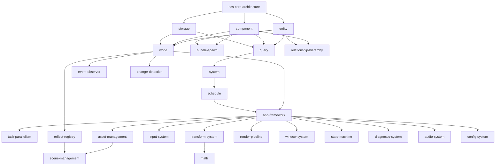

# ECS Engine — Specification Proposal (v3)

> **Notice of Intent** — mapping unstructured input to specification domains.
> Target implementation: Go (latest version, stdlib-first per C24)

## Architecture Overview

The specification system uses a **two-layer architecture**:

- **Layer 1 (Concept)** — Technology-agnostic ECS engine design. Can be ported to any language.
- **Layer 2 (Implementation)** — Concrete realization in Go. Each L2 spec maps to its L1 parent via `Implements:`.

## Proposed Specification Map

### Priority 1 — ECS Core (Foundation)

| # | L1 Spec (Concept) | L2 Spec (Go) | Description |
| :--- | :--- | :--- | :--- |
| 1 | `ecs-core-architecture.md` | `go-ecs-core-architecture.md` | Overarching ECS design philosophy, archetype model, data-oriented principles, module decomposition |
| 2 | `entity.md` | `go-entity.md` | Entity allocation/deallocation, generational indices, entity sets, entity mapping |
| 3 | `component.md` | `go-component.md` | Component registration, storage strategy selection (Table/SparseSet), metadata, required components, cloning |
| 4 | `storage.md` | `go-storage.md` | Table storage (SoA), sparse set storage, blob arrays, archetype management, memory layout |
| 5 | `query.md` | `go-query.md` | Query definition, filters (With/Without/Changed/Added), iteration, parallel iteration, access tracking |
| 6 | `system.md` | `go-system.md` | System definition, system parameters, function systems, exclusive systems, conditions, commands |
| 7 | `schedule.md` | `go-schedule.md` | Schedule definition, system ordering/dependencies, system sets, executors, stepping, deferred apply |

### Priority 2 — ECS Extended

| # | L1 Spec (Concept) | L2 Spec (Go) | Description |
| :--- | :--- | :--- | :--- |
| 8 | `world.md` | `go-world.md` | World container (central data store), resource management, change detection (ticks), lifecycle hooks |
| 9 | `event-observer.md` | `go-event-observer.md` | Event bus, event readers/writers, observers (reactive triggers), messages, lifecycle triggers |
| 10 | `bundle-spawn.md` | `go-bundle-spawn.md` | Bundles (component grouping), spawn/despawn operations, lifecycle management |
| 11 | `relationship-hierarchy.md` | `go-relationship-hierarchy.md` | Parent-child relationships, custom relations, children, traversal, relationship queries |
| 12 | `change-detection.md` | `go-change-detection.md` | Tick-based change tracking, smart wrappers, change detection interface |

### Priority 3 — Engine Framework

| # | L1 Spec (Concept) | L2 Spec (Go) | Description |
| :--- | :--- | :--- | :--- |
| 13 | `app-framework.md` | `go-app-framework.md` | App builder pattern, plugins, plugin groups, sub-apps, main schedule, game loop, schedule runner |
| 14 | `task-parallelism.md` | `go-task-parallelism.md` | Task pools (compute, IO, async), goroutine management, context.Context, errgroup |
| 15 | `asset-management.md` | `go-asset-management.md` | Asset loading/saving, handles (strong/weak), hot-reloading, asset processors, IO abstraction |
| 16 | `scene-management.md` | `go-scene-management.md` | Scene serialization/deserialization, dynamic scenes, scene spawning, scene filters |
| 17 | `reflect-registry.md` | `go-reflect-registry.md` | Type registry, runtime introspection, component metadata, serialization support |

### Priority 4 — Engine Systems

| # | L1 Spec (Concept) | L2 Spec (Go) | Description |
| :--- | :--- | :--- | :--- |
| 18 | `input-system.md` | `go-input-system.md` | Input abstraction, keyboard/mouse/gamepad/touch events, button state tracking, axes |
| 19 | `transform-system.md` | `go-transform-system.md` | Transform components, global/local transforms, transform propagation |
| 20 | `math.md` | `go-math.md` | Vectors (Vec2/3/4), matrices (Mat4), quaternions, value-type immutable math |
| 21 | `render-pipeline.md` | `go-render-pipeline.md` | Render graph, render phases, draw commands, **pluggable backend abstraction** |
| 22 | `window-system.md` | `go-window-system.md` | Window management, window events, cursor, monitors |
| 23 | `state-machine.md` | `go-state-machine.md` | Application states, state transitions, computed states, sub-states |
| 24 | `diagnostic-system.md` | `go-diagnostic-system.md` | Diagnostics (FPS, frame time), structured logging (`log/slog`), debug overlay |
| 25 | `audio-system.md` | `go-audio-system.md` | Audio sources as components, spatial audio, audio backend abstraction |
| 26 | `config-system.md` | `go-config-system.md` | Engine configuration, settings persistence, runtime overrides |

## Totals

| Layer | Count |
| :--- | :--- |
| L1 (Concept) | 26 |
| L2 (Go Implementation) | 26 |
| **Total** | **52** |

## Dependency Graph (L1 Specs)



## Go Package Structure

```plaintext
engine/
├── cmd/
│   └── game/
│       └── main.go              # Entry point, initialization only
├── internal/
│   ├── core/                    # ECS: World, Entity, Component, System, Query, Schedule
│   ├── event/                   # Event bus, observers, messages
│   ├── bundle/                  # Bundle definitions, spawn/despawn
│   ├── hierarchy/               # Parent-child, relationships, traversal
│   ├── reflect/                 # Type registry, metadata, introspection
│   ├── app/                     # App builder, plugins, game loop, schedule runner
│   ├── task/                    # Task pools, goroutine management
│   ├── asset/                   # Asset loading, handles, hot-reload
│   ├── scene/                   # Scene serialization, spawning
│   ├── input/                   # Keyboard, mouse, gamepad, touch
│   ├── transform/               # Transform components, propagation
│   ├── math/                    # Vec2/3/4, Mat4, Quat (value types)
│   ├── render/                  # Render graph, phases, backend interface
│   ├── window/                  # Window management, events
│   ├── state/                   # State machine, transitions
│   ├── diagnostic/              # Metrics, logging, debug overlay
│   ├── audio/                   # Audio sources, spatial audio
│   └── config/                  # Engine configuration
├── pkg/
│   └── ecs/                     # Public API (if distributing as library)
├── game/
│   ├── scenes/                  # Game scenes / levels
│   ├── components/              # Game-specific components
│   └── systems/                 # Game-specific systems
└── assets/
    ├── shaders/
    ├── textures/
    └── sounds/
```

## Suggested Execution Plan

Given the volume (52 specs total), batched approach:

1. **Batch 1**: Specs 1–7 (ECS Core) — L1 first, then L2
2. **Batch 2**: Specs 8–12 (ECS Extended) — L1 first, then L2
3. **Batch 3**: Specs 13–17 (Engine Framework) — L1 first, then L2
4. **Batch 4**: Specs 18–26 (Engine Systems) — L1 first, then L2

Each batch: write L1 specs → review → write L2 specs → review → promote to Stable.
