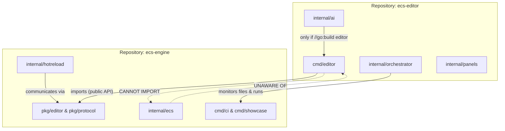

# Contributing

## 📂 Engine Repository Structure (`ecs-engine`)

```plaintext
ecs-engine/                 # Root of the engine project
├── cmd/                    # CLI tools and standalone executables (Go 1.26.1)
│   ├── cli/                # Scaffolding and project management tool
│   ├── ci/                 # CI automation tool (l1-build-tooling §4.1)
│   │   ├── main.go         # Subcommand dispatch: format, vet, lint, test, bench, …
│   │   └── commands/       # Per-check implementations (format.go, bench.go, …)
│   └── showcase/           # Bulk example runner, visual regression, screenshots (l1-build-tooling §4.5)
│       └── main.go
│
├── examples/               # Validating implementations (required by C26/C29)
│   ├── ecs/                # Entity/component/system core patterns
│   ├── world/              # Resources, events, hierarchy, change detection
│   ├── app/                # Plugin system, schedules, state machines
│   ├── 2d/                 # 2D rendering pipeline
│   ├── 3d/                 # 3D rendering pipeline
│   ├── physics/            # Collision, rigid bodies, character controller
│   ├── audio/              # Spatial and non-spatial audio
│   ├── ui/                 # Layout engine and widgets
│   ├── networking/         # Snapshot sync, prediction, lockstep
│   ├── asset/              # Asset loading, hot-reload, VFS
│   ├── diagnostic/         # Profiling, gizmos, debug overlay
│   └── stress_test/        # Performance benchmarks
│
├── internal/               # Core engine implementation (private)
│   │
│   ├── ecs/                # Central entity-component-system kernel
│   │   ├── archetype/      # Table-based contiguous memory layout
│   │   ├── component/      # Registries, bundles, and sparse-set storage
│   │   ├── entity/         # Generational ID allocation and recycling
│   │   ├── query/          # Archetype filters and parallel iterators
│   │   ├── command/        # CommandBuffer, deferred mutations, EntityCommands
│   │   ├── change/         # Tick-based change detection, Ref[T]/Mut[T], ClearTrackers
│   │   ├── world/          # Main data store and implementation coordinator
│   │   └── scheduler/      # Parallel DAG execution and system scheduling
│   │
│   ├── app/                # Application framework and plugin orchestrator
│   ├── asset/              # Asynchronous asset server and hot-reloader
│   ├── hotreload/          # Engine hot-swap orchestrator, state snapshots, VFS watchers
│   │                       # NOTE: hot-reload *orchestration* lives in ecs-editor/internal/orchestrator/
│   │                       # This package handles the engine-side: snapshot serialization,
│   │                       # IPC signal handling, and state restore (l1-hot-reload §4.2–4.4)
│   ├── scene/              # DynamicScene, StaticScene, entity remapping, prefabs
│   ├── hierarchy/          # ChildOf, Children, transform propagation
│   ├── input/              # ButtonInput[T], AxisInput, action mapping, picking
│   ├── state/              # State[S], NextState[S], SubState, ComputedState
│   ├── time/               # Fixed-timestep loop and virtual timers
│   ├── events/             # Observables and reactive event bus
│   ├── registry/           # Runtime type registry, reflection bridge, and metadata
│   ├── definition/         # JSON declarative layer, interpreters, hot-reload binding
│   │
│   ├── render/             # Render SubApp, render graph, extract pattern
│   │   ├── core/           # RenderGraph, RenderPass, backend abstraction, RID
│   │   ├── mesh/           # Mesh assets, vertex layout, skinning, morph targets
│   │   ├── material/       # PBR materials, shaders, pipeline specialization
│   │   ├── camera/         # Camera, projections, frustum culling, visibility (l1-camera-and-visibility)
│   │   ├── light/          # Light types, shadow maps, IBL, irradiance volumes
│   │   ├── pipeline2d/     # Sprite batching, TextureAtlas, Text2D
│   │   ├── pipeline3d/     # 3D render phases, instancing, deferred
│   │   └── postprocess/    # Bloom, tonemapping, AA, DOF, SSAO
│   │
│   ├── physics/            # Physics SubApp, backend abstraction
│   │   ├── server/         # PhysicsServer, command queue, sync/writeback phases
│   │   ├── body/           # RigidBody component, BodyType, MassProperties
│   │   ├── collider/       # ColliderShape, CollisionGroups, compound colliders
│   │   ├── query/          # RayCast, ShapeCast, OverlapShape, ContactsBetween
│   │   ├── joints/         # Revolute, Prismatic, Spherical, Distance, Generic
│   │   ├── events/         # CollisionStarted/Ended, TriggerEntered/Exited
│   │   ├── material/       # PhysicsMaterial, CombineRule, surface tags
│   │   └── character/      # CharacterController, iterative sweep, step-up
│   │
│   ├── audio/              # Audio SubApp, backend abstraction
│   │   ├── server/         # AudioServer, bus graph, AudioDriver interface
│   │   ├── source/         # AudioPlayer, PlaybackSettings, SpatialAudioSink
│   │   └── effect/         # AudioEffect factory/instance split, bus effects
│   │
│   ├── ui/                 # UI system (built on engine's own ECS — dogfooding)
│   │   ├── layout/         # Flexbox engine (Taffy-equivalent), dirty flags
│   │   ├── style/          # Style component, Val, UiRect, BackgroundColor
│   │   ├── text/           # Font loading, glyph atlas, Text2D pipeline
│   │   ├── interaction/    # Hover/press state, MouseFilter, focus management
│   │   └── widget/         # Node, ImageNode, ScrollView convenience bundles
│   │
│   ├── window/             # OS window management (entity-based)
│   │   ├── component/      # Window component, WindowMode, CursorOptions
│   │   └── backend/        # WindowBackend interface, platform implementations
│   │
│   └── network/            # Networking — primitives only, no specific model
│       ├── transport/      # UDP, channels, reliability layer, connection lifecycle
│       ├── replication/    # Component markers, EntityMap, visibility, delta compression
│       ├── snapshot/       # SnapshotData, ring buffer, delta compression
│       ├── prediction/     # InputBuffer, RollbackCoordinator, misprediction smoothing
│       ├── interpolation/  # SnapshotBuffer, per-component lerp, adaptive delay
│       ├── lockstep/       # LockstepScheduler, input delay, desync detection
│       └── rpc/            # RpcRegistry, RpcSender/Receiver, rate limiting
│
└── pkg/                    # Exportable utility packages (reusable by editor and games)
    ├── math/               # SIMD-optimized vectors, matrices, and geometry
    ├── platform/           # Cross-platform capability negotiation
    │   ├── profile/        # PlatformProfile, PlatformCaps bitfield
    │   └── backend/        # SocketBackend, RenderBackend, AudioDriver interfaces
    ├── diagnostic/         # Observability layer
    │   ├── store/          # DiagnosticsStore, Diagnostic, rolling history
    │   ├── gizmo/          # Immediate-mode debug drawing, GizmoConfigStore
    │   ├── profiling/      # Span API, Tracy/pprof/chrome exporters
    │   └── error/          # EngineError, E-series codes, localization registry
    ├── codegen/            # ecs-gen: code generation for components/queries
    ├── editor/             # Stable interfaces consumed by ecs-editor (l1-multi-repo §4.3)
    │   ├── plugin.go       # EditorPlugin interface (Build)
    │   ├── inspector.go    # InspectorPlugin interface (Handles, Render, PropertyInfo)
    │   ├── gizmo.go        # GizmoPlugin interface (Draw, Interact)
    │   └── definition.go   # DefinitionEditorPlugin interface (mirroring l1-definition §4.10)
    └── protocol/           # IPC wire format: hot-reload and diagnostic messages (l1-multi-repo §4.4)
        ├── hotreload.go    # HotReloadPrepare/Ready/Failed, ShaderError, ReloadMetrics
        └── diagnostics.go  # NetworkAlert, DiagnosticSnapshot
```

## 📂 Editor Repository Structure (`ecs-editor`)

The editor is a **separate Git repository** that depends on `ecs-engine` as a standard Go module.
It never imports `internal/` packages from the engine — only `pkg/`. See `l1-multi-repo-architecture`
for the full rationale and versioning contract.



```plaintext
ecs-editor/
├── cmd/
│   ├── editor/             # Main editor binary
│   │   └── main.go         # NewApp() + DefaultPlugins + EditorPlugin{}
│   └── hot-reload-daemon/  # Headless file-watcher for CLI iteration (l1-hot-reload §4.7)
│       └── main.go         # Runs orchestrator without a GUI window
│
├── internal/
│   │
│   ├── app/                # Top-level editor plugin wiring
│   │   ├── plugin.go       # implements pkg/editor.EditorPlugin; Build() registers all below
│   │   └── levels.go       # LEVEL_EDITOR init callbacks (l1-app-framework §4.10)
│   │
│   ├── panels/             # Editor UI panels (l1-ai-assistant §4.7)
│   │   ├── scene/          # Scene hierarchy tree (ChildOf entity view)
│   │   ├── inspector/      # Component inspector (PropertyInfo, revert/default)
│   │   ├── assets/         # Asset browser (Handle<T>, hot-reload status)
│   │   ├── console/        # DiagnosticsStore + LogSystem output
│   │   ├── profiler/       # Span timeline (reads pkg/diagnostic/profiling)
│   │   └── ai/             # Chat panel, suggestions, generation preview (l1-ai §4.7)
│   │
│   ├── viewport/           # 3D/2D editor viewport
│   │   ├── camera.go       # Editor camera controller (orbit, fly, pan)
│   │   ├── grid.go         # Infinite reference grid gizmo
│   │   ├── picking.go      # Ray-cast entity selection (l1-input §4.5)
│   │   └── render.go       # Integration with engine RenderFeature
│   │
│   ├── gizmo/              # GizmoPlugin implementations (pkg/editor/gizmo.go)
│   │   ├── transform.go    # Move/rotate/scale handles
│   │   ├── physics.go      # Collider wireframes, joint axes
│   │   └── light.go        # Light source gizmos
│   │
│   ├── inspector/          # InspectorPlugin implementations (pkg/editor/inspector.go)
│   │   ├── transform.go    # Vec3/Quat field editors
│   │   ├── sprite.go       # Texture picker, atlas region selector
│   │   ├── rigidbody.go    # MassProperties, BodyType controls
│   │   └── generic.go      # DynamicObject fallback for unregistered types
│   │
│   ├── definition/         # DefinitionEditorPlugin implementations (l1-definition §4.10–4.11)
│   │   ├── ui_editor.go    # Visual UI-tree editor (drag-drop nodes, style panel)
│   │   ├── flow_editor.go  # Flow graph (node-and-edge state machine editor)
│   │   └── scene_editor.go # Scene definition editor (entity/component table)
│   │
│   ├── ai/                 # AI Agent system (l1-ai-assistant-system)
│   │   │                   # NOTE: excluded from engine binary via //go:build editor
│   │   ├── manager.go      # AssistantManager resource — connection lifecycle
│   │   ├── transport/      # StdioTransport, WebSocketTransport, HTTPTransport
│   │   │   ├── stdio.go
│   │   │   ├── websocket.go
│   │   │   └── http.go
│   │   ├── capability.go   # CapabilitySet bitfield, user approval dialog
│   │   ├── context.go      # ContextProvider — assembles EditorContext per request
│   │   └── registry.go     # AgentRegistry — scans .agents/, parses manifest.json
│   │
│   ├── undo/               # Undo/redo history
│   │   ├── history.go      # Circular buffer of command groups
│   │   └── group.go        # Groups commands by AgentID+RequestID (l1-ai §4.6)
│   │
│   ├── ipc/                # IPC client connecting editor to the engine process
│   │   ├── client.go       # Unix socket (Linux/macOS) / named pipe (Windows)
│   │   └── messages.go     # Wrappers over pkg/protocol types (HotReloadPrepare, etc.)
│   │
│   └── orchestrator/       # Hot-reload orchestrator (l1-hot-reload §4.6)
│       ├── watcher.go      # FileWatcher — monitors *.go, *.glsl, *.json, *.png …
│       ├── builder.go      # Runs: go build -o {binary} ./cmd/game/
│       └── lifecycle.go    # Phases: Detect → Snapshot → Rebuild → Restore
│
├── assets/                 # Editor-own assets (never shipped with the game)
│   ├── icons/              # SVG icons for toolbar and panels
│   ├── fonts/              # Editor-specific fonts (if different from engine default)
│   └── themes/             # Light/dark UI color themes
│
├── config/                 # Declarative editor configuration (l1-definition §4.1)
│   ├── layout.json         # Default window/panel layout
│   ├── shortcuts.json      # Keybindings
│   └── default.flow.json   # Starter flow definition for new projects
│
├── go.mod
│   # module github.com/org/ecs-editor
│   #
│   # require github.com/org/ecs-engine v0.x.0
│   #
│   # The line below is ONLY for local co-development.
│   # It MUST be removed before tagging any release (enforced by CI).
│   # replace github.com/org/ecs-engine => ../ecs-engine
│
├── go.sum
└── CONTRIBUTING.md
```

## 🗝️ Core Architectural Decisions

### ECS Kernel Isolation

`internal/ecs/command/` and `internal/ecs/change/` are explicitly isolated sub-packages for
`CommandBuffer` and change detection (`Ref[T]`/`Mut[T]`) logic. `internal/ecs/scheduler/` is
integrated directly into the ECS core, utilizing access descriptors from queries and commands for
DAG construction.

### Render SubApp — `camera/` is a first-class package

`internal/render/camera/` is a dedicated sub-package alongside `core/`, `mesh/`, `material/` etc.
It owns `Camera`, `OrthographicProjection`, `PerspectiveProjection`, `Frustum`, `ViewVisibility`,
and the transform-propagation → frustum-culling system set. Per `l1-camera-and-visibility`, camera
and visibility are a self-contained subsystem with their own update schedule (`CameraUpdateSystems`
in `PostUpdate`).

### SubApp Modularity

`internal/render/` is decomposed into 8 specialized sub-packages to manage the high complexity of
the render graph and pipeline specialization (P4/P5 specs). `internal/physics/` mirrors an
8-package structure (P8 specs) with `server/` isolating backend implementations from pure data
components. `internal/network/` uses layer-based sub-packages (P7 specs) ensuring that transport
remains unaware of high-level synchronization logic (prediction/lockstep).

### Build and CI Tooling

`cmd/ci/` provides the single Go binary described in `l1-build-tooling §4.1`. Every CI check that
runs in the pipeline must be reproducible locally with `go run ./cmd/ci/ <subcommand>`. Direct
calls to `.sh` or `.ps1` scripts are not permitted — use the executor pattern.

`cmd/showcase/` provides the bulk example runner described in `l1-build-tooling §4.5` and
`l1-examples-framework §4.6`. It supports headless CI mode, screenshot capture, and filtered
execution by category.

### Exported Packages (`pkg/`)

`pkg/platform/` is limited to interfaces and capability negotiation; physical implementations
remain in `internal/window/backend/`.

`pkg/diagnostic/` is split into `store/`, `gizmo/`, `profiling/`, and `error/` to minimize
cross-dependency.

`pkg/editor/` and `pkg/protocol/` define the stable architectural boundary for communication with
the `ecs-editor` repository. These packages contain **only interfaces, data types, and constants** —
no business logic, no World access, no ECS system registration. Any breaking change to these
packages requires a SemVer major bump in `ecs-engine` and a forced upgrade in `ecs-editor`.

### Multi-Repo Architecture

The GUI editor resides in a separate `ecs-editor` repository. The engine never imports the editor.
The editor never imports `internal/` packages from the engine — Go module semantics enforce this
structurally. See `l1-multi-repo-architecture` for the versioning contract, CI strategy, and
local development workflow.

`ecs-editor` constructs the engine via the same `NewApp() + DefaultPlugins` builder pattern as any
game. This ensures the editor **dogfoods** the engine's public API surface continuously.

### AI Assistant System

`l1-ai-assistant-system` defines the AI plugin architecture for the **editor only**. All AI code
lives in `ecs-editor/internal/ai/` and is excluded from engine builds via `//go:build editor`.
The engine itself contains no AI integration — it exports the `pkg/editor/` interfaces that the
editor implements. The engine never depends on any AI service or model.

### Hot-Reload Responsibility Split

| Concern | Repository | Package |
| :--- | :--- | :--- |
| Engine-side: pause loop, write snapshot, restore state | `ecs-engine` | `internal/hotreload/` |
| Orchestrator: file watching, `go build`, launch new binary | `ecs-editor` | `internal/orchestrator/` |
| IPC wire format: messages exchanged between both sides | `ecs-engine` | `pkg/protocol/` |
| IPC client (editor connects to engine socket) | `ecs-editor` | `internal/ipc/` |

The file watcher must survive engine process restarts, which is why orchestration lives in the
editor process. The engine-side `internal/hotreload/` only knows how to serialize/restore state
and respond to IPC signals — it does not spawn processes or watch the filesystem.

## 🏗️ Game Project Structure (User Project)

```plaintext
my-game/                    # Typical project using ecs-engine
├── assets/                 # Raw assets (glTF, images, audio, scenes)
├── cmd/
│   └── game/
│       └── main.go         # App builder, plugin registration and game loop
├── internal/               # Game-specific logic (private)
│   ├── component/          # Custom components
│   └── system/             # Custom systems
├── config/                 # Declarative definitions (UI, logic flows, templates)
└── go.mod                  # module my-game; require github.com/teratron/ecs-engine
```
